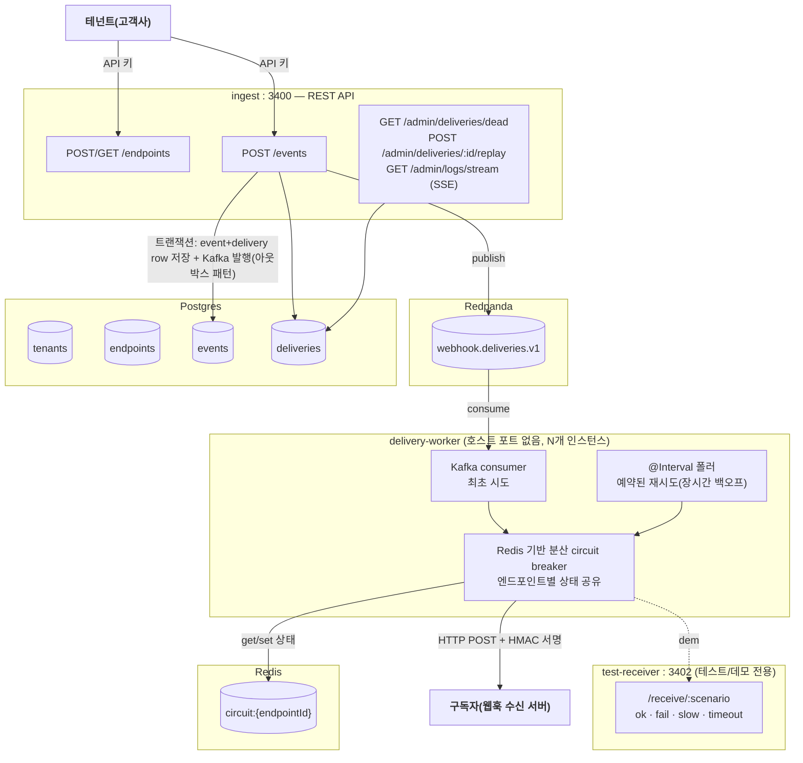

## 플랜 실행 이력

### 후속: 2026-08-01 — node-forge 1.0.10 채택(공식 DistributedCircuitBreaker로 교체)

**결과**: 성공. 두 제안서(`20260801-distributed-circuit-breaker.md`,
`20260801-circuit-breaker-options-parity.md`)가 같은 날 node-forge 1.0.10
`redis/circuit-breaker.ts`(`DistributedCircuitBreaker`)로 제안한 API 그대로(HALF_OPEN
프로브 실패 시 즉시 재-OPEN하는 세부 동작까지) 반영된 걸 확인하고, 로컬 임시 구현을
전량 교체.

**실제 변경 파일**:
- `shared/redis-circuit-breaker.ts` — 삭제(로컬 `RedisCircuitBreaker`, 공식 클래스로 완전 대체)
- `redis-circuit-breaker.test.ts` — 삭제(회로 상태 전이 자체의 정확성 검증 6건, 이제
  node-forge 자신의 테스트 책임)
- `ingest/admin.controller.ts`, `delivery-worker/delivery-attempt.service.ts` — import를
  `@paikpaik/node-forge/redis`의 `DistributedCircuitBreaker`로 교체
- `ingest/app.module.ts`, `delivery-worker/app.module.ts` — `DistributedCircuitBreaker`
  등록용 `useFactory` provider 추가(생성자가 `(redis, options)` plain constructor라
  파라미터 데코레이터 기반 자동 DI가 안 돼서 명시적 factory 필요, `inject: [REDIS_CLIENT]`)
- `test-utils/fake-redis-client.ts` — `hset/hmset/hgetall`이 단순 `String()` 변환이 아니라
  실제로는 `JSON.stringify`/`JSON.parse`로 직렬화한다는 걸 확인하고 fake를 맞춰 재작성
  (안 고쳤으면 `String(null) === "null"`이 계속 truthy로 남아 실제 Redis와 다르게 동작할 뻔함)
- `delivery-attempt.service.test.ts` — 공식 `DistributedCircuitBreaker` 인스턴스로 교체해 재검증

**계획과의 차이**: 없음 — 두 제안서에 쓴 API가 옵션 이름까지 그대로 반영되어 추가 협의나
API 재설계 없이 기계적 교체로 끝남.

**검증(2026-08-01)**: 유닛 테스트 19개(circuit breaker 자체 테스트 6건 제거로 25→19) 전부
통과. Docker 재빌드 후 실제 컨테이너로 기본 배달/circuit OPEN/보류/데드레터+replay/circuit
CLOSED 복귀를 전부 재확인 — 1.0.10 이전과 동일한 동작 확인.

**잔존 작업**: 없음. `docs/issues.md`에 1.0.10 행 추가 완료.

### 후속: 2026-08-01 — 분산 circuit breaker 제안서에 successThreshold/onStateChange 추가 제안

첫 제안서(`20260801-distributed-circuit-breaker.md`)가 기존 `CircuitBreakerOptions`의
`successThreshold`/`name`/`onStateChange`를 빠뜨렸다는 걸 뒤늦게 확인 — webhook-relay의
로컬 구현이 애초에 그 셋을 안 쓰고 있었던 걸 그대로 옮겨 적어서 생긴 누락. 이미 넘긴
제안서는 그대로 두고, `20260801-circuit-breaker-options-parity.md`로 추가 보강 제안서를
작성함(successThreshold 제대로 구현, onStateChange 추가, name 대신 keyPrefix 유지 근거,
HALF_OPEN이 실제로는 Redis에 안 쓰이는 계산값이라는 한계 명시).

### 후속: 2026-08-01 — RedisCircuitBreaker node-forge 제안서 작성

로컬 유닛 테스트(25개) + 실제 멀티 인스턴스 Docker 검증까지 끝낸 뒤
`proposals/node-forge/20260801/20260801-distributed-circuit-breaker.md` 작성. `redis` 모듈에
`DistributedCircuitBreaker`(키 기반 다중 회로 관리) 추가를 요청 — 기존 `ForgeCircuitBreaker`
(단일 프로세스/단일 회로 전제)는 그대로 두고 별도 클래스로 제안. 반영되면 이 서비스의
`RedisCircuitBreaker`를 그걸로 교체 예정.

### 완료: 2026-08-01 — 1~5단계 전부(기반구조 → 배달 → 분산 circuit breaker → test-receiver+패널 → admin API)

**결과**: 성공. 5개 항목(원래 플랜의 1~5단계) 전부 실제 Docker 컨테이너로 재현·검증 완료.

**실제 변경 파일**: `services/webhook-relay/` 신규 워크스페이스 전체
(package.json/tsconfig/Dockerfile/docker-compose.yml, entities 5종, ingest/delivery-worker/
test-receiver 3개 프로세스, `shared/redis-circuit-breaker.ts`/`hmac.ts`, `public/panel.html`,
`ARCHITECTURE.md`). 레포 루트 빌드 컨텍스트는 처음부터 적용(오늘 확립한 패턴 그대로, 재발
이슈 없음).

**계획과의 차이**:
- 원래 플랜은 `ForgeCircuitBreaker`를 그대로 쓰다가 문제를 발견하는 흐름을 암시했지만,
  실제로는 소스를 먼저 읽어서 순수 인메모리라는 걸 미리 확인하고 처음부터
  `RedisCircuitBreaker`를 새로 설계해서 구현했다(재구현 후 발견이 아니라 사전 확인 후 설계)
- Kafka 토픽이 기본 1개 파티션으로 생성돼서, 멀티 인스턴스 실측 검증 전에
  `rpk topic add-partitions`로 4개까지 늘리는 단계가 추가로 필요했다(플랜에 없던 스텝)
- 초기 Docker 빌드에서 `@types/express` 누락(로컬은 다른 워크스페이스의 호이스팅 덕에
  우연히 빌드됐지만 격리된 Docker 이미지에서는 실패) — package.json에 명시적으로 추가
- ingest의 `main.ts`가 `dist/ingest/main.js`(중첩 1단계)로 컴파일되는 걸 깜빡하고
  `useStaticAssets(join(__dirname, "..", "public"))`(단일 프로세스 서비스용 경로)로 처음
  작성해서 panel.html이 404 — order-outbox의 `api/main.ts` 패턴(`"..", "..", "public"`)으로 수정

**검증(2026-08-01, 실제 컨테이너)**:
- 기본 흐름(ok 엔드포인트): 테넌트 생성 → 이벤트 발행 → 4초 뒤 `success`, HMAC 서명 검증 통과
- 실패+circuit breaker: fail 엔드포인트 3건 실패 → OPEN 전환 → 4번째부터 실제 HTTP 호출 없이 보류
- 데드레터 복구: dead 강제 설정 → 엔드포인트 정상화 → replay → 성공 + circuit CLOSED 복귀
- **다중 인스턴스 분산 circuit breaker**(핵심 검증 대상): delivery-worker 2개 인스턴스로 스케일,
  실제로 서로 다른 파티션(`[0,2]`/`[1,3]`)을 소비하는 것 확인. fail 엔드포인트에 6건 동시
  발행 → 공유 카운터가 원자적으로 임계치(3)를 넘겨 OPEN 전환, 그 이후 요청은 확실히
  차단됨(동시 발행 레이스로 5건은 이미 인플라이트였던 정상적인 한계는 있었음 — 로컬
  회로였다면 최소 6건 다 나갔을 것과 대비)

**잔존 작업**: `RedisCircuitBreaker`의 node-forge 제안서는 작성 완료(위 후속 참고, 반영 대기 중).
panel.html의 "다중 인스턴스 경쟁 테스트" 버튼은 단일 인스턴스에서도 동작하는 "5건 연속 발사"
로 구현했고, 실제 멀티 인스턴스 분산 검증은 이번에 터미널에서 `--scale`로 직접 진행함(패널
버튼만으로는 인스턴스 스케일 자체를 조작할 수 없어서 — 필요하면 향후 대시보드/패널에 스케일
조작 UI를 추가할 수 있음, 이번 라운드 범위 밖).

# webhook-relay — 5번째 실험: 웹훅 전달 플랫폼(fan-out + 분산 circuit breaker + 서명)

## 목표

실생활에서 실제로 쓰이는 제품군(Svix/Hookdeck류 웹훅 전달 플랫폼)을 만들면서, 지금까지 4개
실험이 안 건드린 영역을 검증한다: (1) 하나의 이벤트를 여러 외부 HTTP 엔드포인트로 fan-out,
(2) node-forge의 `ForgeCircuitBreaker`를 실제로 처음 써보고, 멀티 인스턴스 delivery-worker
사이에 회로 상태를 어떻게 공유할지, (3) 아웃바운드 웹훅 페이로드 HMAC 서명(msa-checkout의
인바운드 JWT 인증과 반대 방향), (4) 장시간(수 시간대) 백오프 재시도 스케줄링.

## 현재 상태 (AS-IS)

신규 실험이라 없음. 참고할 기존 패턴:
- `order-outbox`의 트랜잭셔널 아웃박스(DB 트랜잭션 + 발행 커밋을 묶는 방식) — 코드는 재사용
  안 하고(컨벤션대로) 패턴만 이 실험에서 새로 구현
- `msa-checkout`의 다중 인스턴스 스케일링(`--scale`) + 실제 경쟁 조건 재현 방법론
- `live-ranking`의 kafka-forge `StandardConsumer`/`StandardProducer`, idempotency 패턴
- node-forge `core/circuit-breaker.ts`의 `ForgeCircuitBreaker` — 순수 인메모리(프로세스 로컬)
  구현이라, 여러 delivery-worker 인스턴스가 같은 엔드포인트의 장애 상태를 공유할 방법이
  없다는 걸 소스 확인함 — 이 실험에서 실제로 마주칠 갭

## 변경 후 상태 (TO-BE)

`services/webhook-relay/` 신규 npm workspace 패키지. 하나의 이미지, `docker-compose.yml`의
`command:`로 3개 프로세스 구분(기존 실험들과 동일 패턴):

## 변경 범위

| 항목 | 내용 |
|---|---|
| `services/webhook-relay/package.json` | 신규 워크스페이스 패키지. `@paikpaik/node-forge`, `@paikpaik/kafka-forge` GitHub Packages 의존성, `@forge-lab/panel-ui` |
| `src/entities/{tenant,endpoint,event,delivery}.entity.ts` | TypeORM 엔티티 4종 |
| `src/ingest/*` | REST API 프로세스(엔드포인트 등록, 이벤트 발행, 관리자 API, SSE) |
| `src/delivery-worker/*` | Kafka consumer(최초 시도) + `@Interval` 재시도 폴러 + circuit breaker 판단 + HTTP 전송 + HMAC 서명 |
| `src/test-receiver/*` | 테스트용 웹훅 수신 서버(정상/실패/느림/타임아웃 시나리오) |
| `src/shared/redis-circuit-breaker.ts` | 로컬 구현 — Redis에 엔드포인트별 회로 상태 저장(로컬 우선 검증 후 node-forge 제안 여부 판단) |
| `public/panel.html` | 엔드포인트 등록(시나리오 선택), 이벤트 발행, 실시간 배달 로그(SSE), circuit breaker 상태 표시, 데드레터 재발송, 다중 인스턴스 경쟁 테스트 |
| `docker-compose.yml`/`Dockerfile` | 레포 루트 빌드 컨텍스트로 처음부터 작성(오늘 확립한 `@forge-lab/panel-ui` 패턴 그대로 적용, 서비스 디렉토리 컨텍스트 이슈 재발 방지) |

## 영향성

| 영향 대상 | 영향 내용 |
|---|---|
| 기존 4개 실험 | 변경 없음 — 완전히 독립된 신규 워크스페이스 |
| `dashboard/` | `forge-lab.json`에 `panelUrl` 선언만 추가하면 자동으로 탭 인식(기존 컨벤션, dashboard 코드 수정 불필요) |
| node-forge/kafka-forge | 로컬 구현(분산 circuit breaker) 검증 후 제안서 작성 가능성 있음(진행하며 판단) |

## Breaking Changes

없음(신규 실험).

## 위험도

**MEDIUM** — 신규 프로세스 3개 + 새 아키텍처 요소(fan-out, 분산 circuit breaker, 장시간 재시도
스케줄링)라 범위는 크지만, 기존 4개 실험에서 검증된 패턴(트랜잭셔널 아웃박스, 컨슈머 스케일링,
데드레터, 관리자 API 네이밍/SSE 컨벤션)을 그대로 재사용할 수 있어 새로 발명해야 하는 부분은
circuit breaker 공유 상태 하나로 좁혀짐.

## 주의사항

- `ForgeCircuitBreaker`(node-forge)는 순수 인메모리라 그대로는 멀티 인스턴스에 못 쓴다 —
  이 실험 전용 Redis 기반 구현을 로컬로 먼저 만들고 실제 멀티 인스턴스 환경에서 검증한 뒤,
  범용성이 있다고 판단되면 node-forge에 제안(local-first-then-propose 컨벤션 그대로)
- Kafka는 "최초 시도"에만 쓴다 — 장시간(수 시간 단위) 백오프 재시도는 Kafka의 지연 발행
  기능이 없어서, `deliveries.nextAttemptAt` 컬럼 + `@Interval` 폴러로 처리(Kafka consume과
  DB 폴링을 같은 서비스 안에서 역할 분리해서 같이 씀 — 이 조합 자체가 이번 실험의 핵심 설계)
- 이벤트 저장 + Kafka 발행은 반드시 같은 DB 트랜잭션 커밋에 걸리는 아웃박스 패턴으로 구현
  (order-outbox 코드를 가져다 쓰지 않고 이 서비스 안에서 새로 구현 — convention.md의 실험 간
  코드 공유 금지 원칙)
- 4단계(waiting-room 다중 인스턴스 테스트, msa-checkout trace 뷰)는 백로그로 유지, 이 실험과
  무관하게 별도 진행

## 작업 단계

### 1단계: 기반 구조

1. `services/webhook-relay/` 워크스페이스 생성, package.json/tsconfig/Dockerfile(레포 루트
   컨텍스트 처음부터), `@forge-lab/panel-ui` 연동
2. TypeORM 엔티티(tenant/endpoint/event/delivery) + Postgres/Redis/Redpanda docker-compose 서비스
3. ingest: 테넌트/엔드포인트 등록 API, `POST /events`(트랜잭셔널 아웃박스로 이벤트+delivery
   row 저장 + Kafka 발행)

### 2단계: 배달(delivery-worker)

1. Kafka consumer로 최초 배달 시도 — HTTP POST + HMAC 서명(`node:crypto`)
2. 실패 시 `attempts`/`nextAttemptAt`(지수 백오프) 갱신, `MAX_ATTEMPTS` 초과 시 dead
3. `@Interval` 재시도 폴러 — `nextAttemptAt` 지난 pending 건 재시도

### 3단계: 분산 circuit breaker

1. Redis 기반 circuit breaker 로컬 구현(엔드포인트별 CLOSED/OPEN/HALF_OPEN 상태 공유)
2. 실제로 여러 delivery-worker 인스턴스(`--scale`)를 띄우고, 한 엔드포인트를 일부러 계속
   실패시켜서 모든 인스턴스가 동일하게 OPEN 상태를 인지하고 요청을 건너뛰는지 실측 검증
3. 검증되면 node-forge 제안 여부 판단

### 4단계: 테스트 수신 서버 + 패널

1. test-receiver(정상/실패/느림/타임아웃 시나리오)
2. panel.html — 엔드포인트 등록/이벤트 발행/실시간 배달 로그(SSE)/circuit breaker 상태/
   데드레터 재발송/다중 인스턴스 경쟁 테스트

### 5단계: admin API + 관측

1. `/admin/deliveries/dead`, `/admin/deliveries/:id/replay` (order-outbox의 데드레터
   복구 패턴 재사용)
2. `/admin/logs/stream` SSE(node-forge 1.0.9 `AdminEventsModule`, 이미 검증된 패턴 그대로 적용)

## 검증 방법

- 각 단계마다 Docker 실제 컨테이너로 재현(이 세션 전체 원칙)
- 정상 배달, 재시도 후 성공, 최대 재시도 초과 후 dead, 데드레터 재발송 성공 각각 실제 재현
- circuit breaker: 한 엔드포인트를 fail 시나리오로 등록 → 연속 실패로 OPEN 전환 → 여러
  delivery-worker 인스턴스 전부가 그 상태를 즉시 인지하는지 실측
- HMAC 서명: test-receiver가 서명을 실제로 검증해서 위조 페이로드를 거부하는지 확인

## 참조 규칙

- `rules/common/principles.md` — 신규 실험 구조는 이미 사용자와 확인 완료(이 문서 자체가
  그 확인 절차), forge 제안은 로컬 검증 후
- `rules/project/convention.md` — 실험 간 코드 공유 금지(아웃박스 패턴 재구현), admin/test
  API 네이밍(`/admin/*`), 공유 패널 UI(`@forge-lab/panel-ui`)
- `rules/common/workflow.md` — 코딩 전 설계 확인(본 문서)
