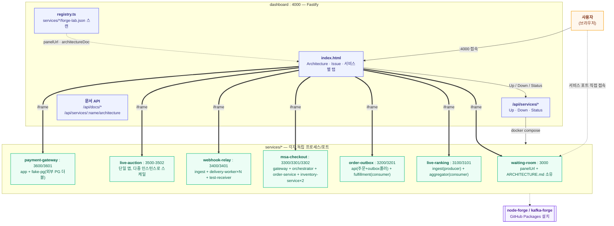

# forge-lab 아키텍처 (전체)

이 문서는 **레포 전체**에 적용되는 구조와 원칙만 다룬다. 개별 서비스의 내부 아키텍처(런타임
구조, 데이터 모델, 서비스 전용 설계 결정)는 각 서비스가 자기 디렉토리에서 직접 관리한다 —
서비스가 늘어나도 이 문서가 계속 부풀지 않게 하기 위함이다.

## 저장소 구조

```
forge-lab/
├── forge/                    node-forge, kafka-forge 참고용 클론 (git 미추적, 읽기 전용)
├── proposals/node-forge/     버그/기능 제안서
├── services/
│   ├── waiting-room/          NestJS + Redis (1번째 실험 — node-forge redis/response/logger/metrics/health)
│   │   ├── src/               API 서버
│   │   ├── public/panel.html  브라우저에서 직접 여는 대기열 시각화 페이지
│   │   ├── ARCHITECTURE.md    이 서비스의 상세 아키텍처 문서
│   │   ├── scripts/seed.js    CLI용 버스트 등록 스크립트
│   │   └── forge-lab.json     { "panelUrl": "...", "architectureDoc": "ARCHITECTURE.md" }
│   ├── live-ranking/          NestJS + Redis + Kafka(Redpanda) (2번째 실험 — kafka-forge producer/consumer/재시도/DLQ/멱등성)
│   │   └── (ingest:producer + aggregator:consumer, 프로세스 2개로 분리)
│   ├── order-outbox/          NestJS + Postgres + Kafka(Redpanda) (3번째 실험 — node-forge database, kafka-forge outbox)
│   │   └── (api:주문+outbox폴러 + fulfillment:다운스트림컨슈머, 프로세스 2개로 분리)
│   ├── msa-checkout/          NestJS + gRPC + Postgres (4번째 실험 — API 게이트웨이 인증/인가, gRPC, orchestration saga, 다중 인스턴스 정합성)
│   │   └── (gateway + orchestrator + order-service + inventory-service×2, 프로세스 4개로 분리)
│   ├── webhook-relay/         NestJS + Postgres + Kafka(Redpanda) + Redis (5번째 실험 — 웹훅 fan-out, 분산 circuit breaker, HMAC 서명)
│   │   └── (ingest + delivery-worker×N + test-receiver, 프로세스 3종으로 분리)
│   ├── live-auction/          NestJS + Postgres + Redis + WebSocket (6번째 실험 — Redis 분산 락/pub-sub, 다중 인스턴스 실시간 동기화)
│   │   └── (단일 앱을 처음부터 다중 인스턴스로 스케일, 포트 3500-3502 범위 노출)
│   └── payment-gateway/       NestJS + Postgres + Redis (7번째 실험 — ForgeHttpClient/분산 서킷브레이커/API 버전 협상, 외부 PG 호출 실패 대응)
│       └── (app:결제 API+거래조회폴러 + fake-pg:외부 PG 테스트 더블, 프로세스 2개로 분리)
├── dashboard/                Fastify, services/* 오케스트레이션 전담
│   └── public/index.html      탭(Architecture/Issue + 서비스별) + 문서 뷰어
└── package.json               npm workspaces root
```

## 전체 런타임 구조



## 레포 전역 설계 원칙

| 결정 | 이유 |
|---|---|
| dashboard는 Up/Down/Status(+문서 뷰어)만 소유, 그 외 전부는 서비스가 소유 | 서비스마다 완전히 다른 UI/기능/아키텍처가 필요할 걸 예상 — dashboard 코드를 안 건드리고 서비스 쪽 선언만으로 확장되게 |
| 서비스별 UI는 `panelUrl`(iframe), 서비스별 아키텍처 문서는 `architectureDoc` — 둘 다 `forge-lab.json`에 선언 | 같은 패턴("내용은 모르고 전달만 한다")을 UI와 문서 양쪽에 일관되게 적용 |
| panel.html이 dashboard를 거치지 않고 자기 API를 직접 호출 | 같은 오리진(iframe src가 서비스 자체 주소)이라 CORS 문제 없이 동작 |
| node-forge/kafka-forge는 직접 안 고치고 제안서로 | `forge/`는 참고용 클론일 뿐, 실제 반영은 사용자가 각 forge 레포에서 진행 — 버전별 이슈 대응 이력은 **Issue** 탭 참고 |

## 새 서비스를 추가할 때

1. `services/<name>/docker-compose.yml` — 이것만으로 dashboard 탭(Up/Down/Status)에 뜬다
2. (선택) 자체 UI가 필요하면 정적 페이지를 서빙하고 `forge-lab.json`에 `panelUrl` 선언
3. (선택) 상세 아키텍처를 남기고 싶으면 `services/<name>/ARCHITECTURE.md` 작성 후
   `forge-lab.json`에 `architectureDoc` 선언 — dashboard의 Architecture 탭에 서브탭으로 자동으로 뜬다
