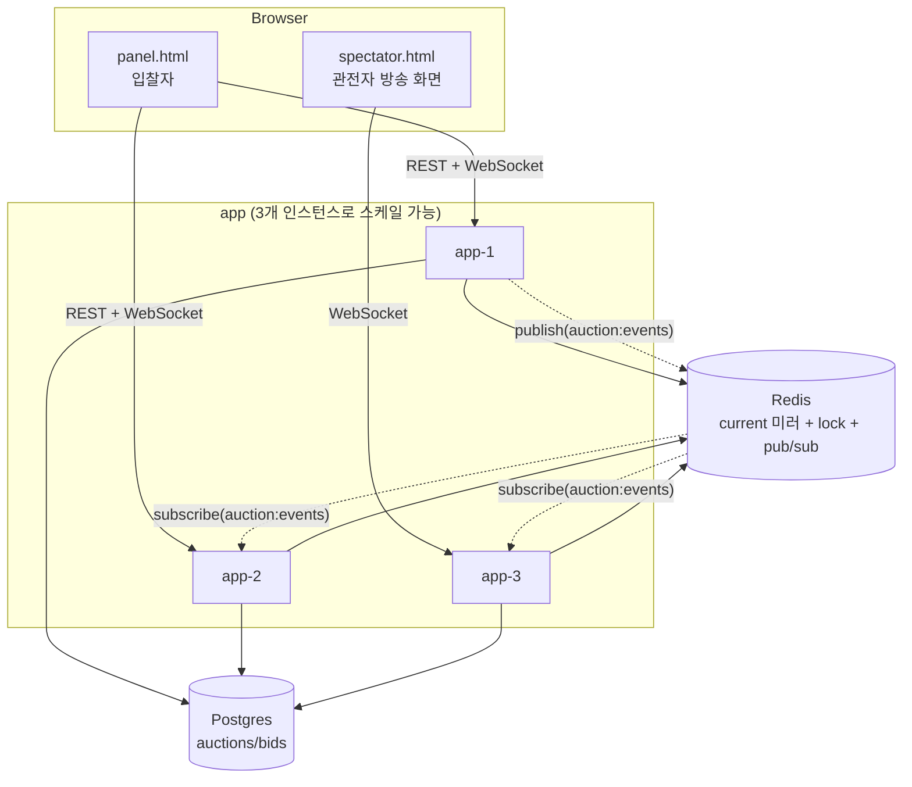

# live-auction — 실시간 경매 (6번째 실험)

지금까지 5개 실험이 검증 안 한 node-forge 기능들 — Redis 분산 락(`withLock`), Redis
pub/sub(`publish`/`subscribe`), WebSocket 실시간 전송 — 을 실제 "실시간 경매" 서비스로
검증한다. 여러 참가자가 동시에 입찰가를 올리는 실시간 경매를 여러 인스턴스로 스케일해도
정합성(최고 입찰자 확정)과 실시간 동기화(다른 인스턴스에 붙은 관전자도 즉시 봄)가 둘 다
성립하는지가 핵심 검증 대상이다.

## 런타임 구조

단일 NestJS 앱 타입을 그대로 여러 인스턴스로 스케일한다(msa-checkout의 inventory-service/
webhook-relay의 delivery-worker와 같은 패턴) — REST API, WebSocket 게이트웨이, 경매 종료
폴러가 전부 같은 프로세스 안에 있고, 인스턴스마다 독립적으로 돈다. 로드밸런서가 없는 이
랩 환경에서 "여러 인스턴스 간 동기화"를 직접 확인할 수 있도록, 호스트 포트를 처음부터
범위(`3500-3502`)로 열어둔다 — 브라우저 탭을 각각 다른 포트로 열어서 한쪽에서 입찰하면
다른 쪽에도 실시간으로 보이는지 바로 확인 가능하다.

## 입찰 흐름 — 왜 Redis 분산 락이 필요한가

`POST /auctions/:id/bids`가 하는 일은 "현재 최고가 조회 → 최소 증분 이상인지 검증 →
Postgres/Redis 갱신 → 다른 인스턴스에 방송"이다. 이 네 단계를 락 없이 하면, 동시에 들어온
두 입찰이 같은 "현재 최고가"를 보고 각자 통과한 뒤 나중에 커밋된 쪽이 이겨버려서(lost
update) **더 낮은 입찰이 최종 승자로 남을 수 있다.** `redis.withLock(auction:{id}:lock, ...)`
로 이 네 단계 전체를 원자화해서, 여러 인스턴스가 동시에 같은 경매에 입찰을 받아도 항상
"실행 순서와 무관하게 객관적으로 더 높은 금액"으로 수렴한다(검증 이력 참고).

## WebSocket 다중 인스턴스 동기화 — 이 실험의 핵심 검증 대상

`AuctionGateway`가 각 인스턴스에서 독립적으로 `auction:events` Redis pub/sub 채널을
구독한다. 입찰을 실제로 처리한 인스턴스가 `redis.publish()`로 이벤트를 쏘면, **그 인스턴스가
아닌 다른 인스턴스에 WebSocket으로 붙어 있는 클라이언트도** 그 인스턴스 자신의 pub/sub
구독을 통해 즉시 같은 이벤트를 받아 자기 소켓 룸에 브로드캐스트한다. socket.io 자체의
room 기능만으로는 인스턴스 경계를 못 넘으므로, Redis pub/sub가 인스턴스 간 다리 역할을
한다.

## 경매 종료 — waiting-room 다중 인스턴스 검증에서 얻은 교훈 반영

waiting-room을 실제로 2인스턴스로 스케일해서 검증했을 때, 여러 인스턴스가 조율 없이 같은
`@Interval` 폴러를 돌리면 admission 자체는 정확해도 로그/지표가 인스턴스별로 중복되거나
누락될 수 있다는 걸 실측으로 확인한 바 있다(`.claude-plans/20260802/
waiting-room-multi-instance-admission-test.md`). 이 실험은 처음부터 다중 인스턴스를
전제로 하므로, `AuctionCloserService`의 종료 로직(`AuctionService.closeAuction()`)을
`UPDATE auctions SET status='ENDED' WHERE id=:id AND status='LIVE'` 조건부 UPDATE로
설계해서, 영향받은 행 수(`affected`)로 "내가 실제로 커밋했는지"를 판단한다. 여러 인스턴스가
동시에 같은 마감 경매를 집어도 정확히 한 인스턴스만 종료 처리(로그 emit + pub/sub 방송
포함)를 완료하고, 나머지는 `affected: 0`을 보고 조용히 스킵한다 — 강제 종료(`POST
/admin/auctions/:id/end`)도 같은 함수를 공유하므로 동일하게 안전하다.

## 거절된 입찰도 이력에 남긴다 (후속, 2026-08-02)

초기 구현은 `placeBid()`가 최소 증분 미달/이미 종료된 경매를 검증하다 실패하면 그 자리에서
`ForgeBizError`만 던지고 끝났다 — `BidEntity` insert는 검증을 통과한 뒤에만 실행돼서,
거절된 입찰은 DB에 전혀 남지 않았다. 문제는 `withLock`이 동시 요청을 순서대로 처리하기
때문에, **동시에 들어온 두 입찰 중 진 쪽도 이 검증에 걸려 거절되는데, 그 이력이 통째로
사라진다는 점**이다(사용자가 실제 컨테이너 테스트 중 발견). 실제 경매라면 "누가 얼마를
불렀는데 이미 늦어서 안 됐다"까지가 감사 대상이므로, `BidEntity`에 `status`(ACCEPTED/
REJECTED)와 `rejectionReason`을 추가해서 거절 시점에도(경매 자체가 없는 E9404 케이스는
제외 — 감사 대상이 될 실제 경매가 없으므로) 행을 남기도록 수정했다. `listBids()`는 변경
없이 그대로 최근 50건을 반환하므로, 이제 진 입찰도 회색 처리+취소선+"거절" 태그로
`panel.html` 입찰 이력에 함께 보인다. `synchronize: true`라 별도 마이그레이션 없이 컬럼이
자동 추가된다.

## API

| Method | Path | 설명 |
|---|---|---|
| GET | `/auctions` | 진행 중(LIVE) 경매 목록 |
| GET | `/auctions/:id` | 현재 상태(Redis 미러 우선 조회, 캐시 미스 시 Postgres 폴백) |
| POST | `/auctions/:id/bids` | 입찰(`withLock`으로 보호) |
| GET | `/auctions/:id/bids` | 입찰 이력(최근 50건, 감사/개발자 콘솔용) |
| POST | `/admin/auctions` | 경매 생성(테스트/운영자 전용) |
| POST | `/admin/auctions/:id/end` | 강제 종료(테스트/운영자 전용) |
| GET | `/admin/logs/stream` | SSE(다른 5개 실험과 동일한 AdminEventBus 패턴, 인스턴스-로컬) |
| WebSocket `join`/`leave` | - | `auction:{id}` 룸 참가/이탈 |
| WebSocket `bid-placed`/`auction-ended` | - | 서버→클라이언트 실시간 브로드캐스트 |

## DB 스키마 (Postgres, `synchronize: true` — 랩 전용)

| 테이블 | 컬럼 |
|---|---|
| `auctions` | `id, title, description, startingPrice, minIncrement, status(LIVE/ENDED), currentHighestBid, currentHighestBidderId, endsAt, winnerId, finalPrice, createdAt` |
| `bids` | `id, auctionId, bidderId, amount, status(ACCEPTED/REJECTED), rejectionReason, placedAt` — 거절된 입찰까지 전부 영구 기록(실제 경매 감사 기록과 동일한 원칙) |

Postgres가 `currentHighestBid`/`currentHighestBidderId`의 원본(source of truth)이다.

## Redis 키 스키마 (신규 도입)

| 키 | 타입 | 용도 |
|---|---|---|
| `auction:{id}:current` | STRING(JSON, `ForgeRedisClient.set/get`) | Postgres 상태의 빠른 조회용 미러 |
| `auction:{id}:lock` | 분산 락(`withLock`) | 입찰 처리 임계구역 원자화 |
| `auction:events` | pub/sub 채널 | 모든 인스턴스가 구독, `{type, auctionId, data}` 페이로드로 입찰/종료 방송 |

## 이 실험만의 설계 결정

| 결정 | 이유 |
|---|---|
| 처음부터 다중 인스턴스 전제 + 호스트 포트 범위(`3500-3502`) | 이 실험의 핵심이 인스턴스 간 동기화라서, 브라우저가 각 인스턴스에 직접 붙어볼 수 있어야 검증이 눈으로 보임(다른 스케일 대상 서비스들은 외부 클라이언트가 필요 없어 포트를 아예 안 열었지만, 여기는 반대) |
| 경매당 pub/sub 채널을 따로 안 만들고 `auction:events` 하나만 사용 | 경매 생성/종료마다 구독을 동적으로 관리하는 복잡도를 피하고, 페이로드의 `auctionId`로 라우팅 |
| REST로 입찰(POST), WebSocket은 방송 전용(구독만) | 입찰 자체를 WS 이벤트로 받으면 인가/검증/에러 응답 처리가 REST보다 번거로움 — 실제 서비스도 "쓰기는 REST/폼, 실시간 갱신은 WS"로 나누는 경우가 흔함 |
| 경매 종료를 조건부 UPDATE(`affected` 카운트)로 커밋 판단 | waiting-room 다중 인스턴스 검증에서 "조율 없는 폴러는 관측이 깨진다"는 걸 실측했고, 이번엔 설계 단계에서부터 반영 |
| Postgres(원본) + Redis(미러/락/pub-sub) 병행 | 사용자가 AskUserQuestion으로 확정 — 감사 가능한 영구 기록은 Postgres, 실시간 상태/조율은 Redis로 역할 분리 |

## 검증 이력 (2026-08-02, 실제 컨테이너, 3인스턴스)

- **다중 인스턴스 상태 일관성**: 경매 생성 후 3500/3501/3502 세 포트 전부에서 완전히
  동일한 상태 조회 확인
- **분산 락 — 인스턴스 간 동시 입찰 레이스**: 3500에 낮은 입찰(120), 3501에 높은
  입찰(150)을 동시에 발사 → 실행 순서와 무관하게 3502에서 조회한 최종 상태가 항상
  `currentHighestBid: 150, currentHighestBidderId: "high-bidder"`로 수렴 확인
- **WebSocket 인스턴스 간 브로드캐스트(핵심 검증)**: socket.io-client로 3500에 WS 연결 →
  3501에 REST로 입찰 발사 → 3500에 붙은 WS 클라이언트가 `bid-placed` 이벤트를 실시간으로
  수신하는 것 확인(Redis pub/sub가 인스턴스 경계를 넘어 방송함을 직접 증명)
- **동시 강제 종료 레이스**: 3500과 3501에서 같은 경매에 동시에 `/admin/auctions/:id/end`
  호출 → 하나는 `{ended:true}`, 하나는 `{ended:false}` — 정확히 한 번만 커밋됨
  확인
- **자동 종료 폴러 다중 인스턴스 안전성**: 3개 인스턴스 전부의 `/admin/logs/stream`을
  동시에 구독한 채로 경매를 자연 만료시킴 → "경매 종료" 이벤트가 정확히 1개 인스턴스(이
  경우 3501)에서만, 정확히 1회 발생 — 3개 인스턴스가 전부 폴러를 돌렸음에도 중복 커밋
  없음 확인
- 유닛 테스트 8개 통과(동시 입찰 레이스 테스트는 실제 Redis 없이, promise 체이닝으로
  진짜 분산 락과 동일한 직렬화를 흉내낸 `FakeRedisClient`로 검증)

**알아둘 점**: `docker compose up -d`(스케일 없이)만 실행하면 1개 인스턴스가 뜨는데,
Docker의 포트 범위 매핑 특성상 이 인스턴스가 항상 3500에 바인딩되는 게 보장되지는
않는다(직접 재현 중 한 번은 3501로 바인딩됨) — `forge-lab.json`의 panelUrl이 안 열리면
`docker compose ps`로 실제 바인딩된 포트를 확인할 것.
