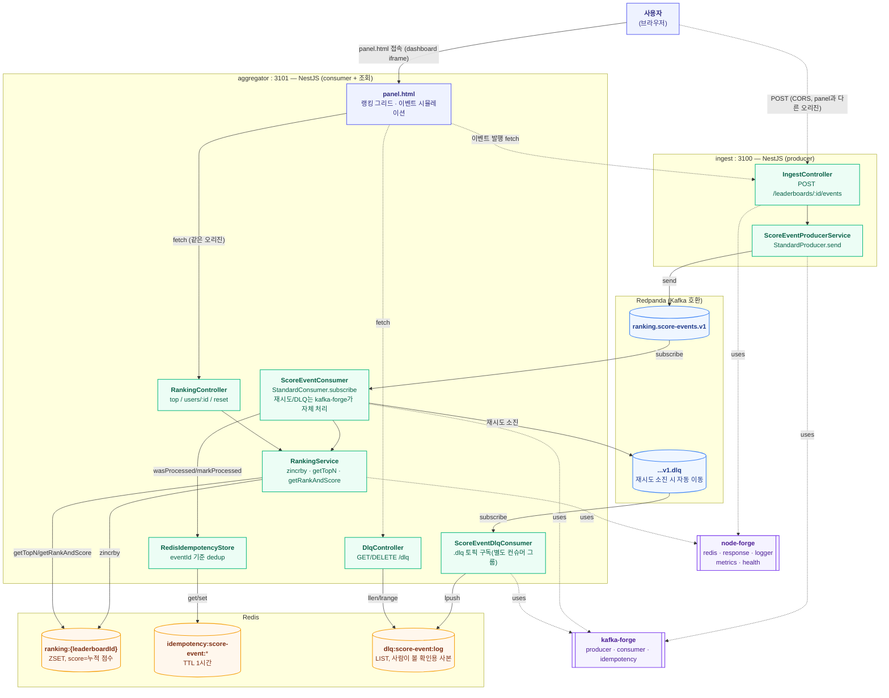

# live-ranking 아키텍처

이벤트 기반 실시간 랭킹 서버. forge-lab의 두 번째 실험이며, waiting-room이 검증하지 않은
**kafka-forge**(producer/consumer/재시도/DLQ/멱등성 확장점)를 node-forge의 Redis ZSET 랭킹
헬퍼와 함께 검증한다. 레포 전체 구조는 dashboard의 **Architecture ▸ 전체** 탭
(`docs/architecture.md`) 참고, 여기서는 이 실험 내부만 다룬다.

## 런타임 구조

하나의 npm workspace(`services/live-ranking`)이지만, producer와 consumer가 서로 다른 포트의
독립된 프로세스로 뜬다 — 같은 이미지를 빌드하고 `docker-compose.yml`의 `command:`만 다르게
지정한다.

## API

### ingest (port 3100)

| 메서드 | 경로 | 설명 |
|---|---|---|
| POST | `/leaderboards/:leaderboardId/events` | 점수 이벤트 발행. `{ userId, delta, eventId? }` — `eventId`를 생략하면 서버가 매번 새로 발급(HTTP 재시도 자체의 멱등성은 스코프 밖) |
| GET | `/health` | Kafka 브로커 연결 상태 |
| GET | `/metrics` | node-forge 기본 HTTP 지표 + kafka-forge 발행 지표(`kafka_forge_produced_total` 등, `registerMetricsInto`로 합류) |

### aggregator (port 3101)

| 메서드 | 경로 | 설명 |
|---|---|---|
| GET | `/leaderboards/:leaderboardId/top?limit=20` | 상위 N명 (1-based rank 포함) |
| GET | `/leaderboards/:leaderboardId/users/:userId` | 특정 유저의 순위/점수. 참가 안 했으면 둘 다 `null` |
| DELETE | `/leaderboards/:leaderboardId` | 리더보드 초기화 (테스트/데모 전용) |
| GET | `/health` | Redis + Kafka 브로커 연결 상태 |
| GET | `/metrics` | node-forge 기본 지표 + `live_ranking_score_events_applied_total` + kafka-forge 소비 지표(`kafka_forge_consumed_total`, `kafka_forge_consumer_lag`, `kafka_forge_deduped_total` 등, `registerMetricsInto`로 합류) |
| GET | `/dlq` | 재시도 소진 후 DLQ로 이동한 이벤트의 누적 건수 + 최근 목록(내용 포함) |
| DELETE | `/dlq` | DLQ 확인용 로그 비우기 (실제 Kafka DLQ 토픽은 그대로, 이 사본만 지움 — 테스트/데모 전용) |
| GET | `/panel.html` | 실시간 랭킹 패널 UI (dashboard가 iframe으로 띄움) |

## Redis 키 스키마

| 키 | 타입 | 용도 |
|---|---|---|
| `ranking:{leaderboardId}` | ZSET | member=`userId`, score=누적 점수(`zincrby`) |
| `idempotency:score-event:{eventId}` | STRING (TTL 1시간) | consumer가 이 이벤트를 이미 처리했는지 기록(현재는 `claim`이 대신 씀) |
| `dlq:score-event:log` | LIST | DLQ로 이동한 이벤트를 사람이 볼 수 있게 옮겨 담은 확인용 사본(최근 `DLQ_LOG_LIMIT`건만 조회) |

## Kafka 토픽

| 토픽 | 용도 |
|---|---|
| `ranking.score-events.v1` | 점수 이벤트. `createTopicName("ranking", "score-events", 1)`로 생성 — 직접 문자열 하드코딩 안 함 |
| `ranking.score-events.v1.dlq` | 재시도(기본 3회) 소진 시 kafka-forge `StandardConsumer`가 자동으로 이동시킴. 별도 컨슈머 그룹(`live-ranking-dlq-viewer`)이 구독해서 `dlq:score-event:log`로 옮겨 담음 |

## 이 실험만의 설계 결정

| 결정 | 이유 |
|---|---|
| producer(ingest)와 consumer(aggregator)를 같은 npm workspace, 다른 프로세스/포트로 분리 | "producer/consumer가 같은 포트를 쓰는 게 이상하다"는 판단에 따라 진짜 분리된 프로세스로 검증하면서도, dashboard 입장에서는 여전히 실험 하나(탭 하나)로 다룬다. Dockerfile은 하나만 만들고 `docker-compose.yml`의 `command:`로만 구분 |
| 멱등성 저장소를 Redis로 직접 구현(`RedisIdempotencyStore`) | kafka-forge는 `IdempotencyStore` 인터페이스만 제공하고 구현은 소비 서비스 책임으로 둔다(저장소 비의존 원칙). 기본 제공되는 `InMemoryIdempotencyStore`는 프로세스 재시작 시 초기화되어 "consumer 크래시 후 재시작 → 재배달"에서는 dedup을 못 한다 — Redis에 저장해 재시작을 넘어서도 dedup이 유지되는 걸 실제로 확인함(아래 검증 참고) |
| dedupeKey를 `eventId`로 지정 (기본값인 `topic:partition:offset` 대신) | offset 기준 dedup은 재처리 시 offset이 달라지면 무력화된다. 비즈니스 키(eventId)로 지정해야 "같은 이벤트"를 진짜로 식별한다 |
| 재시도/DLQ는 커스텀 구현 없이 kafka-forge `StandardConsumer` 기본값 사용 | 이미 재시도(3회, 지수 backoff)와 DLQ 이동을 자체 제공하므로 직접 만들 이유가 없음 — kafka-forge를 실사용 검증하는 게 이 실험의 목적이기도 함 |
| 랭킹 로직에 node-forge 제안서 불필요 | `zincrby`/`zrevrank`/`getTopN`/`getRankAndScore`가 이미 1.0.3에 존재 — waiting-room 때 발견한 `zadd` NX/XX 갭과 달리 이번엔 갭이 없었음 |
| partitionKey = `leaderboardId` | 같은 리더보드의 이벤트를 같은 파티션에 모아, 파티션 단위 관측(consumer lag 등)이 리더보드 단위로 단순해짐 |
| producer는 `idempotent: true, maxInFlightRequests: 1` | kafkajs/브로커 레벨에서 네트워크 재시도로 인한 중복 발행을 막는다. eventId 기반 dedup(consumer 쪽)과는 다른 계층의 멱등성 |
| `/metrics` 하나로 통합 (kafka-forge 1.0.2) | 처음엔 node-forge `MetricsModule.forRoot()`의 `/metrics`와 kafka-forge의 별도 레지스트리(`kafka_forge_*`)를 합칠 방법이 없어 `/metrics/kafka`로 따로 노출했다. kafka-forge에 `registerMetricsInto(registry)` 추가를 제안(`proposals/kafka-forge/20260717-metrics-registry-merge.md`) → 1.0.2에 반영되어 `main.ts`에서 `registerMetricsInto(forgeMetrics.registry)` 한 번 호출로 통합, `/metrics/kafka` 컨트롤러는 제거 |
| 멱등성 스킵 카운터는 kafka-forge 표준 지표 사용 (kafka-forge 1.0.2) | 처음엔 `RedisIdempotencyStore.wasProcessed()` 안에서 직접 카운터를 증가시켰으나, 구현체마다 지표 이름이 달라지면 서비스 간 비교가 어렵다고 판단해 `kafka_forge_deduped_total` 추가를 제안(`proposals/kafka-forge/20260717-consumer-dedup-metric.md`) → 1.0.2에 반영되어 `StandardConsumer`가 자체적으로 잡아주므로 자체 카운터(`scoreEventsDeduped`)는 제거 |
| vitest로 핵심 로직(랭킹 반영/조회/리셋, 멱등성 저장소, 이벤트 스키마)에 유닛테스트 | 실제 Redis/Kafka 없이 `ForgeRedisClient`의 필요한 메서드만 인메모리로 구현한 fake로 검증 (waiting-room과 동일 패턴) |
| 패널에 "같은 이벤트 두 번 보내기" 버튼 추가 | 냉정한 분석 중 발견 — 봇 시뮬레이션/+10점 버튼은 매번 새 `eventId`를 써서 멱등성 검증 경로를 전혀 안 지나갔다. 이 실험의 핵심(재배달돼도 중복 안 됨)을 UI만으로는 아무도 확인할 수 없었던 문제를 해결 |
| 멱등성 선점은 `claim`으로, `wasProcessed`/`markProcessed`는 인터페이스 호환용으로만 유지 (kafka-forge 1.0.3) | 처음엔 "체크 → 이펙트 적용 → 마킹(사후)" 순서라, 이펙트 적용 후 마킹 전에 크래시/리밸런스가 나면 재배달 시 중복 반영되는 크래시 윈도우가 있었다. 이펙트 실행 "전" 원자적 선점을 제안(`proposals/kafka-forge/20260717-idempotency-claim-before-effect.md`) → 1.0.3에 `IdempotencyStore.claim`으로 반영, `StandardConsumer`가 있으면 핸들러 실행 *전*에 이걸로 선점하고 사후 마킹은 스킵한다. `RedisIdempotencyStore.claim()`은 node-forge의 기존 분산 락(`lock()`, SET NX PX)을 그대로 재사용해서 구현 — node-forge 쪽 변경은 불필요했음. 트레이드오프: 크래시가 선점 이후 이펙트 완료 전에 나면 그 메시지는 유실(과소 반영)될 수 있음 — 리더보드 점수가 부풀려지는 것보다 낫다고 판단해 받아들임 |
| DLQ 전용 컨슈머를 `defineEvent()` 없이 `EventContract` 리터럴로 직접 구성 | `toDlqTopicName()`이 만드는 `<topic>.dlq` 형태는 kafka-forge 자신의 토픽 네이밍 컨벤션(`<domain>.<event>.v<N>`)을 안 지켜서, `defineEvent()`로 만들면 내부 `assertValidTopicName`이 던진다. `EventContract`는 순수 인터페이스라 `defineEvent()`를 안 거치고 리터럴로 만들면 이 검증을 우회할 수 있다 — 이 토픽은 우리가 만드는 게 아니라 `StandardConsumer`가 파생시키는 토픽이라 애초에 우리 네이밍 컨벤션의 대상이 아니라고 판단 |
| DLQ 전용 컨슈머는 `retry: false` + 핸들러 내부에서 모든 예외를 삼킴 | 여기서 예외가 새 나가면 kafka-forge가 "이 DLQ의 DLQ"(`...v1.dlq.dlq`)로 보내려 하는데, 그 이름도 네이밍 컨벤션을 어겨서 `assertValidTopicName`이 또 던진다 — 무한히 재귀하는 실패를 막기 위해 이 컨슈머의 핸들러는 절대 예외를 밖으로 던지지 않고 로그만 남긴다 |
| DLQ 목록은 "확인용 사본"일 뿐 재처리 대상이 아님 (Redis LIST, `ltrim` 없이 조회 시에만 최근 N건만 봄) | 이 실험의 목적은 "실패가 조용히 사라지지 않고 보이게" 하는 관측성 확보이지, 실패한 이벤트를 자동으로 재처리하는 신뢰성 메커니즘을 만드는 게 아니다. node-forge에 `ltrim`이 없어 리스트 자체를 물리적으로 자르진 않지만, 랩 환경에서 무한히 쌓일 걱정은 크지 않다고 판단해 최소 구현으로 남김 |
| DLQ를 실제로 채워보는 "실패 이벤트 발생시키기" 버튼 (poison-pill userId) | 실제로 재현 가능하게 실패시킬 방법이 없으면 DLQ 카드가 항상 비어 보여서 "이게 진짜 동작하는지" 확인할 수 없다. 특정 `userId`(`__dlq-test__`)로 오면 aggregator 핸들러가 항상 예외를 던지게 만들어, 버튼 하나로 재시도 소진 → DLQ 이동 → 목록 표시까지 전체 흐름을 눈으로 확인할 수 있게 함 |

## 검증 이력 (2026-07-17)

- `docker compose up --build -d`로 4개 컨테이너(ingest, aggregator, redis, redpanda) 기동 —
  kafkajs의 내부 재시도로 redpanda 초기 기동 지연을 자연스럽게 견딤(별도 healthcheck 불필요,
  안전망으로 `restart: unless-stopped`만 추가)
- curl로 이벤트 발행 → 2초 내 `/top`/`/users/:id`에 반영되는 것 확인
- 같은 `eventId`로 2회 발행 → 점수가 한 번만 반영되는 것으로 멱등성 확인
- aggregator 컨테이너를 재기동해도(재배달 시나리오와 동일한 상황) Redis에 저장된 리더보드
  점수와 멱등성 키가 그대로 유지되는 것 확인 — `InMemoryIdempotencyStore`로는 불가능했을 지점
- panel.html의 cross-origin 이벤트 발행(ingest CORS) 정상 동작 확인
- vitest 19개 전부 통과

### 후속 (2026-07-17) — kafka-forge 1.0.2 반영

`proposals/kafka-forge/20260717/` 두 건이 kafka-forge 1.0.2로 반영되어, 로컬 우회를 걷어내고
공식 API로 되돌렸다.

- `@paikpaik/kafka-forge` `^1.0.0` → `^1.0.2`
- `main.ts`(ingest/aggregator 둘 다)에서 `registerMetricsInto(forgeMetrics.registry)` 호출 추가,
  `KafkaMetricsController`(`/metrics/kafka`)와 그 라우트 등록 삭제
- `RankingMetrics.scoreEventsDeduped`, `RedisIdempotencyStore`의 수동 카운터 증가 코드 삭제
  (`kafka_forge_deduped_total`로 대체)
- 검증: `GET /metrics/kafka`가 404로 사라지고, `GET /metrics` 하나에 `kafka_forge_*`와
  `live_ranking_*` 지표가 함께 나오는 것 확인. 같은 `eventId` 중복 발행 시 점수는 유지되고
  `kafka_forge_deduped_total`이 정확히 증가하는 것 확인. vitest 18개(카운터 중복 테스트
  1건 제거) 전부 통과

### 후속 (2026-07-18) — kafka-forge 1.0.3 반영 (claim)

`proposals/kafka-forge/20260717-idempotency-claim-before-effect.md`가 kafka-forge 1.0.3으로
반영되어, "이펙트 적용 후 마킹 전" 크래시 윈도우를 없앴다.

- `@paikpaik/kafka-forge` `^1.0.2` → `^1.0.3`
- `RedisIdempotencyStore.claim()` 추가 — node-forge `ForgeRedisClient.lock()`(기존 SET NX PX
  분산 락)을 그대로 재사용. `wasProcessed`/`markProcessed`는 인터페이스가 필수로 요구해서
  남겨뒀지만, `claim`이 있는 한 `StandardConsumer`가 더 이상 호출하지 않는 죽은 코드가 됨
- `test-utils/fake-redis-client.ts`에 `lock()` 흉내 추가, `redis-idempotency-store.test.ts`에
  `claim` 원자성(같은 키 두 번째 선점은 항상 false) 테스트 3건 추가
- 검증: 기본 멱등성 스모크(같은 eventId 2회 발행 → 점수 유지) 재확인, vitest 21개 전부 통과.
  다만 "크래시가 정확히 이펙트 적용 후 마킹 전에 나는" 원래 버그 시나리오 자체는 타이밍상
  외부에서 재현하기 어려워, `claim`의 원자성 계약(유닛 테스트)과 `StandardConsumer` 소스의
  실제 호출 순서 확인으로 대신했다 — 살아있는 프로세스를 정확한 순간에 죽이는 실제 카오스
  테스트는 하지 않음

### 후속 (2026-07-19) — DLQ 관측성 확보

냉정한 분석에서 발견한 MEDIUM 이슈(DLQ로 넘어간 이벤트를 아무도 볼 방법이 없음)를 처리.

- `shared/score-event.contract.ts` — `ScoreEventDlq`(EventContract 리터럴, `defineEvent()` 우회),
  `DlqEnvelopeSchema` 추가
- `aggregator/dlq-log.service.ts`, `dlq.controller.ts`, `score-event-dlq.consumer.ts` — 신규.
  `.dlq` 토픽을 별도 컨슈머 그룹(`live-ranking-dlq-viewer`)으로 구독해 Redis LIST에 기록,
  `GET/DELETE /dlq`로 조회/초기화
- `score-event.consumer.ts` — `DLQ_TEST_USER_ID`(`__dlq-test__`)로 오면 항상 예외를 던지는
  테스트 훅 추가
- `public/panel.html` — "DLQ (실패한 이벤트)" 카드: 누적 건수, 최근 목록, "실패 이벤트
  발생시키기"/"DLQ 목록 지우기" 버튼
- `test-utils/fake-redis-client.ts`에 `lpush`/`lrange`/`llen` 흉내 추가,
  `dlq-log.service.test.ts` 신규 3건

**검증**: Docker 재빌드 후 `live-ranking-dlq-viewer` 컨슈머 그룹이 `ranking.score-events.v1.dlq`
파티션에 정상 join하는 것 확인. `__dlq-test__` userId로 이벤트 발행 → 재시도 3회 소진 후
`GET /dlq`에 `{userId, leaderboardId, delta, error, failedAt}`이 정확히 기록되는 것 실제로
재현 확인(가장 확실한 방식 — 코드 경로 추론이 아니라 진짜로 DLQ까지 도달시켜봄). vitest 24개
전부 통과.

관련 플랜: `.claude-plans/20260717/live-ranking-event-pipeline.md` (실행 이력 포함).
