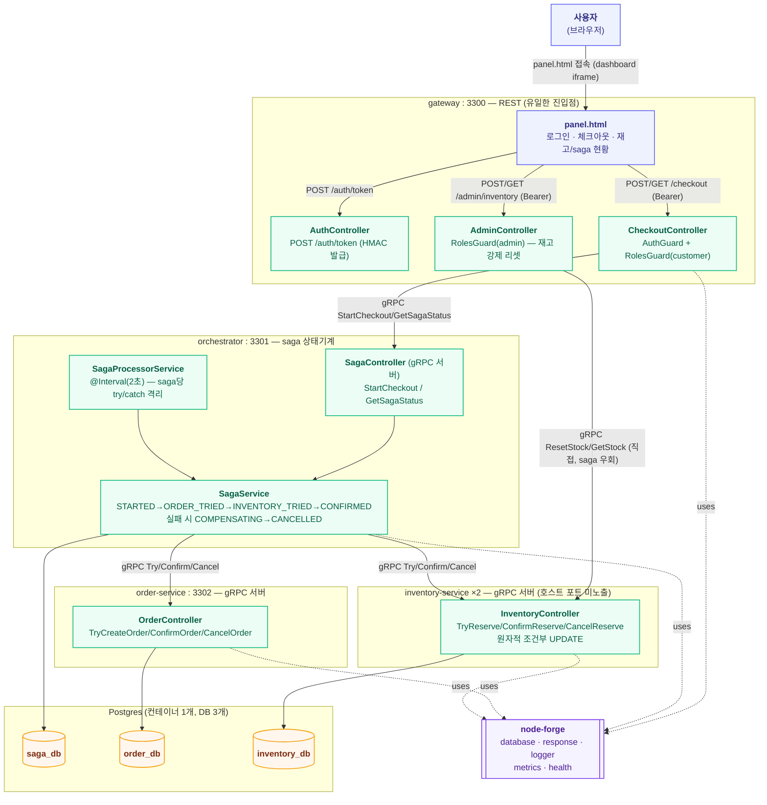

# msa-checkout 아키텍처

API 게이트웨이(인증/인가/라우팅) + gRPC 서비스 간 통신 + orchestration saga(분산 트랜잭션)를
하나의 실험 안에서 통합 검증하는 forge-lab의 4번째 실험. 앞선 세 실험(waiting-room,
live-ranking, order-outbox)이 공통으로 남긴 공백 — "같은 서비스의 인스턴스 여러 개가 같은
자원에 동시 접근할 때의 정합성"이 한 번도 실측된 적 없다는 점 — 을 이번 실험에서 다룬다.
레포 전체 구조는 dashboard의 **Architecture ▸ 전체** 탭(`docs/architecture.md`) 참고.

gRPC와 게이트웨이 HMAC 인증은 forge-lab에서 처음 다루는 영역이라, node-forge에 바로 얹지
않고 이 실험 안에서 로컬로 구현 후 검증했다 — 근거는 아래 "이 실험만의 설계 결정" 참고.

## 런타임 구조

하나의 npm workspace(`services/msa-checkout`)에 4개 프로세스. inventory-service는
`docker compose up --scale inventory-service=2`로 2개 인스턴스로 뜬다 — 이 실험의 다중
인스턴스 검증 대상.



## saga 상태기계

```
STARTED → ORDER_TRIED → INVENTORY_TRIED → CONFIRMED               (해피 패스)
                              └─(재고 부족)→ COMPENSATING → CANCELLED  (보상, order.CancelOrder 호출)
        └─(order Try 실패, 사실상 미발생)→ FAILED
```

order Try를 먼저(항상 성공), inventory Try를 나중에(재고 제약으로 실패 가능) 두도록 의도적으로
설계했다 — 재고 부족이라는 이 실험의 핵심 실패 시나리오가 **order-service의 CancelOrder gRPC
호출까지 실제로 exercise**하게 만들기 위함(반대 순서였다면 CancelOrder는 이 실험에서 한 번도
호출되지 않는 죽은 경로가 됐을 것). Confirm 단계는 TCC 원칙대로 실패해도 되돌리지 않고 다음
폴링에서 재시도한다(둘 다 Try가 성공한 뒤에 되돌리면 한쪽만 확정되는 더 심각한 불일치가 생길
수 있음).

## API

### gateway (port 3300, 유일한 REST 진입점)

| 메서드 | 경로 | 설명 |
|---|---|---|
| POST | `/auth/token` | `{ userId, role }` → HMAC 서명 토큰 발급(TTL 15분). 실제 유저 스토어 없는 랩 전용 단순화 |
| POST | `/checkout` | `{ productId, quantity }`, `customer` 권한 필요. saga를 시작하고 `sagaId` 즉시 반환(진행은 비동기) |
| GET | `/checkout/:sagaId` | saga 상태 조회. `customer`/`admin` |
| POST | `/admin/inventory/:productId/reset` | 재고를 지정한 값으로 강제 리셋. `admin` 권한 필요, saga를 거치지 않고 inventory-service를 직접 호출 |
| GET | `/admin/inventory/:productId` | 재고 조회(total/reserved/available). `customer`/`admin` |
| GET | `/health`, `/metrics` | 프로세스 자체는 외부 상태가 없어 체커 없이 등록 |
| GET | `/panel.html` | 패널 UI |

### orchestrator (port 3301, gRPC 3301→50051)

내부 전용 gRPC 서비스(`CheckoutSagaService`) — `StartCheckout`, `GetSagaStatus`. `/health`,
`/metrics`(saga DB 헬스체크)만 REST로 노출.

### order-service (port 3302, gRPC 50052) / inventory-service (호스트 포트 미노출, gRPC 50053)

각자 `OrderService`/`InventoryService` gRPC(`TryX`/`ConfirmX`/`CancelX`)만 노출, `/health`는
내부 네트워크에서만 접근 가능. inventory-service는 추가로 `ResetStock`/`GetStock`(gateway의
admin 라우트 전용).

## DB 스키마 (Postgres 컨테이너 1개, database 3개로 분리 — `docker/init-db.sql`)

| DB | 테이블 | 주요 컬럼 |
|---|---|---|
| `saga_db` | `saga_instances` | `id`, `userId`, `productId`, `quantity`, `status`, `orderId`(nullable), `reservationId`(nullable), `lastError`(nullable), `updatedAt`(ISO 문자열, 전이마다 갱신) |
| `order_db` | `orders` | `id`, `sagaId`(unique — 멱등성 키), `userId`, `productId`, `quantity`, `status`(PENDING/CONFIRMED/CANCELLED) |
| `inventory_db` | `inventory` | `productId`(PK), `total`, `reserved` — `available = total - reserved` |
| `inventory_db` | `reservations` | `id`, `sagaId`(unique — 멱등성 키), `productId`, `quantity`, `status`(RESERVED/CONFIRMED/CANCELLED) |

세 DB 다 같은 Postgres 컨테이너 안(랩 전용 타협, 컨테이너 수 절감)이지만, 서비스 간 직접 SQL
조인은 하지 않는다 — 항상 gRPC로만 통신한다는 원칙은 지킨다.

## 이 실험만의 설계 결정

| 결정 | 이유 |
|---|---|
| gRPC/인증은 처음엔 로컬 구현 후 검증, 지금은 node-forge 1.0.5(`grpc`, `auth` 모듈) 채택 | 이 실험이 처음 필요로 하는 영역이라 API 모양을 검증 없이 추측하지 않기 위해 로컬로 먼저 구현·검증했고(`principles.md`의 "두 번째 필요 사례가 생길 때 추출"), 그 설계를 근거로 쓴 제안서 2건(`20260725-grpc-multi-instance-lb.md`, `20260725-jwt-auth-module.md`)이 1.0.5로 실제 반영돼 로컬 우회 코드를 걷어내고 공식 API로 전환했다 |
| gateway는 인증/인가/라우팅만, saga 로직은 orchestrator로 완전히 분리 | 사용자 요청("API 게이트웨이에서 인증인가, 라우팅을 담당")을 문자 그대로 반영 — gateway가 비즈니스 로직을 가지면 "게이트웨이"라는 이름이 무색해짐 |
| 분산 트랜잭션 = orchestration saga (gRPC 기반), choreography(Kafka) 아님 | choreography로 가면 gRPC가 트랜잭션 조율에서 빠지게 되어 "gRPC로 분산 트랜잭션을 관리한다"는 이번 실험의 취지와 어긋남(사용자와 논의로 확정) |
| Try 순서를 order → inventory로 (재고 먼저가 아니라) | 재고 부족(이 실험의 핵심 실패 시나리오)이 발생했을 때 반드시 order-service의 CancelOrder gRPC 호출이 exercise되도록 — 순서를 반대로 하면 CancelOrder가 정상 흐름에서 한 번도 안 불리는 죽은 경로가 됨 |
| Confirm 부분 실패는 보상하지 않고 재시도 | TCC 원칙 — Try가 둘 다 성공한 뒤에 되돌리면 한쪽만 확정되고 한쪽만 취소되는 더 심각한 불일치가 생길 수 있음. `orchestrator`가 죽었다 재기동해도 `fetchPending`이 터미널이 아닌 saga를 전부 다시 집어서 이어가므로 안전 |
| SagaProcessorService가 saga 하나씩 개별 try/catch로 처리 | kafka-forge `OutboxPublisher`가 겪었던 "배치 중 하나 실패 시 전체 중단·중복 재발행" 버그(order-outbox 라운드에서 실제로 재현하고 제안서로 고친 바로 그 버그)를 이 실험에서 반복하지 않기 위해 처음부터 격리해서 구현 |
| inventory Try는 원자적 조건부 UPDATE(`WHERE total - reserved >= qty`) | SELECT 후 애플리케이션에서 조건 검사하는 2단계 방식은 TOCTOU라 다중 인스턴스 상황에서 재고가 마이너스로 내려갈 수 있음 |
| gRPC 클라이언트에 `dns:///` 스킴 + `round_robin` LB 명시 | grpc-js 기본 정책(`pick_first`)은 최초 연결한 인스턴스에 고정돼서, Docker가 서비스명 하나로 여러 인스턴스를 돌려줘도(임베디드 DNS round-robin) 실제로는 한쪽만 계속 쓰게 됨 — 다중 인스턴스 검증의 전제 조건이라 명시적으로 설정 |
| orchestrator/order-service/inventory-service 전부 호스트 포트를 노출하지 않음 | inventory-service는 2인스턴스라 애초에 고정 포트 매핑이 불가능해서 그랬지만, 이후 API 게이트웨이 5대 책임(라우팅·인증인가·변환·정책·관측) 감사에서 orchestrator(3301)/order-service(3302)의 HTTP 포트(health/metrics용)가 여전히 host에 노출돼 "내부 IP/port 은닉"이 불완전하다는 걸 발견 → 두 포트도 제거해서 gateway(3300)만 유일한 host 진입점으로 만듦. 개별 서비스 health 확인은 `docker exec`으로 대체 |
| `orders`/`reservations`에 `sagaId` unique 컬럼으로 멱등성 확보 | orchestrator가 네트워크 오류 후 같은 sagaId로 Try를 재시도해도(폴러가 다음 tick에 다시 호출) 주문/예약이 중복 생성되지 않음 |
| 재고 리셋(`ResetStock`)은 saga를 거치지 않고 gateway → inventory-service 직접 호출 | 테스트/데모용 관리 작업이지 트랜잭션이 아니라서, orchestrator를 끼워 넣을 이유가 없음(다른 실험들의 test-only trigger 컨벤션과 동일한 성격) |
| 인증은 `@paikpaik/node-forge/auth`(`signToken`/`verifyToken`) + `auth/nestjs`(`JwtAuthModule`/`JwtAuthGuard`/`Roles`) — waiting-room HMAC → 로컬 `@nestjs/jwt` → node-forge 공식 API 순으로 세 번 교체 | "forge는 forge-lab만이 아니라 실서비스 고도화가 목적이고, 회원 인증의 bearer 토큰은 사실상 JWT가 표준"이라는 판단(사용자 논의)에 따라 로컬 JWT로 먼저 검증한 뒤 그 설계를 근거로 쓴 제안서가 1.0.5로 반영돼 최종적으로 forge 공식 API로 전환. 유저 스토어 없이 `userId+role`을 그대로 클레임(`sub`/`role`)에 담아 서명하는 것은 여전히 랩 전용 단순화 |
| `RolesGuard`는 node-forge 걸 그대로 사용(로컬 우회 없음) | node-forge 1.0.5에서 `Reflector` DI 실패 버그를 실제로 재현해 잠시 로컬 서브클래싱으로 우회했지만, 1.0.6에서 `@Inject(Reflector)` 명시로 수정돼 반영 즉시 우회 코드를 전부 제거하고 원래대로 되돌렸다(아래 검증 이력 참고) |
| vitest로 saga 상태기계를 fake OrderClient/InventoryClient로 검증 (order-service/inventory-service를 실제로 안 띄우고) | waiting-room/live-ranking의 FakeRedisClient와 동일한 패턴을 gRPC 클라이언트 인터페이스에도 적용 — `OrderClient`/`InventoryClient` 인터페이스로 실 구현과 fake를 분리 |
| trace ID/access log는 node-forge 1.0.7의 `core`(`runWithRequestContext`/`getRequestContext`), `logger/nestjs`(`TraceAccessLogMiddleware`), `grpc/nestjs`(`buildOutgoingTraceMetadata`/`GrpcTraceAccessLogInterceptor`) 공식 API 사용(로컬 우회 없음) | 처음엔 로컬로 구현해 검증한 뒤 제안서(`20260725-nestjs-trace-propagation.md`)를 썼고, 1.0.7로 반영돼 로컬 코드(`src/shared/trace/*`, `gateway/middleware/trace-access-log.middleware.ts`)를 전부 걷어내고 공식 API로 전환. 실제 구현이 예상보다 넓게 대응됨(크로스 엔트리 DI 스모크 테스트까지 CI에 추가됨 — 아래 검증 이력 참고) |
| saga 폴러(`SagaProcessorService`)가 하위 서비스를 호출할 때는 trace가 원래 HTTP 요청과 이어지지 않고 매 tick마다 새로 시작됨(알려진 한계, 의도적으로 안 고침) | `@Interval` 폴러는 HTTP 요청과 무관한 별도의 비동기 트리거라 `AsyncLocalStorage` 컨텍스트가 없다 — 실제로 재현해서 확인(아래 검증 이력 참고). `sagaId`를 traceId로 재사용해서 이어붙이는 안을 검토했으나 기각 — W3C trace-id는 "하나의 유한한 인과적 호출 체인"을 나타내도록 설계된 것이라 여러 tick에 걸친 장기 프로세스에 재사용하면 표준 트레이싱 도구의 가정과 충돌한다. saga 단위 추적이 필요하면 `sagaId`를 별도 correlation-id 로그 필드로 추가하는 게 맞는 방향(미구현, 필요시 별도 진행) |
| gRPC status code → HTTP status 매핑 필터(`GrpcStatusExceptionFilter`) | `@nestjs/microservices`의 gRPC 클라이언트가 실패를 grpc-js `ServiceError` 그대로 던지는데, 이걸 잡는 필터가 없어서 orchestrator가 다운되든(`UNAVAILABLE`) 뭐든 전부 500으로 뭉뚱그려졌다(RolesGuard 버그 재현 때도 그랬음). grpc-gateway가 쓰는 표준 매핑(`UNAVAILABLE`→503, `NOT_FOUND`→404 등)을 적용하는 catch-all(`@Catch()`) 필터를 추가하되, `ForgeExceptionFilter` *다음*에 등록해서 `ForgeBizError`는 여전히 그쪽으로 먼저 가도록 순서를 맞춤 |
| rate limiting은 `@nestjs/throttler`(로컬 전용, node-forge 제안 안 함) | 사용자와 논의로 확정 — NestJS 공식 패키지가 이미 잘 만들어져 있어서 JWT 때와 달리 forge가 감쌀 필요가 크지 않다고 판단. `APP_GUARD`로 전역 등록, 기본 IP당 60초 20회(env로 조정 가능) |
| CORS는 명시적으로 설정(기본은 요청 Origin 반사, env로 좁힐 수 있음) | panel.html이 같은 오리진이라 기능상 꼭 필요친 않지만, "정책 계층이 존재하지 않는다"는 감사 결과를 남겨두지 않기 위해 명시적으로 설정 |
| IP 차단은 데모용 deny-list 미들웨어(`IpBlockMiddleware`, env `BLOCKED_IPS`) | 실서비스라면 WAF/L4에서 처리할 일이지만, 이 실험 안에서 "정책" 계층이 실제로 동작한다는 걸 보여주는 최소 구현. IP 차단 미들웨어를 access log 미들웨어보다 먼저 실행해서, 차단된 요청은 로그도 안 남기고 즉시 거부 |

## 검증 이력 (2026-07-25)

`docker compose up --build -d --scale inventory-service=2`로 5개 컨테이너(gateway,
orchestrator, order-service, inventory-service ×2, postgres) 기동. 최초 기동 시 `/app/proto`
경로 오류(gRPC 서버 3개 전부 부팅 실패)를 겪음 — `copy:proto` 스크립트가 proto를
`dist/proto/`(dist 안쪽)로 복사했는데, 코드는 `dist`와 형제 디렉토리인 `proto/`를 찾고
있었음. `public`과 동일하게 Dockerfile 런타임 스테이지에서 `proto/`를 `dist`의 형제로 복사하는
쪽으로 통일해서 해결 — 이 수정 이후 재빌드하니 4개 프로세스 전부 `/health` 정상.

- **해피 패스**: `POST /checkout`(widget-plenty, qty 2) → 5.5초 후 `GET /checkout/:sagaId`에서
  `status: "CONFIRMED"`, `orderId`/`reservationId` 둘 다 채워진 것 확인
- **보상 트랜잭션**: widget-scarce 재고를 admin으로 0까지 리셋한 뒤 체크아웃 → saga가
  `status: "CANCELLED"`, `reservationId: ""`(재고 예약은 애초에 성공한 적 없음),
  `lastError: "재고가 부족합니다"`로 종료. **order-service의 실제 Postgres 행을
  `docker exec psql`로 직접 조회**해서 `status = 'CANCELLED'`인 것까지 확인(orchestrator가
  주장만 하는 게 아니라 실제로 CancelOrder gRPC가 도달했음을 raw SQL로 재확인)
- **다중 인스턴스 정합성**: widget-scarce 재고를 1로 리셋 후 동시 체크아웃 2건(`curl ... &` +
  `wait`로 거의 동시에 발사) → 정확히 1건은 `CONFIRMED`(orderId+reservationId 보유), 나머지
  1건은 `CANCELLED`(`lastError: "재고가 부족합니다"`)로 갈라짐. 최종 재고
  `{ total: 0, reserved: 0, available: 0 }` — 마이너스로 내려가지 않음(원자적 조건부 UPDATE가
  실제로 두 인스턴스 간 경쟁에서도 정합성을 지킴)
- **gRPC 라운드로빈 실측**: widget-plenty로 체크아웃 10건을 동시 발사하기 전/후 두
  inventory-service 인스턴스의 `docker stats` NET I/O를 비교 — 인스턴스1 `16.8kB→30.2kB`(+13.4kB),
  인스턴스2 `22.9kB→36.3kB`(+13.4kB)로 **거의 동일한 양만큼 둘 다 증가** — `dns:///` +
  `round_robin` 설정이 없었다면(기본값 `pick_first`) 한쪽만 늘고 다른 쪽은 그대로였을 상황.
  10건 전부 `CONFIRMED`로 정상 처리됨도 함께 확인
- **인증/인가**: 만료된 토큰(TTL 15분 경과)으로 요청 시 `401 Unauthorized` 확인(재현 과정에서
  실제로 발생 — 버그 아님, 정상 동작). `admin` 전용 재고 리셋을 `customer` 토큰으로 시도하면
  `403 Forbidden`, 메시지에 필요한 role이 정확히 표시되는 것 확인
- vitest 31개(가드/토큰 9, order-service 5, inventory-service 11, saga 상태기계 6) 전부 통과,
  `tsc --noEmit` 클린
- 검증 후 `TRUNCATE orders`, `TRUNCATE inventory, reservations`, `TRUNCATE saga_instances` +
  inventory-service 재기동으로 초기 재고(widget-plenty 1000 / widget-scarce 1) 재시드 확인

### 후속 (2026-07-25) — orchestrator 크래시 복구 실제 재현

이전 라운드에서 "코드/vitest로만 확인, 실제 강제 종료는 미재현"으로 남겨뒀던 검증 공백을
메웠다.

**방법**: 체크아웃 요청 직후 `docker exec ... psql`로 saga 상태를 0.3초 간격 타이트 폴링하다가
`ORDER_TRIED`(order Try는 성공, inventory Try는 아직 실행 전) 순간을 잡아 `docker kill`로
orchestrator 컨테이너를 즉시 강제 종료 — 이론적 크래시 시나리오가 아니라 saga가 실제로
중간 상태에 멈춰 있는 정확한 타이밍을 실측으로 잡아냈다.

**확인된 것**:
- 킬 직후: `saga_instances.status = 'ORDER_TRIED'`로 멈춰 있음(더 진행되지 않음),
  `order_db.orders`에는 주문이 `PENDING`으로 이미 존재, `inventory_db.reservations`에는
  아무 행도 없음 — 정확히 예상한 중간 상태
- `docker compose start orchestrator`로 재기동 후, **새로운 `StartCheckout` 호출 없이도**
  폴러가 기존 saga를 자동으로 집어 `INVENTORY_TRIED` → `CONFIRMED`까지 이어서 완료
- `order_db.orders`의 `id`가 크래시 전과 재기동 후 **동일**(중복 생성되지 않음), 최종
  `status`도 `CONFIRMED`로 정확히 반영
- `inventory_db.reservations`에 새 예약 1건이 정상 생성되고 `CONFIRMED`로 반영(재기동 후
  처음으로 inventory Try가 실행됐으므로 새로 생기는 게 맞음)

**부수 발견(버그 아님, 운영 특성)**: `restart: unless-stopped` 정책이 설정돼 있었지만
`docker kill`(SIGKILL) 직후 자동 재시작이 즉시 일어나지 않아 명시적으로
`docker compose start orchestrator`로 재기동시켜야 했다 — Docker의 재시작 백오프 동작으로
추정되며 이 실험의 정합성 결론과는 무관. 실서비스라면 오케스트레이터(k8s 등)의 liveness probe
기반 재시작에 맡길 부분이라 별도 조치 없이 관찰 사실로만 기록.

**검증**: 크래시 재현 후 데이터 정리(`TRUNCATE` 3개 DB) + 재고 재시드(1000/1) 완료.

### 후속 (2026-07-25) — HMAC 자체 구현을 JWT(`@nestjs/jwt`)로 교체

"forge는 forge-lab 검증용이 아니라 실제 forge 고도화가 목적이고, 회원 인증의 bearer 토큰은
JWT가 사실상 표준"이라는 논의 끝에, `AuthTokenService`를 HMAC 직접 구현에서
`@nestjs/jwt`(jsonwebtoken 래퍼) 기반으로 교체하고 실제 컨테이너에서 재검증했다.

**변경**: `issue()`는 `JwtService.sign({ sub: userId, role })`, `verify()`는
`JwtService.verify()`(실패 시 예외 → catch해서 null)로 교체. `AuthGuard`/`RolesGuard`
인터페이스는 그대로라 호출부 변경 없음. `gateway.module.ts`에 `JwtModule.register({ secret,
signOptions: { expiresIn } })` 추가.

**실제 컨테이너 검증**:
- 발급된 토큰이 표준 JWT 구조(`header.payload.signature`, 3-segment)이고, payload를 디코딩하면
  `{ sub, role, iat, exp }` 표준 클레임이 실제로 들어있는 것 확인
- payload를 직접 조작해(`role: "customer"` → `"admin"`) 서명은 그대로 붙인 변조 토큰으로
  admin 리소스 접근 시도 → `401 Unauthorized`(서명 불일치로 거부), 원본 토큰으로는 정상 접근
  되는 것과 대조 확인
- TTL을 3초로 낮춘 임시 컨테이너(`docker compose run`)를 별도로 띄워 발급 직후엔 성공, 4초
  대기 후엔 실제로 `401`(만료)이 되는 것을 실측(vitest의 fake timer 검증과 별개로 real
  wall-clock 만료를 실제 컨테이너에서 재현)
- vitest 33개(JWT 변조/만료/타 secret 거부 테스트 포함) 전부 통과

**계획과의 차이**: 없음 — 사용자와 논의로 확정한 방향 그대로 진행.

**잔존 작업**: 없음. waiting-room의 HMAC 입장 토큰(admission ticket)은 이번 교체 대상이
아니다 — 그건 "반복 가능한 API 인증 자격증명"이 아니라 "1회성 입장권 + Redis TTL"로 성격이
달라서, JWT로 바꿀 이유가 없다고 판단해 그대로 뒀다.

### 후속 (2026-07-25) — node-forge 1.0.5 채택: `grpc`/`auth` 모듈로 로컬 우회 걷어냄

앞서 작성한 두 제안서(gRPC 라운드로빈 헬퍼, JWT auth 모듈)가 node-forge 1.0.5로 실제
반영됐다. `git log`/`git tag`로 확인 후 실제 `dist` 소스까지 읽어 API 형태를 파악하고, 로컬
구현을 전부 걷어내고 공식 API로 전환했다.

**실제 변경 파일**:
- `package.json` — `@paikpaik/node-forge` `^1.0.4` → `^1.0.5`, `@nestjs/jwt` 제거(더 이상
  불필요 — forge의 `auth` 모듈이 `jsonwebtoken`을 직접 사용)
- `src/shared/grpc-client.util.ts` 삭제 — 4개 프로세스의 `main.ts`/`*.module.ts`에서
  `@paikpaik/node-forge/grpc/nestjs`의 `createGrpcClientOptions`/`createGrpcServerOptions`를
  직접 사용(forge 버전은 `protoPath`를 호출부가 직접 조합해서 넘기는 방식이라 각 파일에서
  `join(__dirname, "..", "..", "proto", "x.proto")` 형태로 수정)
- `src/shared/auth/*` 전체 삭제 — `signToken`/`verifyToken`(`@paikpaik/node-forge/auth`),
  `JwtAuthModule`/`JwtAuthGuard`/`Roles`(`@paikpaik/node-forge/auth/nestjs`)로 교체. `Role`
  타입만 msa-checkout 도메인 타입으로 `shared/constants.ts`에 유지(forge의 `RolesGuard`는
  role을 string으로만 다뤄 특정 타입을 강제하지 않음)
- `req.user!.userId` → `req.user!.sub`로 전체 변경(forge의 `AuthedRequest<T>`가 JWT 표준
  클레임 필드명 `sub`를 그대로 씀)
- `src/gateway/roles-guard.workaround.ts` — 신규, 아래 버그 우회용
- 로컬 auth 유닛테스트(가드/토큰) 11개 삭제 — node-forge 쪽에 이미 자체 테스트가 있어 중복
  검증 불필요. vitest 33개 → 22개

**실제로 겪은 문제 1 — `RolesGuard` DI 실패(HIGH, 재현·우회·제안서 완료)**: 재빌드 후 인증이
붙은 모든 라우트가 500. 로그는 `RolesGuard.canActivate`에서
`Cannot read properties of undefined (reading 'getAllAndOverride')` — `this.reflector`가
`undefined`. 실제 배포된 `node_modules/@paikpaik/node-forge/dist/auth/nestjs/index.js`를 직접
열어서 원인 확인: `JwtAuthGuard`는 `@Inject(AUTH_OPTIONS)`를 명시했지만 `RolesGuard`는
`Reflector` 타입 추론에만 의존하는데, tsup(esbuild) 빌드가 `emitDecoratorMetadata`를
방출하지 않아 실제 배포 `dist`에는 그 타입 정보가 없다. `{ provide: RolesGuard, useFactory:
..., inject: [Reflector] }`로 명시 주입을 시도했지만 **동일한 에러가 그대로 재현**돼서(원인
불명, `@UseGuards()`의 provider 해석 경로 문제로 추정) 결국 로컬 서브클래싱(msa-checkout
자체 tsc 빌드는 `emitDecoratorMetadata`가 정상 동작하므로 메타데이터가 살아있음)으로
우회했다. 제안서 작성 완료(`proposals/node-forge/20260725/20260725-roles-guard-di-broken.md`).

**실제로 겪은 문제 2 — gRPC 라운드로빈이 "안 되는 것처럼" 보였던 사례(버그 아님, 운영 관찰)**:
gateway만 재빌드하는 과정에서 `docker compose up -d gateway`가 매번 inventory-service의
스케일을 1로 초기화시켜(`--scale` 지정이 유지 안 됨 — 이것도 별도 관찰 사항), 다시 스케일한
뒤 라운드로빈을 재검증하니 인스턴스-2 트래픽이 전혀 늘지 않았다. **orchestrator를 재시작한
뒤 재검증하니 두 인스턴스 모두 정상적으로 트래픽을 받았다** — 즉 `createGrpcClientOptions`의
`dns:///`+`round_robin` 자체는 정상 동작하고, 원인은 "이미 gRPC 채널을 열어둔 클라이언트가
나중에 추가된 인스턴스를 즉시 재해석하지 못하는" grpc-js/DNS resolver의 특성이었다. 실서비스
운영 교훈: 도메인 서비스를 롤링으로 스케일아웃할 때, 이미 떠 있는 클라이언트(orchestrator)
쪽도 재시작하지 않으면 새 인스턴스가 트래픽을 못 받을 수 있다.

**검증**: JWT 발급/정상 인증(201)/인가 실패(403)/변조 거부(401) 전부 실제 컨테이너에서
재확인. gRPC 라운드로빈은 orchestrator 재시작 후 두 인스턴스 모두 트래픽 증가로 재확인. saga
21건 전부 CONFIRMED. vitest 22개 전부 통과. 검증 후 3개 DB `TRUNCATE` + 재고 재시드(1000/1).

**계획과의 차이**: `RolesGuard` DI 버그는 계획에 없던 발견 — 대응까지 이번 라운드 안에서 처리.

**잔존 작업**: 두 제안서(`roles-guard-di-broken`, 이번 라운드에서 재발견된 스케일 재해석
이슈는 별도 제안서 없이 관찰 기록만)의 후속 반영 확인은 다음 라운드로.

### 후속 (2026-07-25) — node-forge 1.0.6 채택: `RolesGuard` DI 버그 수정 반영, 로컬 우회 제거

바로 앞 라운드에서 재현·제안서 작성한 `RolesGuard` DI 버그가 node-forge 1.0.6으로 수정
반영됐다는 알림을 받고 실제 커밋(`3638c25`)을 직접 읽어 확인했다.

**node-forge 쪽 실제 수정 내용** (제안서보다 더 넓게 대응됨):
- `src/auth/nestjs/roles.guard.ts` — 제안한 그대로 `constructor(@Inject(Reflector)
  private readonly reflector: Reflector)`로 수정
- `src/events/nestjs/events.explorer.ts` — 같은 원인(esbuild가 `emitDecoratorMetadata`
  미방출)의 버그가 있던 `EventsExplorer`(discovery/scanner/reflector 3개 파라미터)도 함께
  발견해 전부 `@Inject()` 명시로 수정 — 제안서가 지목한 범위보다 넓게 근본 원인을 훑어서
  대응한 것
- `scripts/smoke-test.mjs` — 제안서의 "실제로 빌드된 dist를 설치해서 스모크 테스트해야
  드러난다"는 지적을 그대로 반영: `Reflect.getMetadata("self:paramtypes", RolesGuard)`로
  `@Inject(Reflector)` 메타데이터가 실제 dist에 살아있는지 직접 검증하는 코드와,
  `EventsModule`을 실제로 부팅시켜 `EventsExplorer`가 죽지 않는지 확인하는 스모크 테스트가
  CI에 추가됨

**실제 변경 파일(msa-checkout 쪽)**:
- `package.json` — `@paikpaik/node-forge` `^1.0.5` → `^1.0.6`
- `src/gateway/roles-guard.workaround.ts` 삭제
- `src/gateway/gateway.module.ts`, `checkout.controller.ts`, `admin.controller.ts` —
  `RolesGuard` import를 로컬 워크어라운드에서 `@paikpaik/node-forge/auth/nestjs`로 되돌림

**검증**: 우회 코드를 완전히 제거한 상태로 재빌드 후 실제 컨테이너에서 정상 체크아웃(201),
customer 토큰으로 admin 리소스 접근 시 403, admin 토큰으로는 정상 처리까지 재확인 — 처음
`RolesGuard`를 만났을 때와 동일한 케이스를 동일하게 재현해서 버그가 실제로 없어졌음을
증명했다. vitest 22개, `tsc --noEmit` 전부 클린.

**계획과의 차이**: 없음.

**잔존 작업**: 없음. `docs/issues.md`의 node-forge 표에 `RolesGuard` DI 버그 항목을 1.0.6
대응 결과로 추가.

### 후속 (2026-07-25) — API 게이트웨이 5대 책임 감사 + 1단계(포트 은닉) 완료

gateway를 실제 API 게이트웨이의 5대 책임(라우팅, 인증/인가, 변환, 정책, 관측) 기준으로
감사한 결과, 인증/인가만 완전 구현이고 나머지 4개는 부분적이거나 전혀 없었다. 4단계
계획(`.claude-plans/20260725/msa-checkout-gateway-hardening.md`)을 세우고 순서대로(포트 은닉
→ 관측 → 변환 → 정책) 채우기 시작.

**1단계 — 포트 은닉 완성**: orchestrator/order-service의 `docker-compose.yml` `ports:` 섹션
제거. 재기동 후 `curl --max-time 3 http://localhost:3301/health`(orchestrator)와
`:3302`(order-service) 둘 다 connection refused(`exit=7`)로 실제 차단 확인, `docker exec`으로
컨테이너 내부에서는 여전히 `/health` 조회 가능함을 대조 확인, gateway 경유 체크아웃 흐름은
정상(201) 유지되는 것도 재확인. 이제 host에 노출된 포트는 gateway(3300) 하나뿐 — inventory-service
(원래도 미노출), orchestrator, order-service 전부 내부 Docker 네트워크로만 접근 가능.

**검증**: 위 3가지(외부 차단/내부 접근성/gateway 정상)를 전부 실제 컨테이너로 재확인. 테스트로
생성된 saga/order/reservation `TRUNCATE`로 정리.

### 후속 (2026-07-25) — 2단계: trace ID(W3C traceparent) + access log

**발견**: node-forge core에 `parseTraceparent`/`buildTraceparent`(W3C 표준)와 `RequestContext`
타입이 이미 있었고, fastify 로거 플러그인은 이미 이걸로 요청별 trace-aware 로거를 자동
연결해주고 있었다 — **NestJS 쪽에만 이 통합이 빠져 있었다**. traceparent 파싱/생성은 새로
안 만들고 그대로 재사용, NestJS(Express) 미들웨어 + gRPC 인터셉터로 AsyncLocalStorage 전파만
새로 구현.

**실제 변경 파일**:
- `src/shared/trace/trace-context.ts` — `AsyncLocalStorage<RequestContext>` 래퍼
- `src/shared/trace/grpc-trace.util.ts` — `buildOutgoingMetadata()`(나가는 gRPC 호출에
  traceparent 첨부), `getIncomingRequestContext()`(들어온 metadata에서 복원, 없으면 새 시작)
- `src/gateway/middleware/trace-access-log.middleware.ts` — HTTP 진입점, `ForgeLoggerService.
  withContext()`로 traceId 바인딩된 access log
- `src/shared/trace/grpc-trace-access-log.interceptor.ts` — gRPC 서버 공통 인터셉터(orchestrator/
  order-service/inventory-service 전부 동일하게 사용)
- 4개 gRPC 클라이언트 wrapper(`order-grpc-client.ts` 등) — 호출마다 `buildOutgoingMetadata()`
  첨부

**실제 컨테이너 검증**: `POST /checkout` 호출 후 응답 헤더의 `traceparent`에서 traceId를 뽑아
`docker compose logs`로 전 프로세스를 grep —
- gateway access log와 orchestrator의 `SagaController.startCheckout` access log가 **정확히
  같은 traceId**를 가짐(gateway→orchestrator 동기 hop은 완벽히 전파)
- 그 이후 `SagaProcessorService`(`@Interval` 폴러)가 order-service/inventory-service를 호출한
  access log 4건(`tryCreateOrder`/`confirmOrder`/`tryReserve`/`confirmReserve`)은 **전부 서로
  다른 traceId**를 가짐 — 원래 예상한 대로, 폴러 tick은 HTTP 요청과 무관한 별도의 비동기
  트리거라 `AsyncLocalStorage` 컨텍스트가 없어서 매번 새 trace가 시작됨. 위 설계 결정 표에
  "알려진 한계"로 기록
- 각 access log에 `grpcMethod`/`status`/`durationMs`/`traceId`/`requestId` 필드가 정확히
  찍히는 것 확인, saga는 정상적으로 `CONFIRMED`까지 진행
- vitest 22개, `tsc --noEmit` 클린

**후속 개선 후보(이번 라운드에서 안 함)**: `SagaProcessorService.tick()`이 각 saga를 처리할 때
`sagaId`를 traceId로 삼아 `runWithRequestContext`로 감싸면, 여러 tick에 걸친 saga 전체 진행을
하나의 traceId로 묶을 수 있다 — "장애 시 traceId 하나로 전체 경로 추적"이라는 원래 목표에 더
가까워짐. 사용자 확인 후 진행 여부 결정.

**node-forge 제안 후보**: 이번에 로컬로 구현한 패턴(AsyncLocalStorage 전파 + W3C traceparent
+ gRPC metadata 왕복 + access log 인터셉터)은 gRPC를 쓰는 모든 서비스가 필요로 할 뻔한
기능이고, node-forge core의 기존 traceparent 유틸/fastify 통합과도 자연스럽게 이어진다 —
"NestJS 쪽에 이 통합이 빠져 있다"는 이번 발견 자체가 제안서감이다. 3단계/4단계까지 마친 뒤
한 번에 정리해서 제안할지, 지금 바로 쓸지는 사용자 확인 필요.

**계획과의 차이**: 없음.

이후 (1) sagaId를 traceId로 재사용하는 안은 W3C trace-id 의미론과 충돌해서 기각(위 설계
결정 표 참고), (2) trace 전파 패턴은 `proposals/node-forge/20260725/
20260725-nestjs-trace-propagation.md`로 제안서 작성 완료.

### 후속 (2026-07-25) — 3단계: gRPC status → HTTP 매핑

**실제 변경 파일**:
- `src/gateway/filters/grpc-status.filter.ts` 신규 — `GrpcStatusExceptionFilter`
  (`@Catch()`, `BaseExceptionFilter` 상속). grpc-js status code 16종을 grpc-gateway 표준
  매핑대로 HTTP status로 변환, `fail()`로 다른 실험들과 동일한 응답 포맷 유지. gRPC 에러가
  아니면 `super.catch()`로 위임(회귀 없음)
- `src/gateway/main.ts` — `ForgeExceptionFilter` 다음에 등록(순서 중요 — catch-all이 먼저면
  `ForgeBizError`까지 가로챔)

**실제 컨테이너 검증**: `docker compose stop orchestrator`로 실제로 내린 뒤 `/checkout` 호출 →
이전엔(RolesGuard 버그 때도 확인했듯) `{"statusCode":500,"message":"Internal server error"}`로
뭉뚱그려지던 게, 이제 `HTTP 503`, 바디는 `{"success":false,"error":{"code":"E9500","message":
"...ECONNREFUSED..."}}`로 정확히 매핑됨을 확인. `docker compose start orchestrator` 재기동
후 정상 201 복구도 확인. vitest 22개, tsc 클린.

**계획과의 차이**: 없음.

### 후속 (2026-07-26) — 4단계: 정책(rate limit/CORS/IP 차단) + 게이트웨이 5대 책임 감사 마무리

**실제 변경 파일**:
- `package.json` — `@nestjs/throttler` 추가
- `src/gateway/app.module.ts` — `ThrottlerModule.forRoot()` + `APP_GUARD`로 `ThrottlerGuard`
  전역 등록(기본 IP당 60초 20회, env로 조정), `IpBlockMiddleware`를 access log 미들웨어보다
  먼저 실행되도록 등록
- `src/gateway/middleware/ip-block.middleware.ts` 신규 — `BLOCKED_IPS` env(콤마 구분) 기반
  deny-list
- `src/gateway/main.ts` — `app.enableCors({ origin: ..., credentials: true })` 추가

**실제 컨테이너 검증**:
- CORS: `Origin: http://example.com`으로 요청 → 응답에 `Access-Control-Allow-Origin:
  http://example.com`, `Access-Control-Allow-Credentials: true` 확인
- IP 차단: `docker compose run`으로 `BLOCKED_IPS`에 실제 클라이언트 IP(`::ffff:185.199.111.154`,
  이 환경의 outbound IP)를 넣은 임시 컨테이너 띄워 요청 → `403 Forbidden` 확인
- rate limit: 별도 임시 컨테이너(`RATE_LIMIT_LIMIT=3`, `RATE_LIMIT_TTL_MS=5000`)로 5초 안에
  5번 연속 요청 → 정확히 3번째까지 `201`, 4·5번째는 `429` 확인. 정식 gateway(기본 한도
  20회/60초)는 일반 사용에 지장 없음도 확인
- vitest 22개, tsc 클린

**계획과의 차이**: 없음.

### 게이트웨이 5대 책임 — 최종 감사 결과

이 실험 초반에 냉정하게 감사했을 때는 인증/인가 1개만 완전 구현이었다. 4단계를 전부
마친 지금은:

| # | 항목 | 상태 |
|---|---|---|
| 1 | 라우팅(포트 은닉) | **완전 구현** — gateway(3300)만 유일한 host 진입점, 나머지는 전부 내부 네트워크 전용 |
| 2 | 인증/인가 | **완전 구현** — 하위 서비스에 인증 코드 0건 |
| 3 | 변환 | **완전 구현** — 응답 포맷 통일 + gRPC status → HTTP status 매핑 |
| 4 | 정책 | **완전 구현** — rate limiting, CORS, IP 차단 |
| 5 | 관측 | **완전 구현**(알려진 한계 1건 명시) — trace 전파 + access log, 단 백그라운드 폴러 구간은 별도 trace로 시작(의도적) |

5개 중 5개 모두 실제 컨테이너 재현으로 검증 완료.

### 후속 (2026-07-26) — node-forge 1.0.7 채택: trace 전파를 로컬 구현에서 공식 API로 전환

`20260725-nestjs-trace-propagation.md` 제안서가 1.0.7(`core`에 `request-context.ts`,
`logger/nestjs`에 `TraceAccessLogMiddleware`, `grpc/nestjs`에
`buildOutgoingTraceMetadata`/`GrpcTraceAccessLogInterceptor`)로 반영됐다는 알림을 받고 실제
커밋(`b0c0f47`)을 읽어 확인 후 채택했다.

**node-forge 쪽 실제 구현 특이사항**: `GrpcTraceAccessLogInterceptor`가 `logger/nestjs`의
`ForgeLoggerService`를 크로스 엔트리로 `@Inject`하는데, 이건 정확히 1.0.2에서 겪었던
"tsup splitting으로 엔트리마다 클래스가 중복 번들링돼 DI/instanceof가 깨지는" 버그 클래스와
같은 위험이다 — 이번엔 실제 NestJS 앱을 부팅해서 `app.get(GrpcTraceAccessLogInterceptor)`가
제대로 해결되는지까지 확인하는 스모크 테스트가 미리 추가돼 있었다(이 세션에서 반복
발견해온 문제 유형이 forge 쪽 검증 관행에도 누적 반영되고 있는 것으로 보임).

**실제 변경 파일(msa-checkout)**:
- `package.json` — `@paikpaik/node-forge` `^1.0.6` → `^1.0.7`
- `src/shared/trace/*` 전체 삭제, `src/gateway/middleware/trace-access-log.middleware.ts` 삭제
- 4개 gRPC 클라이언트 wrapper — `buildOutgoingMetadata()`(로컬) → `buildOutgoingTraceMetadata()`
  (node-forge)
- orchestrator/order-service/inventory-service의 gRPC 컨트롤러 3개, `gateway/app.module.ts` —
  `GrpcTraceAccessLogInterceptor`/`TraceAccessLogMiddleware` import를 node-forge로 전환

**실제 컨테이너 검증**: 이전 라운드와 동일한 시나리오(`POST /checkout` → 응답 헤더
traceparent → gateway/orchestrator 로그 grep) 재현 — traceId **값**은 정확히 일치 확인.
saga CONFIRMED, order-service/inventory-service access log 정상. vitest 22개, tsc 클린.

**새로 발견한 버그**: gateway 로그의 `traceId`가 `a3ee3f87-ee14-4dff-a759-85c3476d8d2b`
(하이픈 포함 UUID)인 반면 orchestrator 로그는 `a3ee3f87ee144dffa75985c3476d8d2b`(하이픈 없는
32-hex)로 찍혀서, 값은 같은데 문자열이 달라 "traceId로 정확 일치 grep"이 깨진다. 원인은
`TraceAccessLogMiddleware`/`GrpcTraceAccessLogInterceptor`(그리고 이전부터 있던
`logger/fastify` 플러그인)가 새 trace를 발급할 때 `crypto.randomUUID()`를 하이픈 그대로
쓰기 때문 — `buildTraceparent`가 전파 시점에만 하이픈을 제거해서 정규화하다 보니 발급
지점과 전파받은 지점의 표현이 어긋난다. 제안서 작성 완료
(`proposals/node-forge/20260726/20260726-trace-id-format-inconsistency.md`).

**계획과의 차이**: 없음.

### 후속 (2026-07-26) — node-forge 1.0.8 채택: traceId 포맷 불일치 완전 해결

바로 앞 라운드에서 재현·제안한 traceId 문자열 불일치 버그가 1.0.8로 수정 반영됐다는 알림 —
실제 커밋(`c042691`)을 읽어 확인. 제안한 그대로 `core`에 `generateTraceId()`(32-char hex,
하이픈 없이 직접 발급) 헬퍼가 추가됐고, `logger/nestjs`(`TraceAccessLogMiddleware`),
`grpc/nestjs`(`GrpcTraceAccessLogInterceptor`), 그리고 이번에 처음 손댄 게 아니라 원래부터
있던 `logger/fastify` 플러그인까지 **세 곳 전부** `crypto.randomUUID()` → `generateTraceId()`
로 교체됨 — 제안서에서 지적한 fastify 쪽도 함께 고쳐졌다.

msa-checkout 쪽은 API 변경이 없어 `package.json`의 버전만 `^1.0.7` → `^1.0.8`로 올리면 끝.

**실제 컨테이너 검증**: 이전과 동일하게 `POST /checkout` → 응답 헤더 traceparent로
gateway/orchestrator 로그를 확인 — 이번엔 **문자열까지 완전히 동일**
(`b5695a1710d1bfef3a12bb0b05cea0ef`)함을 확인했고, `docker compose logs gateway
orchestrator | grep -c "\"traceId\":\"$TRACE_ID\""`로 정확 일치 검색이 2건(양쪽 다) 잡히는
것까지 확인 — "traceId 하나로 grep해서 전체 경로 추적"이라는 관측 기능의 원래 목표가 이제
완전히 달성됐다. saga CONFIRMED, vitest 22개 통과.

**계획과의 차이**: 없음.

이걸로 `20260725-nestjs-trace-propagation.md`(1.0.7로 반영) →
`20260726-trace-id-format-inconsistency.md`(1.0.8로 반영) 두 제안서 모두 실제 반영까지
확인 완료.

관련 플랜: `.claude-plans/20260725/msa-checkout.md`,
`.claude-plans/20260725/msa-checkout-gateway-hardening.md` (실행 이력 포함).

### 후속 (2026-08-02) — 실사용 페르소나 화면 + 개발자 콘솔(+ 최초로 AdminEventBus 배선) + receipt.html(실제 목적지 데모)

webhook-relay → waiting-room → live-ranking → order-outbox 순으로 확립한 "메인 화면은
실사용 페르소나만, 시스템 로그/원시 상태는 개발자 콘솔로, 이 시스템이 실제로 쓰이는 곳은
완전히 별도 스타일의 데모 앱으로" 컨벤션(`.claude/rules/project/convention.md`)을 다섯 번째
(마지막)로 이 서비스에 적용(`.claude-plans/20260802/msa-checkout-persona-split.md`).

다른 4개와 달리 이 서비스는 서버 쪽 SSE 로그 스트림(`AdminEventBus`)이 아예 없었다 —
"이벤트 로그"가 순수 클라이언트 액션 로깅뿐이라 saga의 백그라운드 자동 전이는 로그에 안
잡혔음. 개발자 콘솔의 "로그" 탭을 다른 서비스처럼 실질적으로 만들기 위해, 이번 라운드에서
유일하게 작은 백엔드를 추가함(사용자에게 먼저 확인받고 진행):

- `AdminEventsModule.forRoot({path:"admin/logs"})`를 gateway에 추가, `checkout.controller.ts`
  (체크아웃 시작)/`admin.controller.ts`(재고 리셋) 성공 경로에 `AdminEventBus.emit()` 추가.
  인가 실패(403)처럼 가드가 핸들러 진입 전에 막는 경우는 서버가 그 사실을 emit할 기회 자체가
  없어 클라이언트 쪽 기록으로 남음(의도된 동작)
- **실제 버그를 하나 만들고 바로 잡음**: `AdminEventsModule.forRoot`를 처음엔 루트
  `GatewayAppModule`에 넣었는데, 이를 주입받는 `CheckoutController`/`AdminController`는
  형제 모듈인 `GatewayModule` 소속이라 NestJS 모듈 캡슐화 규칙상 DI가 안 닿아 컨테이너
  부팅이 실패함(`Nest can't resolve dependencies ... FORGE_ADMIN_EVENT_BUS`) — 실제
  컨테이너 로그로 원인을 확인하고, `AdminEventsModule.forRoot`를 `GatewayModule`(실제
  컨트롤러들이 있는 모듈)로 옮겨서 해결

- `panel.html`을 "장바구니에서 결제하는 손님" 페르소나로 재구성: 헤더 바 + 고객 로그인 +
  "체크아웃" 히어로(성공 시 "영수증 보기 →" 링크) + "내 주문 내역"만 메인에 남기고, admin
  로그인/재고 리셋/인가 실패 재현/다중 인스턴스 경쟁 테스트(동시 체크아웃 2건)는 전부
  "테스트 도구" 모달로 이동. 이벤트 로그는 `PanelUI.mountDevConsole`(로그 탭 + "재고/saga
  상태" 탭, 2초 폴링)로 옮겨 메인 화면에서 걷어냈다
- **신규 `public/receipt.html`** — webhook-relay의 `channel.html`/waiting-room의
  `ticket-shop.html`/live-ranking의 `broadcast-overlay.html`/order-outbox의
  `order-status.html`에 대응하는, "이 체크아웃 saga가 실제로 도달하는 곳"을 보여주는 완전히
  다른 스타일(실제 쇼핑몰 결제완료/영수증 페이지 톤)의 데모. saga 상태를 성공 경로(주문
  접수→주문 확인→재고 확보→결제 확정)와 실패 경로(주문 접수→주문 확인→주문 취소,
  `lastError` 표시) 둘 다 타임라인으로 표현. 기존 `GET /checkout/:sagaId`를 그대로
  재사용(Bearer 토큰은 URL 쿼리로 전달) — 새 API 없음

**검증(2026-08-02)**: 유닛 테스트 22개 회귀 없음. Docker 재빌드(gateway만)·재기동 후 curl로
(1) 체크아웃→saga CONFIRMED 전이→`GET /checkout/:sagaId` 응답이 receipt.html이 기대하는
그대로(orderId/reservationId 포함) 반환, (2) 체크아웃 시작/재고 리셋 이벤트가
`/admin/logs/stream`으로 정확히 방송, (3) customer 토큰으로 admin 리셋 시도 시 403 + 서버
emit 없음(의도대로), (4) widget-scarce 재고 1개에 동시 체크아웃 2건 → 정확히 1건
CONFIRMED·1건 CANCELLED(`lastError:"재고가 부족합니다"`)까지 전부 재현 확인.

이걸로 forge-lab 5개 실험 전체(webhook-relay/waiting-room/live-ranking/order-outbox/
msa-checkout)의 페르소나+개발자콘솔+실제목적지 데모 재개편이 완료됐다.
