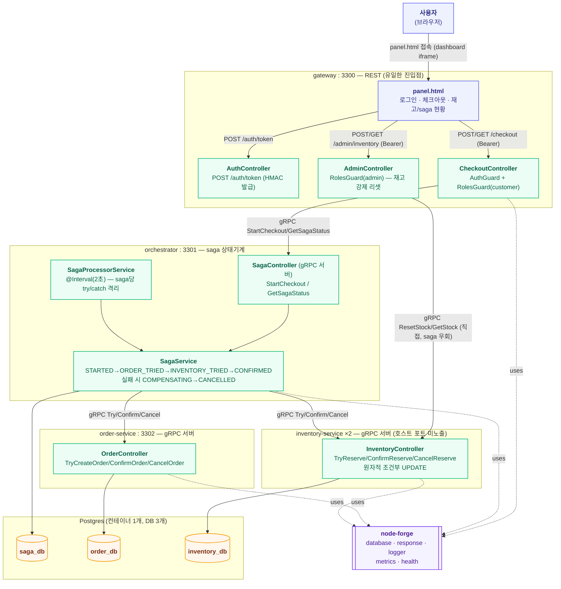

# msa-checkout 아키텍처

API 게이트웨이(인증/인가/라우팅) + gRPC 서비스 간 통신 + orchestration saga(분산 트랜잭션)를
하나의 실험 안에서 통합 검증하는 forge-lab의 4번째 실험. 앞선 세 실험(waiting-room,
live-ranking, order-outbox)이 공통으로 남긴 공백 — "같은 서비스의 인스턴스 여러 개가 같은
자원에 동시 접근할 때의 정합성"이 한 번도 실측된 적 없다는 점 — 을 이번 실험에서 다룬다.
레포 전체 구조는 dashboard의 **Architecture ▸ 전체** 탭(`docs/architecture.md`) 참고.

gRPC와 게이트웨이 HMAC 인증은 forge-lab에서 처음 다루는 영역이라, node-forge에 바로 얹지
않고 이 실험 안에서 로컬로 구현 후 검증했다 — 근거는 아래 "이 실험만의 설계 결정" 참고.

## 런타임 구조

하나의 npm workspace(`services/msa-checkout`)에 4개 프로세스. inventory-service는
`docker compose up --scale inventory-service=2`로 2개 인스턴스로 뜬다 — 이 실험의 다중
인스턴스 검증 대상.



## saga 상태기계

```
STARTED → ORDER_TRIED → INVENTORY_TRIED → CONFIRMED               (해피 패스)
                              └─(재고 부족)→ COMPENSATING → CANCELLED  (보상, order.CancelOrder 호출)
        └─(order Try 실패, 사실상 미발생)→ FAILED
```

order Try를 먼저(항상 성공), inventory Try를 나중에(재고 제약으로 실패 가능) 두도록 의도적으로
설계했다 — 재고 부족이라는 이 실험의 핵심 실패 시나리오가 **order-service의 CancelOrder gRPC
호출까지 실제로 exercise**하게 만들기 위함(반대 순서였다면 CancelOrder는 이 실험에서 한 번도
호출되지 않는 죽은 경로가 됐을 것). Confirm 단계는 TCC 원칙대로 실패해도 되돌리지 않고 다음
폴링에서 재시도한다(둘 다 Try가 성공한 뒤에 되돌리면 한쪽만 확정되는 더 심각한 불일치가 생길
수 있음).

## API

### gateway (port 3300, 유일한 REST 진입점)

| 메서드 | 경로 | 설명 |
|---|---|---|
| POST | `/auth/token` | `{ userId, role }` → HMAC 서명 토큰 발급(TTL 15분). 실제 유저 스토어 없는 랩 전용 단순화 |
| POST | `/checkout` | `{ productId, quantity }`, `customer` 권한 필요. saga를 시작하고 `sagaId` 즉시 반환(진행은 비동기) |
| GET | `/checkout/:sagaId` | saga 상태 조회. `customer`/`admin` |
| POST | `/admin/inventory/:productId/reset` | 재고를 지정한 값으로 강제 리셋. `admin` 권한 필요, saga를 거치지 않고 inventory-service를 직접 호출 |
| GET | `/admin/inventory/:productId` | 재고 조회(total/reserved/available). `customer`/`admin` |
| GET | `/health`, `/metrics` | 프로세스 자체는 외부 상태가 없어 체커 없이 등록 |
| GET | `/panel.html` | 패널 UI |

### orchestrator (port 3301, gRPC 3301→50051)

내부 전용 gRPC 서비스(`CheckoutSagaService`) — `StartCheckout`, `GetSagaStatus`. `/health`,
`/metrics`(saga DB 헬스체크)만 REST로 노출.

### order-service (port 3302, gRPC 50052) / inventory-service (호스트 포트 미노출, gRPC 50053)

각자 `OrderService`/`InventoryService` gRPC(`TryX`/`ConfirmX`/`CancelX`)만 노출, `/health`는
내부 네트워크에서만 접근 가능. inventory-service는 추가로 `ResetStock`/`GetStock`(gateway의
admin 라우트 전용).

## DB 스키마 (Postgres 컨테이너 1개, database 3개로 분리 — `docker/init-db.sql`)

| DB | 테이블 | 주요 컬럼 |
|---|---|---|
| `saga_db` | `saga_instances` | `id`, `userId`, `productId`, `quantity`, `status`, `orderId`(nullable), `reservationId`(nullable), `lastError`(nullable), `updatedAt`(ISO 문자열, 전이마다 갱신) |
| `order_db` | `orders` | `id`, `sagaId`(unique — 멱등성 키), `userId`, `productId`, `quantity`, `status`(PENDING/CONFIRMED/CANCELLED) |
| `inventory_db` | `inventory` | `productId`(PK), `total`, `reserved` — `available = total - reserved` |
| `inventory_db` | `reservations` | `id`, `sagaId`(unique — 멱등성 키), `productId`, `quantity`, `status`(RESERVED/CONFIRMED/CANCELLED) |

세 DB 다 같은 Postgres 컨테이너 안(랩 전용 타협, 컨테이너 수 절감)이지만, 서비스 간 직접 SQL
조인은 하지 않는다 — 항상 gRPC로만 통신한다는 원칙은 지킨다.

## 이 실험만의 설계 결정

| 결정 | 이유 |
|---|---|
| gRPC/인증을 node-forge로 바로 올리지 않고 로컬 구현 후 검증 | 이 실험이 처음 필요로 하는 영역이라 API 모양을 검증 없이 추측하지 않기 위해서(`principles.md`의 "두 번째 필요 사례가 생길 때 추출" — s3-forge를 기각했던 것과 같은 논리). gRPC 라운드로빈 헬퍼는 검증 후 제안서 작성 완료(`proposals/node-forge/20260725/20260725-grpc-multi-instance-lb.md`) |
| gateway는 인증/인가/라우팅만, saga 로직은 orchestrator로 완전히 분리 | 사용자 요청("API 게이트웨이에서 인증인가, 라우팅을 담당")을 문자 그대로 반영 — gateway가 비즈니스 로직을 가지면 "게이트웨이"라는 이름이 무색해짐 |
| 분산 트랜잭션 = orchestration saga (gRPC 기반), choreography(Kafka) 아님 | choreography로 가면 gRPC가 트랜잭션 조율에서 빠지게 되어 "gRPC로 분산 트랜잭션을 관리한다"는 이번 실험의 취지와 어긋남(사용자와 논의로 확정) |
| Try 순서를 order → inventory로 (재고 먼저가 아니라) | 재고 부족(이 실험의 핵심 실패 시나리오)이 발생했을 때 반드시 order-service의 CancelOrder gRPC 호출이 exercise되도록 — 순서를 반대로 하면 CancelOrder가 정상 흐름에서 한 번도 안 불리는 죽은 경로가 됨 |
| Confirm 부분 실패는 보상하지 않고 재시도 | TCC 원칙 — Try가 둘 다 성공한 뒤에 되돌리면 한쪽만 확정되고 한쪽만 취소되는 더 심각한 불일치가 생길 수 있음. `orchestrator`가 죽었다 재기동해도 `fetchPending`이 터미널이 아닌 saga를 전부 다시 집어서 이어가므로 안전 |
| SagaProcessorService가 saga 하나씩 개별 try/catch로 처리 | kafka-forge `OutboxPublisher`가 겪었던 "배치 중 하나 실패 시 전체 중단·중복 재발행" 버그(order-outbox 라운드에서 실제로 재현하고 제안서로 고친 바로 그 버그)를 이 실험에서 반복하지 않기 위해 처음부터 격리해서 구현 |
| inventory Try는 원자적 조건부 UPDATE(`WHERE total - reserved >= qty`) | SELECT 후 애플리케이션에서 조건 검사하는 2단계 방식은 TOCTOU라 다중 인스턴스 상황에서 재고가 마이너스로 내려갈 수 있음 |
| gRPC 클라이언트에 `dns:///` 스킴 + `round_robin` LB 명시 | grpc-js 기본 정책(`pick_first`)은 최초 연결한 인스턴스에 고정돼서, Docker가 서비스명 하나로 여러 인스턴스를 돌려줘도(임베디드 DNS round-robin) 실제로는 한쪽만 계속 쓰게 됨 — 다중 인스턴스 검증의 전제 조건이라 명시적으로 설정 |
| inventory-service는 호스트 포트를 노출하지 않음 | 2개 인스턴스로 스케일되므로 고정 호스트 포트 매핑이 애초에 불가능 — orchestrator/gateway만 내부 Docker 네트워크(`dns:///inventory-service:50053`)로 접근 |
| `orders`/`reservations`에 `sagaId` unique 컬럼으로 멱등성 확보 | orchestrator가 네트워크 오류 후 같은 sagaId로 Try를 재시도해도(폴러가 다음 tick에 다시 호출) 주문/예약이 중복 생성되지 않음 |
| 재고 리셋(`ResetStock`)은 saga를 거치지 않고 gateway → inventory-service 직접 호출 | 테스트/데모용 관리 작업이지 트랜잭션이 아니라서, orchestrator를 끼워 넣을 이유가 없음(다른 실험들의 test-only trigger 컨벤션과 동일한 성격) |
| 인증은 `@nestjs/jwt`(jsonwebtoken) 기반 JWT — 처음엔 waiting-room의 HMAC 토큰 패턴을 재사용했다가 교체 | HMAC 직접 구현은 이 실험 하나만의 검증 목적으로는 충분했지만, "forge는 forge-lab만이 아니라 실서비스 고도화가 목적이고, 회원 인증의 bearer 토큰은 사실상 JWT가 표준"이라는 판단(사용자 논의)에 따라 실제로 JWT로 교체해 발급/검증/변조 거부/만료를 전부 실제 컨테이너에서 재현한 뒤 node-forge 제안서를 작성(`proposals/node-forge/20260725/20260725-jwt-auth-module.md`). 유저 스토어 없이 `userId+role`을 그대로 클레임(`sub`/`role`)에 담아 서명하는 것은 여전히 랩 전용 단순화 |
| vitest로 saga 상태기계를 fake OrderClient/InventoryClient로 검증 (order-service/inventory-service를 실제로 안 띄우고) | waiting-room/live-ranking의 FakeRedisClient와 동일한 패턴을 gRPC 클라이언트 인터페이스에도 적용 — `OrderClient`/`InventoryClient` 인터페이스로 실 구현과 fake를 분리 |

## 검증 이력 (2026-07-25)

`docker compose up --build -d --scale inventory-service=2`로 5개 컨테이너(gateway,
orchestrator, order-service, inventory-service ×2, postgres) 기동. 최초 기동 시 `/app/proto`
경로 오류(gRPC 서버 3개 전부 부팅 실패)를 겪음 — `copy:proto` 스크립트가 proto를
`dist/proto/`(dist 안쪽)로 복사했는데, 코드는 `dist`와 형제 디렉토리인 `proto/`를 찾고
있었음. `public`과 동일하게 Dockerfile 런타임 스테이지에서 `proto/`를 `dist`의 형제로 복사하는
쪽으로 통일해서 해결 — 이 수정 이후 재빌드하니 4개 프로세스 전부 `/health` 정상.

- **해피 패스**: `POST /checkout`(widget-plenty, qty 2) → 5.5초 후 `GET /checkout/:sagaId`에서
  `status: "CONFIRMED"`, `orderId`/`reservationId` 둘 다 채워진 것 확인
- **보상 트랜잭션**: widget-scarce 재고를 admin으로 0까지 리셋한 뒤 체크아웃 → saga가
  `status: "CANCELLED"`, `reservationId: ""`(재고 예약은 애초에 성공한 적 없음),
  `lastError: "재고가 부족합니다"`로 종료. **order-service의 실제 Postgres 행을
  `docker exec psql`로 직접 조회**해서 `status = 'CANCELLED'`인 것까지 확인(orchestrator가
  주장만 하는 게 아니라 실제로 CancelOrder gRPC가 도달했음을 raw SQL로 재확인)
- **다중 인스턴스 정합성**: widget-scarce 재고를 1로 리셋 후 동시 체크아웃 2건(`curl ... &` +
  `wait`로 거의 동시에 발사) → 정확히 1건은 `CONFIRMED`(orderId+reservationId 보유), 나머지
  1건은 `CANCELLED`(`lastError: "재고가 부족합니다"`)로 갈라짐. 최종 재고
  `{ total: 0, reserved: 0, available: 0 }` — 마이너스로 내려가지 않음(원자적 조건부 UPDATE가
  실제로 두 인스턴스 간 경쟁에서도 정합성을 지킴)
- **gRPC 라운드로빈 실측**: widget-plenty로 체크아웃 10건을 동시 발사하기 전/후 두
  inventory-service 인스턴스의 `docker stats` NET I/O를 비교 — 인스턴스1 `16.8kB→30.2kB`(+13.4kB),
  인스턴스2 `22.9kB→36.3kB`(+13.4kB)로 **거의 동일한 양만큼 둘 다 증가** — `dns:///` +
  `round_robin` 설정이 없었다면(기본값 `pick_first`) 한쪽만 늘고 다른 쪽은 그대로였을 상황.
  10건 전부 `CONFIRMED`로 정상 처리됨도 함께 확인
- **인증/인가**: 만료된 토큰(TTL 15분 경과)으로 요청 시 `401 Unauthorized` 확인(재현 과정에서
  실제로 발생 — 버그 아님, 정상 동작). `admin` 전용 재고 리셋을 `customer` 토큰으로 시도하면
  `403 Forbidden`, 메시지에 필요한 role이 정확히 표시되는 것 확인
- vitest 31개(가드/토큰 9, order-service 5, inventory-service 11, saga 상태기계 6) 전부 통과,
  `tsc --noEmit` 클린
- 검증 후 `TRUNCATE orders`, `TRUNCATE inventory, reservations`, `TRUNCATE saga_instances` +
  inventory-service 재기동으로 초기 재고(widget-plenty 1000 / widget-scarce 1) 재시드 확인

### 후속 (2026-07-25) — orchestrator 크래시 복구 실제 재현

이전 라운드에서 "코드/vitest로만 확인, 실제 강제 종료는 미재현"으로 남겨뒀던 검증 공백을
메웠다.

**방법**: 체크아웃 요청 직후 `docker exec ... psql`로 saga 상태를 0.3초 간격 타이트 폴링하다가
`ORDER_TRIED`(order Try는 성공, inventory Try는 아직 실행 전) 순간을 잡아 `docker kill`로
orchestrator 컨테이너를 즉시 강제 종료 — 이론적 크래시 시나리오가 아니라 saga가 실제로
중간 상태에 멈춰 있는 정확한 타이밍을 실측으로 잡아냈다.

**확인된 것**:
- 킬 직후: `saga_instances.status = 'ORDER_TRIED'`로 멈춰 있음(더 진행되지 않음),
  `order_db.orders`에는 주문이 `PENDING`으로 이미 존재, `inventory_db.reservations`에는
  아무 행도 없음 — 정확히 예상한 중간 상태
- `docker compose start orchestrator`로 재기동 후, **새로운 `StartCheckout` 호출 없이도**
  폴러가 기존 saga를 자동으로 집어 `INVENTORY_TRIED` → `CONFIRMED`까지 이어서 완료
- `order_db.orders`의 `id`가 크래시 전과 재기동 후 **동일**(중복 생성되지 않음), 최종
  `status`도 `CONFIRMED`로 정확히 반영
- `inventory_db.reservations`에 새 예약 1건이 정상 생성되고 `CONFIRMED`로 반영(재기동 후
  처음으로 inventory Try가 실행됐으므로 새로 생기는 게 맞음)

**부수 발견(버그 아님, 운영 특성)**: `restart: unless-stopped` 정책이 설정돼 있었지만
`docker kill`(SIGKILL) 직후 자동 재시작이 즉시 일어나지 않아 명시적으로
`docker compose start orchestrator`로 재기동시켜야 했다 — Docker의 재시작 백오프 동작으로
추정되며 이 실험의 정합성 결론과는 무관. 실서비스라면 오케스트레이터(k8s 등)의 liveness probe
기반 재시작에 맡길 부분이라 별도 조치 없이 관찰 사실로만 기록.

**검증**: 크래시 재현 후 데이터 정리(`TRUNCATE` 3개 DB) + 재고 재시드(1000/1) 완료.

### 후속 (2026-07-25) — HMAC 자체 구현을 JWT(`@nestjs/jwt`)로 교체

"forge는 forge-lab 검증용이 아니라 실제 forge 고도화가 목적이고, 회원 인증의 bearer 토큰은
JWT가 사실상 표준"이라는 논의 끝에, `AuthTokenService`를 HMAC 직접 구현에서
`@nestjs/jwt`(jsonwebtoken 래퍼) 기반으로 교체하고 실제 컨테이너에서 재검증했다.

**변경**: `issue()`는 `JwtService.sign({ sub: userId, role })`, `verify()`는
`JwtService.verify()`(실패 시 예외 → catch해서 null)로 교체. `AuthGuard`/`RolesGuard`
인터페이스는 그대로라 호출부 변경 없음. `gateway.module.ts`에 `JwtModule.register({ secret,
signOptions: { expiresIn } })` 추가.

**실제 컨테이너 검증**:
- 발급된 토큰이 표준 JWT 구조(`header.payload.signature`, 3-segment)이고, payload를 디코딩하면
  `{ sub, role, iat, exp }` 표준 클레임이 실제로 들어있는 것 확인
- payload를 직접 조작해(`role: "customer"` → `"admin"`) 서명은 그대로 붙인 변조 토큰으로
  admin 리소스 접근 시도 → `401 Unauthorized`(서명 불일치로 거부), 원본 토큰으로는 정상 접근
  되는 것과 대조 확인
- TTL을 3초로 낮춘 임시 컨테이너(`docker compose run`)를 별도로 띄워 발급 직후엔 성공, 4초
  대기 후엔 실제로 `401`(만료)이 되는 것을 실측(vitest의 fake timer 검증과 별개로 real
  wall-clock 만료를 실제 컨테이너에서 재현)
- vitest 33개(JWT 변조/만료/타 secret 거부 테스트 포함) 전부 통과

**계획과의 차이**: 없음 — 사용자와 논의로 확정한 방향 그대로 진행.

**잔존 작업**: 없음. waiting-room의 HMAC 입장 토큰(admission ticket)은 이번 교체 대상이
아니다 — 그건 "반복 가능한 API 인증 자격증명"이 아니라 "1회성 입장권 + Redis TTL"로 성격이
달라서, JWT로 바꿀 이유가 없다고 판단해 그대로 뒀다.

관련 플랜: `.claude-plans/20260725/msa-checkout.md` (실행 이력 포함).
