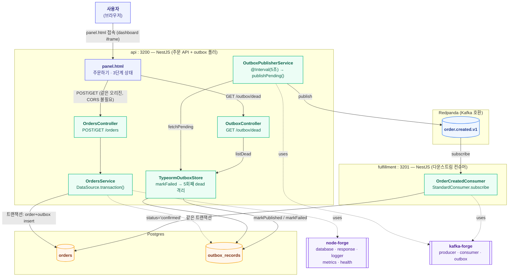

# order-outbox 아키텍처

트랜잭셔널 아웃박스 패턴. forge-lab의 세 번째 실험이며, waiting-room(node-forge: redis 등),
live-ranking(kafka-forge: producer/consumer/재시도/DLQ/멱등성)에 이어 지금까지 안 건드려본
**node-forge의 `database`**(TypeORM)와 **kafka-forge의 `OutboxPublisher`/`OutboxStore`**를
검증한다. "DB 쓰기와 이벤트 발행을 어떻게 원자적으로 묶는가"(dual-write 문제)를 실제로
구현해서 확인한다. 레포 전체 구조는 dashboard의 **Architecture ▸ 전체** 탭
(`docs/architecture.md`) 참고.

## 런타임 구조

하나의 npm workspace(`services/order-outbox`)이지만, live-ranking처럼 api(주문 API + outbox
폴러)와 fulfillment(다운스트림 컨슈머)가 서로 다른 프로세스/포트로 뜬다. 다만 이유는
live-ranking과 다르다 — live-ranking은 두 프로세스 다 진짜 HTTP API를 갖고 있어서 분리가
자연스러웠고, 여긴 HTTP API가 api 프로세스 하나뿐이다(fulfillment는 health/metrics만). 그래도
"나중에 fulfillment가 진짜 다른 팀/서비스가 될 수 있다"는 가정 아래 처음부터 분리하는 쪽을
선택했다.

## API

### api (port 3200)

| 메서드 | 경로 | 설명 |
|---|---|---|
| POST | `/orders` | 주문 생성. `{ item, amount }` — 주문 저장과 outbox 기록을 하나의 트랜잭션으로 커밋 |
| GET | `/orders` | 최근 주문 목록. 각 항목에 `stage`(created/published/confirmed) 포함 |
| GET | `/orders/:id` | 단건 조회 |
| GET | `/admin/outbox/dead` | dead-lettered outbox 레코드 목록/개수 — 발행 5회 연속 실패 시 격리된 레코드 확인용(admin/test 네이밍 컨벤션 적용, 기존 `/outbox/dead`에서 이동) |
| POST | `/admin/outbox/dead/:id/revive` | 죽은 레코드 복구 — `deadAt`/`attempts`/`lastError`를 리셋하고, poison topic이었으면 정상 topic으로 고쳐서 다음 폴링에 재발행되게 함. 없거나 안 죽은 id면 `E9404` |
| GET | `/admin/logs/stream` | SSE — created/published 이벤트 실시간 스트림(node-forge 1.0.9 `AdminEventsModule`) |
| GET | `/health` | Postgres + Kafka 연결 상태 (5초 캐싱) |
| GET | `/metrics` | node-forge 기본 지표 + `order_outbox_orders_created_total` + kafka-forge 발행 지표 |
| GET | `/panel.html` | 패널 UI (dashboard가 iframe으로 띄움) |

### fulfillment (port 3201)

| 메서드 | 경로 | 설명 |
|---|---|---|
| GET | `/admin/logs/stream` | SSE — confirmed 이벤트 실시간 스트림(node-forge 1.0.9 `AdminEventsModule`). api와 별도 프로세스라 자기 포트에서 자기 이벤트만 방송 — panel.html이 CORS로 cross-origin 구독 |
| GET | `/health` | Postgres + Kafka 연결 상태 |
| GET | `/metrics` | node-forge 기본 지표 + kafka-forge 소비 지표(`kafka_forge_consumed_total`, `kafka_forge_handled_total` 등) |

fulfillment는 별도 비즈니스 API가 없다 — api가 같은 Postgres를 그대로 읽어서 주문 상태를
보여주므로 조회 API를 중복으로 둘 필요가 없다.

## DB 스키마 (Postgres, `synchronize: true`로 자동 생성 — 랩 전용, 마이그레이션 도구 없음)

| 테이블 | 주요 컬럼 | 용도 |
|---|---|---|
| `orders` | `id`(app에서 uuid 생성), `item`, `amount`, `status`(pending/confirmed), `createdAt`, `confirmedAt`(nullable, ISO 문자열) | 주문 본체. `status`/`confirmedAt`은 fulfillment가 최초 1회만 세팅(재배달돼도 안 덮어씀) |
| `outbox_records` | `id`, `topic`, `key`, `payload`(simple-json), `createdAt`, `publishedAt`(nullable, ISO 문자열), `attempts`(int, default 0), `lastError`(nullable), `deadAt`(nullable, ISO 문자열) | kafka-forge `OutboxStore` 계약. `publishedAt`이 null이면 미발행, `attempts`가 `OUTBOX_MAX_ATTEMPTS`(5)에 도달하면 `deadAt` 세팅 후 `fetchPending`에서 영구 제외(dead-letter) |

패널의 3단계(`생성됨`/`발행됨`/`확인됨`)는 두 테이블을 조합해서 계산한다 —
`orders.status`가 `confirmed`면 확인됨, 아니면 매칭되는 `outbox_records.publishedAt`이
있으면 발행됨, 없으면 생성됨. `GET /orders`, `GET /orders/:id`는 이 계산된 `stage`뿐 아니라
`publishedAt`/`confirmedAt` 실제 시각도 그대로 내려준다(아래 "폴링과 이벤트 로그" 참고).

## Kafka 토픽

| 토픽 | 용도 |
|---|---|
| `order.created.v1` | 주문 생성 이벤트. `createTopicName("order", "created", 1)`로 생성 |

## 이 실험만의 설계 결정

| 결정 | 이유 |
|---|---|
| Redis 없음 | waiting-room/live-ranking 둘 다 Redis를 썼는데, 이번엔 node-forge의 `database`(TypeORM)를 검증하는 게 목적이라 저장은 전부 Postgres로만. 멱등성도 outbox row 자체(같은 트랜잭션에 커밋)로 해결돼서 별도 Redis 멱등성 저장소가 필요 없었음 |
| id를 `@BeforeInsert()` 훅이 아니라 서비스 코드에서 직접 `randomUUID()`로 생성 | TypeORM의 라이프사이클 훅은 실제 엔티티 인스턴스에만 붙고, `manager.save(Entity, plainObject)`처럼 plain object를 그대로 저장할 때는 발동하지 않는다는 걸 테스트 중 발견 — 훅에 의존하지 않고 호출부에서 명시적으로 생성하는 쪽으로 변경 |
| `outbox_records.publishedAt`을 `Date` 컬럼이 아니라 ISO 문자열(`varchar`)로 저장 | Postgres는 `timestamp`, SQLite(테스트용)는 `datetime`만 인식하는 등 드라이버마다 타입 이름이 갈려서, 문자열로 두면 드라이버 무관하게 동일하게 동작 — 실 DB 없이 테스트로 진짜 쿼리를 검증할 수 있게 됨 |
| `payload` 컬럼은 Postgres `jsonb` 대신 `simple-json` | payload 안쪽 필드로 쿼리할 일이 없어서(항상 `key`/`publishedAt`으로만 조회), TypeORM의 `simple-json`(JSON.stringify 기반, 드라이버 무관)으로 충분 — 위와 같은 이유로 테스트 이식성도 확보 |
| vitest에서 실제 SQLite in-memory(`better-sqlite3`)로 검증 | TypeORM의 Repository/QueryBuilder API 표면이 넓어서 waiting-room/live-ranking처럼 손으로 fake DB를 만드는 대신, 실제로 초기화되는 가벼운 DB로 트랜잭션·`IsNull`·`In` 같은 진짜 동작을 검증하는 쪽을 선택 |
| 컬럼 타입을 전부 명시 (`@Column("varchar")` 등, 타입 추론 생략형 안 씀) | vitest가 쓰는 esbuild 트랜스폼은 `emitDecoratorMetadata`를 방출하지 않아서, TypeORM이 리플렉션으로 타입을 추론하는 방식의 데코레이터는 테스트 환경에서 실패함 |
| DLQ 관측성(전용 뷰어 UI) 재구현 안 함 | live-ranking에서 이미 검증된 기능이라 스코프 아웃, `StandardConsumer` 기본 재시도/DLQ만 사용 |
| `synchronize: true` | 마이그레이션 도구 없이 엔티티로 테이블 자동 생성 — 랩 환경이라 이 정도로 충분(실 서비스라면 지양해야 하는 설정임을 인지) |
| ~~(알려진 한계, 미해결)~~ kafka-forge `OutboxPublisher.publishPending()`의 배치 중 일부 실패 시 부분 재발행/영구 블로킹 | **kafka-forge 1.0.5에서 해결.** 실제로 재현(포이즌 topic row 삽입 → `produced_total`이 5초마다 중복 증가, 뒤쪽 정상 row는 영구히 미발행)한 뒤 두 건의 제안서(`proposals/kafka-forge/20260719/`)를 작성해 반영시켰다: (1) 배치 중 한 건이 실패해도 이미 성공한 건들은 계속 `markPublished`하고 다음 row로 넘어가도록 수정, (2) `OutboxStore`에 선택적 `markFailed?(id, error)` 훅 추가. 아래 두 행 참고 |
| `OUTBOX_MAX_ATTEMPTS`(5)·dead-letter 정책은 서비스가 소유, kafka-forge는 훅만 제공 | kafka-forge의 원칙("저장소 구현에 의존하지 않는다, 확장 지점은 인터페이스로만 제공") — `maxAttempts`/`markDead`를 `OutboxPublisher` 자체에 넣는 대신, `IdempotencyStore.claim`/`release`와 같은 선례를 따라 `markFailed` 훅 하나만 kafka-forge에 추가하고, "몇 번 실패하면 죽었다고 볼지"·"죽은 레코드를 어떻게 다룰지"는 전부 `TypeormOutboxStore`(이 서비스) 책임으로 뒀다 |
| dead-letter 유발을 위한 전용 테스트 트리거(`OUTBOX_POISON_ITEM`) | 임의 topic을 직접 지정할 수 있는 API를 노출하는 대신, live-ranking의 `DLQ_TEST_USER_ID` 컨벤션과 동일하게 "특정 상품명(`__outbox-fail__`)으로 주문하면 서버가 내부적으로 유효하지 않은 topic을 넣는다"는 방식으로 재현 경로를 안전하게 제한 |
| `orders.confirmedAt`은 fulfillment가 "이미 있으면 갱신 안 함" 조건으로 세팅 | 카프카 재배달로 같은 이벤트가 다시 처리돼도(핸들러 자체는 멱등이라 안전) `confirmedAt`이 재배달 시각으로 덮여쓰이면 "최초로 확인된 시각"이라는 관측 정보가 훼손된다 — `WHERE confirmedAt IS NULL` 조건으로 최초 1회만 기록 |
| 패널 이벤트 로그는 폴링 snapshot이 아니라 서버가 내려주는 `publishedAt`/`confirmedAt` 실제 시각으로 재구성 | outbox 폴링 간격(5초)에 비해 발행→소비(카프카 컨슈머 반응)는 보통 수십~수백ms 안에 끝나서, 패널의 1초 폴링이 "발행됨" 상태를 거의 항상 놓친다(실측: 발행 12ms 뒤 확인됨). "지금 상태가 뭐냐"만 폴링해서 전이를 로그로 남기면 중간 단계가 통째로 빠질 수 있어서, 서버가 실제 발행/확인 시각을 함께 내려주고 클라이언트는 그 시각 기준으로 로그를 재구성한다 — 폴링 방식 자체는 그대로 두고(waiting-room/live-ranking과 동일 컨벤션), 폴링이 실어오는 정보만 풍부하게 만든 것 |

## 검증 이력 (2026-07-19)

- `docker compose up --build -d`로 4개 컨테이너(api, fulfillment, postgres, redpanda) 기동 —
  Postgres가 아직 안 떴을 때의 일시적 `ECONNREFUSED`는 `restart: unless-stopped`로 자연스럽게
  복구됨(live-ranking의 redpanda 초기 기동 지연과 같은 패턴)
- `POST /orders`로 주문 생성 → 즉시 `stage: "created"` 확인 → 약 12초 후 `stage: "confirmed"`로
  전환된 것 확인(outbox 폴러 발행 → fulfillment 컨슈머 반영까지 실제로 재현)
- `order_outbox_orders_created_total`(api), `kafka_forge_produced_total`(api),
  `kafka_forge_consumed_total`/`kafka_forge_handled_total`(fulfillment) 지표가 모두 1로
  정확히 찍히는 것 확인
- panel.html 정상 서빙 확인
- vitest 15개(이벤트 스키마 5, TypeormOutboxStore 4, OrdersService 6) 전부 통과 — 실제
  SQLite in-memory DB로 트랜잭션/조회 로직까지 검증

### 후속 (2026-07-19) — 이벤트 로그가 "발행됨"을 건너뛰던 문제

실제 사용자 테스트에서 "발행됨을 안 거치고 바로 확인됨으로 넘어간다"는 리포트 발견. 원인은
버그가 아니라 폴링 주기(1초)보다 발행→소비 지연이 훨씬 짧아서(실측 12ms) 패널이 그 상태를
관측할 기회 자체가 거의 없었던 것 — 폴링 방식 자체는 유지하고, 서버가 실제 시각을
같이 내려주도록 고쳤다.

- `entities/order.entity.ts` — `confirmedAt`(nullable, ISO 문자열) 추가
- `fulfillment/order-created.consumer.ts` — `confirmedAt`을 `WHERE confirmedAt IS NULL`
  조건으로 최초 1회만 세팅
- `api/orders.service.ts` — `OrderView`에 `publishedAt`/`confirmedAt` 노출
- `public/panel.html` — 이벤트 로그를 poll snapshot 비교 대신 `publishedAt`/`confirmedAt`
  존재 여부 + "이미 로그로 남긴 전이인지" 추적(`loggedTransitions`)으로 재작성, 로그 시각도
  `new Date()`가 아니라 실제 전이 시각으로 표시
- `orders.service.test.ts` — publishedAt/confirmedAt 노출 검증 추가

**검증**: 주문 생성 → 8초 후 조회 시 `publishedAt`/`confirmedAt`이 실제 값으로 채워지는 것
확인(예시: 발행 08:57:29.108 → 확인 08:57:29.120, 12ms 차이). panel.html 반영 확인, vitest
15개 유지하며 통과.

### 후속 (2026-07-19) — kafka-forge 1.0.5 채택: outbox 부분 실패/영구 블로킹 수정 + dead-lettering

"냉정하게 평가해달라"는 요청으로 `OutboxPublisher.publishPending()` 소스를 읽다가 발견한 버그를
직접 재현: `docker exec ... psql`로 정상 row 1건 → 독성 topic row 1건 → 정상 row 1건을 순서대로
삽입하고 api 컨테이너를 재시작해서 관찰한 결과,

- `kafka_forge_produced_total`이 40초 동안 5씩 증가 — 앞쪽 정상 row가 5초마다 **중복 발행**됨
  (배치 중 하나가 실패하면 그 이전에 이미 성공한 것도 `markPublished`가 호출되지 않고 예외가
  던져졌기 때문)
- `kafka_forge_produce_errors_total{topic="invalid topic name!!!"}`이 9까지 무한정 증가 —
  재시도 제한 없음
- 세 번째(뒤쪽) 정상 row는 테스트 기간 내내 `publishedAt`이 계속 null — 독성 row에 **영구히
  막힘**(head-of-line blocking)

이걸 근거로 두 건의 제안서를 작성해 알렸고, 사용자가 kafka-forge 1.0.5로 반영:
- `20260719-outbox-publisher-partial-failure.md` — 배치 처리 루프가 개별 row 실패에 더 이상
  `throw`하지 않고 로그만 남긴 채 계속 진행, 이미 성공한 건은 항상 `markPublished`
- `20260719-outbox-store-mark-failed-hook.md` — `OutboxStore`에 선택적 `markFailed?(id, error)`
  훅 추가 (정책은 전부 구현체 책임)

이 서비스 쪽 구현:
- `entities/outbox-record.entity.ts` — `attempts`(int, default 0), `lastError`(nullable),
  `deadAt`(nullable, ISO 문자열) 컬럼 추가
- `api/typeorm-outbox-store.ts` — `markFailed(id, error)`(5회째 `deadAt` 세팅), `listDead(limit)`
  구현, `fetchPending`에서 `deadAt IS NULL` 조건 추가
- `api/outbox.controller.ts` — `GET /outbox/dead` 신규
- `api/orders.service.ts` — `item === OUTBOX_POISON_ITEM`이면 outbox row의 topic을 일부러
  유효하지 않은 문자열(`OUTBOX_POISON_TOPIC`)로 저장
- `public/panel.html` — "죽은 outbox 레코드" 카드(개수 + 목록) + "발행 실패 유발" 버튼 추가
- 테스트 3건 추가(반복 실패 시 유지/5회째 dead 전이/존재하지 않는 id 무시) — 총 19개, 전부 통과

**검증(2026-07-19, `docker compose up --build -d` 후 실제 컨테이너 대상)**: 사전 정상 주문 →
포이즌 주문(`__outbox-fail__`) → 사후 정상 주문 순서로 3건 생성 후 25초 대기(5초 간격 ×
`OUTBOX_MAX_ATTEMPTS`=5회) 결과,
- 사전 주문: `stage: "confirmed"` 정상
- 포이즌 주문: `stage: "created"`로 영구 고정(정상 동작), `GET /outbox/dead`에
  `attempts: 5`, `lastError: "The request attempted to perform an operation on an invalid
  topic"`, `deadAt` 세팅된 것 확인
- **사후 주문도 `stage: "confirmed"`로 정상 처리** — 포이즌 레코드에 더 이상 막히지 않음(수정 전
  버그였던 영구 블로킹 해소 확인)
- `kafka_forge_produced_total{topic="order.created.v1"}` = 2 (사전+사후, 중복 없음),
  `kafka_forge_produce_errors_total{topic="invalid topic name!!!"}` = 5 (정확히
  `OUTBOX_MAX_ATTEMPTS`에서 멈추고 더 이상 증가하지 않음 — 무한 재시도 해소 확인)

테스트 데이터는 검증 후 `TRUNCATE orders, outbox_records`로 정리.

관련 플랜: `.claude-plans/20260719/order-outbox-pipeline.md` (실행 이력 포함).

### 후속 (2026-08-01) — 공유 패널 UI + admin API 네이밍 통일 + SSE 로그 스트리밍

`dashboard-panel-expansion` 플랜(`.claude-plans/20260801/dashboard-panel-expansion.md`)의
1~3단계를 적용:

- **공유 패널 UI**: `panel.html`의 카드/버튼/폼/로그/가이드 CSS를 `@forge-lab/panel-ui`(신규
  워크스페이스 패키지, `services/shared-panel-ui/`)로 이동. `main.ts`(api)가
  `require.resolve("@forge-lab/panel-ui/package.json")`로 위치를 찾아 `/shared/*`로 마운트.
  이 과정에서 Docker 빌드 컨텍스트가 서비스 디렉토리 단위였던 게 npm workspace 심볼릭 링크를
  못 찾는 구조적 문제라는 걸 발견 — `docker-compose.yml`/`Dockerfile`을 레포 루트 빌드
  컨텍스트로 전면 재구성(사용자 확인 후 진행, 4개 실험 전부 동일 적용)
- **admin API 네이밍 통일**: `OutboxController`를 `/outbox` → `/admin/outbox`로 이동
  (`rules/project/convention.md`의 Admin/Test API 네이밍 규칙 적용, `panel.html`의
  `/outbox/dead` fetch도 `/admin/outbox/dead`로 동반 수정)
- **SSE 로그 스트리밍**: "생성→발행→확인" 3단계를 폴링 없이 실시간으로 보여주는 파일럿을
  api(`created`/`published`)와 fulfillment(`confirmed`, cross-origin+CORS) 양쪽에 구현

이 SSE 파일럿을 만들고 나서, `AdminEventsService`(rxjs `Subject` 브로드캐스터)와
`AdminLogsController`(`@Sse()` 래퍼) 두 파일이 order-outbox 도메인과 무관한 순수 인프라
코드라는 걸 확인 — 나머지 3개 서비스로 그대로 복붙하기 전에
`proposals/node-forge/20260801/20260801-admin-event-sse-stream.md` 제안서를 작성했고,
**같은 날 node-forge 1.0.9로 반영**돼서 바로 공식 API로 교체:

- `@paikpaik/node-forge/events`의 `AdminEventBus<T>` — 로컬 `AdminEventsService`와 동일한
  rxjs `Subject` 기반이지만, `emit()`이 `(type, message)` 2개 인자가 아니라 이벤트 객체
  1개(`emit(event: T)`)를 받는 시그니처 — 호출부(`orders.service.ts`,
  `outbox-publisher.service.ts`, `order-created.consumer.ts`) 전부 `{ type, message, at }`
  객체를 직접 만들어 넘기도록 수정
- `@paikpaik/node-forge/events/nestjs`의 `AdminEventsModule.forRoot({ path })` — `ADMIN_EVENT_BUS`
  토큰 등록 + `<path>/stream` SSE 컨트롤러를 동적으로 함께 생성. `@Controller(path)`를 클래스
  선언이 아니라 함수 호출로 동적 적용하는 새로운 패턴이라, node-forge가 자체 smoke-test에서
  esbuild(tsup) 번들 dist에도 데코레이터 메타데이터가 살아있는지 미리 검증해둔 걸 확인
  (20260725 RolesGuard DI 버그와 같은 클래스의 문제를 이번엔 사전에 막음)
- 로컬 `admin-events.service.ts`/`admin-logs.controller.ts` 삭제, `admin-log-event.ts`(payload
  타입만 정의하는 파일)로 대체 — `OrdersModule`/`FulfillmentModule`이 각자
  `AdminEventsModule.forRoot({ path: "admin/logs" })`를 import하는 구조로 변경

**검증(2026-08-01, 실제 컨테이너 대상)**: 주문 1건 생성 → `curl -sN`으로 api(3200)와
fulfillment(3201)의 `/admin/logs/stream`을 동시에 구독해서 `created`(api) →
`published`(api) → `confirmed`(fulfillment) 3개 이벤트가 순서대로, 올바른 페이로드로
도착하는 것 확인. 최초 시도에서 fulfillment 쪽이 비어 있었던 건 컨테이너 재기동 직후 Kafka
컨슈머 그룹 리밸런스(~22초)가 안 끝난 상태에서 발행한 타이밍 문제였고, 리밸런스 완료 후
재시도하니 정상 수신 — node-forge 1.0.9 자체 회귀는 아님. 유닛 테스트 19개 전부 통과.

**잔존 작업**: SSE를 waiting-room/live-ranking으로 확산은 완료(2026-08-01, 아래 후속 참고).
msa-checkout은 포트 은닉 원칙과 충돌해 제외하기로 함.

### 후속 (2026-08-01) — 데드레터 레코드 복구(revive) API + UI

오랫동안 미뤄져 있던 P0 — 죽은 레코드를 확인만 할 수 있고 되살릴 방법이 없었던 공백을 메움.

- `TypeormOutboxStore.revive(id)`: `deadAt`/`attempts`/`lastError`를 리셋해서 `fetchPending()`
  대상으로 되돌린다. 이 랩에서 레코드가 죽는 유일한 원인은 데모용 poison topic(실제로
  유효하지 않은 문자열이라 재시도해도 항상 다시 실패)이라, 카운터만 리셋하면 20~25초 뒤
  다시 죽어서 "복구"가 아무 일도 안 한 것처럼 보인다 — 그래서 topic이 poison이면 정상
  `OrderCreated.topic`으로 같이 고쳐서, 실무의 "원인을 고친 뒤 재시도"를 시뮬레이션한다
- `OutboxController`에 `POST /admin/outbox/dead/:id/revive` 추가, 없거나 안 죽은 id면
  `ForgeBizError("E9404")`
- `public/panel.html`: 죽은 레코드 목록의 각 행에 "복구" 버튼 추가, 클릭 시 revive 호출 후
  주문/데드레터 목록 갱신
- 테스트 3건 추가(poison topic 복구 시 topic 수정 확인/안 죽은 레코드는 revived:false/존재
  하지 않는 id도 revived:false) — 총 22개, 전부 통과

**검증(2026-08-01, 실제 컨테이너)**: `__outbox-fail__` 주문 생성 → 27초 대기(재시도 5회
소진, 실제 dead-letter 발생 확인) → `POST .../revive` 호출 → 8초 뒤 해당 주문이 실제로
`stage: "confirmed"`(`publishedAt`/`confirmedAt` 둘 다 세팅)로 전이된 것 확인, 죽은
레코드 수도 감소 확인. 관측만 되던 걸 실제 대응까지 가능하게 만든 것을 end-to-end로
재현했다.

### 후속 (2026-08-01) — OutboxPublisherService.flush()에 try/catch 추가 (오래된 P0 해소)

`@Interval`의 `setInterval`은 콜백이 반환한 Promise를 기다리지 않는다 — `flush()` 안에서
`publishPending()`이 던지면 구조화된 pino 로그가 아니라 raw unhandled rejection으로만
남아서 검색/관측이 안 됐던 오래된 P0. kafka-forge의 `OutboxPublisher.publishPending()`
소스를 직접 읽어서 실제로 어디가 try/catch 밖인지 확인했다: 개별 레코드의 발행 실패는
1.0.5부터 내부에서 이미 흡수하지만(`console.error`로 자체 로깅), 맨 앞의
`await this.store.fetchPending(limit)`(DB 조회)는 그 밖에 있어서 DB 장애 시 그대로
던져진다.

- `flush()`를 `try { ... } catch (err) { this.logger.error(...) }`로 감쌈 — 다음 폴링
  주기는 `setInterval`이 알아서 계속 진행하므로 재시작 로직은 불필요

**검증(2026-08-01, 실제 컨테이너)**: 처음엔 redpanda를 내려서 재현을 시도했으나, kafka-forge
1.0.5가 이미 개별 레코드 실패를 내부에서 흡수해서(`[OutboxPublisher] 발행 실패, 다음
폴링에서 재시도` 자체 로그만 남고 `flush()`까지 안 올라옴) 재현이 안 됐다 — 소스를 다시
읽고 나서 **Postgres를 내려야** `fetchPending()`이 던진다는 걸 확인. `docker compose stop
postgres` → 5초 간격으로 3회 연속 구조화된 로그(`{"level":50,...,"context":
"OutboxPublisherService","msg":"outbox 발행 폴링 실패: getaddrinfo ENOTFOUND postgres"}`,
전체 스택트레이스 포함) 확인, 폴러는 죽지 않고 계속 재시도함. `docker compose start
postgres` 후 자동 회복, 새 주문이 정상적으로 `confirmed`까지 이어지는 것까지 확인.

### 후속 (2026-08-02) — 실사용 페르소나 화면 + 개발자 콘솔 + order-status.html(실제 목적지 데모)

webhook-relay → waiting-room → live-ranking 순으로 확립한 "메인 화면은 실사용 페르소나만,
시스템 로그/원시 상태는 개발자 콘솔로, 이 시스템이 실제로 쓰이는 곳은 완전히 별도 스타일의
데모 앱으로" 컨벤션(`.claude/rules/project/convention.md`)을 네 번째로 이 서비스에 적용
(`.claude-plans/20260802/order-outbox-persona-split.md`). 백엔드는 전혀 건드리지 않고
`public/` 정적 파일만 변경/추가했다.

- `panel.html`을 "온라인 스토어에서 주문하는 손님" 페르소나로 재구성: 헤더 바 + "주문하기"
  히어로(생성 직후 "주문 조회하기 →" 링크로 `order-status.html`을 새 탭에 엶) + "최근 주문"
  목록만 메인에 남기고, "발행 실패 유발"(poison 트리거)은 "테스트 도구" 모달로 이동. 이벤트
  로그/dead-letter 목록은 `PanelUI.mountDevConsole`(로그 탭 + "Outbox 상태" 탭, 3초 폴링)로
  옮겨 메인 화면에서 걷어냈다. fulfillment(3201, cross-origin)의 SSE는 `mountDevConsole`이
  반환한 `devConsole.log()` 핸들을 그대로 재사용해 같은 로그 탭에 시간순으로 합침
- **신규 `public/order-status.html`** — webhook-relay의 `channel.html`/waiting-room의
  `ticket-shop.html`/live-ranking의 `broadcast-overlay.html`에 대응하는, "이 트랜잭셔널
  아웃박스가 실제로 이어지는 곳"을 보여주는 완전히 다른 스타일(실제 쇼핑몰 주문조회/배송추적
  페이지 톤)의 데모. 주문번호 검색창 + 결제완료→상품준비중→배송확정 수직 타임라인(완료
  체크마크/진행중 펄스 애니메이션/대기 회색조). 기존 `GET /orders/:id`를 그대로 1.5초
  폴링으로 재사용 — 새 API 없음

**검증(2026-08-02)**: 유닛 테스트 22개 회귀 없음. Docker 재빌드(api만)·재기동 후 curl로
주문 생성 → `GET /orders/:id`가 created→published→confirmed까지 정확히 반영되는 것 확인,
poison 주문 → 5회 재시도 후 dead-letter API 응답 확인 → revive API로 정상 복구까지 재현.
