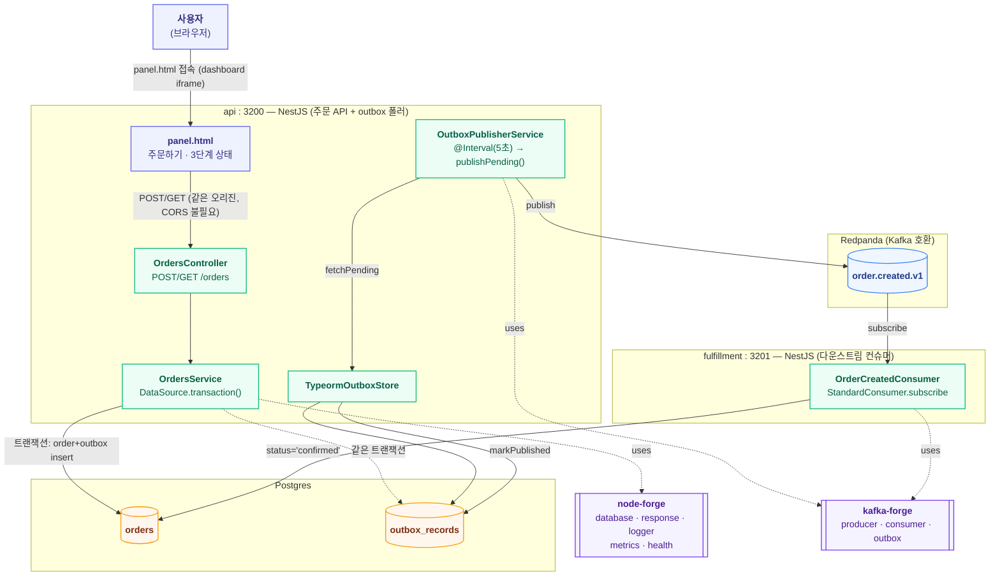

# order-outbox 아키텍처

트랜잭셔널 아웃박스 패턴. forge-lab의 세 번째 실험이며, waiting-room(node-forge: redis 등),
live-ranking(kafka-forge: producer/consumer/재시도/DLQ/멱등성)에 이어 지금까지 안 건드려본
**node-forge의 `database`**(TypeORM)와 **kafka-forge의 `OutboxPublisher`/`OutboxStore`**를
검증한다. "DB 쓰기와 이벤트 발행을 어떻게 원자적으로 묶는가"(dual-write 문제)를 실제로
구현해서 확인한다. 레포 전체 구조는 dashboard의 **Architecture ▸ 전체** 탭
(`docs/architecture.md`) 참고.

## 런타임 구조

하나의 npm workspace(`services/order-outbox`)이지만, live-ranking처럼 api(주문 API + outbox
폴러)와 fulfillment(다운스트림 컨슈머)가 서로 다른 프로세스/포트로 뜬다. 다만 이유는
live-ranking과 다르다 — live-ranking은 두 프로세스 다 진짜 HTTP API를 갖고 있어서 분리가
자연스러웠고, 여긴 HTTP API가 api 프로세스 하나뿐이다(fulfillment는 health/metrics만). 그래도
"나중에 fulfillment가 진짜 다른 팀/서비스가 될 수 있다"는 가정 아래 처음부터 분리하는 쪽을
선택했다.

## API

### api (port 3200)

| 메서드 | 경로 | 설명 |
|---|---|---|
| POST | `/orders` | 주문 생성. `{ item, amount }` — 주문 저장과 outbox 기록을 하나의 트랜잭션으로 커밋 |
| GET | `/orders` | 최근 주문 목록. 각 항목에 `stage`(created/published/confirmed) 포함 |
| GET | `/orders/:id` | 단건 조회 |
| GET | `/health` | Postgres + Kafka 연결 상태 (5초 캐싱) |
| GET | `/metrics` | node-forge 기본 지표 + `order_outbox_orders_created_total` + kafka-forge 발행 지표 |
| GET | `/panel.html` | 패널 UI (dashboard가 iframe으로 띄움) |

### fulfillment (port 3201)

| 메서드 | 경로 | 설명 |
|---|---|---|
| GET | `/health` | Postgres + Kafka 연결 상태 |
| GET | `/metrics` | node-forge 기본 지표 + kafka-forge 소비 지표(`kafka_forge_consumed_total`, `kafka_forge_handled_total` 등) |

fulfillment는 별도 비즈니스 API가 없다 — api가 같은 Postgres를 그대로 읽어서 주문 상태를
보여주므로 조회 API를 중복으로 둘 필요가 없다.

## DB 스키마 (Postgres, `synchronize: true`로 자동 생성 — 랩 전용, 마이그레이션 도구 없음)

| 테이블 | 주요 컬럼 | 용도 |
|---|---|---|
| `orders` | `id`(app에서 uuid 생성), `item`, `amount`, `status`(pending/confirmed), `createdAt`, `confirmedAt`(nullable, ISO 문자열) | 주문 본체. `status`/`confirmedAt`은 fulfillment가 최초 1회만 세팅(재배달돼도 안 덮어씀) |
| `outbox_records` | `id`, `topic`, `key`, `payload`(simple-json), `createdAt`, `publishedAt`(nullable, ISO 문자열) | kafka-forge `OutboxStore` 계약. `publishedAt`이 null이면 미발행 |

패널의 3단계(`생성됨`/`발행됨`/`확인됨`)는 두 테이블을 조합해서 계산한다 —
`orders.status`가 `confirmed`면 확인됨, 아니면 매칭되는 `outbox_records.publishedAt`이
있으면 발행됨, 없으면 생성됨. `GET /orders`, `GET /orders/:id`는 이 계산된 `stage`뿐 아니라
`publishedAt`/`confirmedAt` 실제 시각도 그대로 내려준다(아래 "폴링과 이벤트 로그" 참고).

## Kafka 토픽

| 토픽 | 용도 |
|---|---|
| `order.created.v1` | 주문 생성 이벤트. `createTopicName("order", "created", 1)`로 생성 |

## 이 실험만의 설계 결정

| 결정 | 이유 |
|---|---|
| Redis 없음 | waiting-room/live-ranking 둘 다 Redis를 썼는데, 이번엔 node-forge의 `database`(TypeORM)를 검증하는 게 목적이라 저장은 전부 Postgres로만. 멱등성도 outbox row 자체(같은 트랜잭션에 커밋)로 해결돼서 별도 Redis 멱등성 저장소가 필요 없었음 |
| id를 `@BeforeInsert()` 훅이 아니라 서비스 코드에서 직접 `randomUUID()`로 생성 | TypeORM의 라이프사이클 훅은 실제 엔티티 인스턴스에만 붙고, `manager.save(Entity, plainObject)`처럼 plain object를 그대로 저장할 때는 발동하지 않는다는 걸 테스트 중 발견 — 훅에 의존하지 않고 호출부에서 명시적으로 생성하는 쪽으로 변경 |
| `outbox_records.publishedAt`을 `Date` 컬럼이 아니라 ISO 문자열(`varchar`)로 저장 | Postgres는 `timestamp`, SQLite(테스트용)는 `datetime`만 인식하는 등 드라이버마다 타입 이름이 갈려서, 문자열로 두면 드라이버 무관하게 동일하게 동작 — 실 DB 없이 테스트로 진짜 쿼리를 검증할 수 있게 됨 |
| `payload` 컬럼은 Postgres `jsonb` 대신 `simple-json` | payload 안쪽 필드로 쿼리할 일이 없어서(항상 `key`/`publishedAt`으로만 조회), TypeORM의 `simple-json`(JSON.stringify 기반, 드라이버 무관)으로 충분 — 위와 같은 이유로 테스트 이식성도 확보 |
| vitest에서 실제 SQLite in-memory(`better-sqlite3`)로 검증 | TypeORM의 Repository/QueryBuilder API 표면이 넓어서 waiting-room/live-ranking처럼 손으로 fake DB를 만드는 대신, 실제로 초기화되는 가벼운 DB로 트랜잭션·`IsNull`·`In` 같은 진짜 동작을 검증하는 쪽을 선택 |
| 컬럼 타입을 전부 명시 (`@Column("varchar")` 등, 타입 추론 생략형 안 씀) | vitest가 쓰는 esbuild 트랜스폼은 `emitDecoratorMetadata`를 방출하지 않아서, TypeORM이 리플렉션으로 타입을 추론하는 방식의 데코레이터는 테스트 환경에서 실패함 |
| DLQ 관측성(전용 뷰어 UI) 재구현 안 함 | live-ranking에서 이미 검증된 기능이라 스코프 아웃, `StandardConsumer` 기본 재시도/DLQ만 사용 |
| `synchronize: true` | 마이그레이션 도구 없이 엔티티로 테이블 자동 생성 — 랩 환경이라 이 정도로 충분(실 서비스라면 지양해야 하는 설정임을 인지) |
| **(알려진 한계, 미해결)** kafka-forge `OutboxPublisher.publishPending()`의 배치 중 일부 실패 시 부분 재발행 가능성 | 소스 확인 결과, 배치로 여러 row를 발행하다가 하나라도 실패하면 그 전에 이미 성공한 것들도 `markPublished`가 호출되지 않고 그대로 예외가 던져진다 — 다음 폴링에서 이미 발행된 것들이 다시 발행(중복)될 수 있다. 이번 구현 스코프에서는 재현/수정하지 않고, 추후 냉정한 분석 대상으로 남겨둔다 |
| `orders.confirmedAt`은 fulfillment가 "이미 있으면 갱신 안 함" 조건으로 세팅 | 카프카 재배달로 같은 이벤트가 다시 처리돼도(핸들러 자체는 멱등이라 안전) `confirmedAt`이 재배달 시각으로 덮여쓰이면 "최초로 확인된 시각"이라는 관측 정보가 훼손된다 — `WHERE confirmedAt IS NULL` 조건으로 최초 1회만 기록 |
| 패널 이벤트 로그는 폴링 snapshot이 아니라 서버가 내려주는 `publishedAt`/`confirmedAt` 실제 시각으로 재구성 | outbox 폴링 간격(5초)에 비해 발행→소비(카프카 컨슈머 반응)는 보통 수십~수백ms 안에 끝나서, 패널의 1초 폴링이 "발행됨" 상태를 거의 항상 놓친다(실측: 발행 12ms 뒤 확인됨). "지금 상태가 뭐냐"만 폴링해서 전이를 로그로 남기면 중간 단계가 통째로 빠질 수 있어서, 서버가 실제 발행/확인 시각을 함께 내려주고 클라이언트는 그 시각 기준으로 로그를 재구성한다 — 폴링 방식 자체는 그대로 두고(waiting-room/live-ranking과 동일 컨벤션), 폴링이 실어오는 정보만 풍부하게 만든 것 |

## 검증 이력 (2026-07-19)

- `docker compose up --build -d`로 4개 컨테이너(api, fulfillment, postgres, redpanda) 기동 —
  Postgres가 아직 안 떴을 때의 일시적 `ECONNREFUSED`는 `restart: unless-stopped`로 자연스럽게
  복구됨(live-ranking의 redpanda 초기 기동 지연과 같은 패턴)
- `POST /orders`로 주문 생성 → 즉시 `stage: "created"` 확인 → 약 12초 후 `stage: "confirmed"`로
  전환된 것 확인(outbox 폴러 발행 → fulfillment 컨슈머 반영까지 실제로 재현)
- `order_outbox_orders_created_total`(api), `kafka_forge_produced_total`(api),
  `kafka_forge_consumed_total`/`kafka_forge_handled_total`(fulfillment) 지표가 모두 1로
  정확히 찍히는 것 확인
- panel.html 정상 서빙 확인
- vitest 15개(이벤트 스키마 5, TypeormOutboxStore 4, OrdersService 6) 전부 통과 — 실제
  SQLite in-memory DB로 트랜잭션/조회 로직까지 검증

### 후속 (2026-07-19) — 이벤트 로그가 "발행됨"을 건너뛰던 문제

실제 사용자 테스트에서 "발행됨을 안 거치고 바로 확인됨으로 넘어간다"는 리포트 발견. 원인은
버그가 아니라 폴링 주기(1초)보다 발행→소비 지연이 훨씬 짧아서(실측 12ms) 패널이 그 상태를
관측할 기회 자체가 거의 없었던 것 — 폴링 방식 자체는 유지하고, 서버가 실제 시각을
같이 내려주도록 고쳤다.

- `entities/order.entity.ts` — `confirmedAt`(nullable, ISO 문자열) 추가
- `fulfillment/order-created.consumer.ts` — `confirmedAt`을 `WHERE confirmedAt IS NULL`
  조건으로 최초 1회만 세팅
- `api/orders.service.ts` — `OrderView`에 `publishedAt`/`confirmedAt` 노출
- `public/panel.html` — 이벤트 로그를 poll snapshot 비교 대신 `publishedAt`/`confirmedAt`
  존재 여부 + "이미 로그로 남긴 전이인지" 추적(`loggedTransitions`)으로 재작성, 로그 시각도
  `new Date()`가 아니라 실제 전이 시각으로 표시
- `orders.service.test.ts` — publishedAt/confirmedAt 노출 검증 추가

**검증**: 주문 생성 → 8초 후 조회 시 `publishedAt`/`confirmedAt`이 실제 값으로 채워지는 것
확인(예시: 발행 08:57:29.108 → 확인 08:57:29.120, 12ms 차이). panel.html 반영 확인, vitest
15개 유지하며 통과.

관련 플랜: `.claude-plans/20260719/order-outbox-pipeline.md` (실행 이력 포함).
