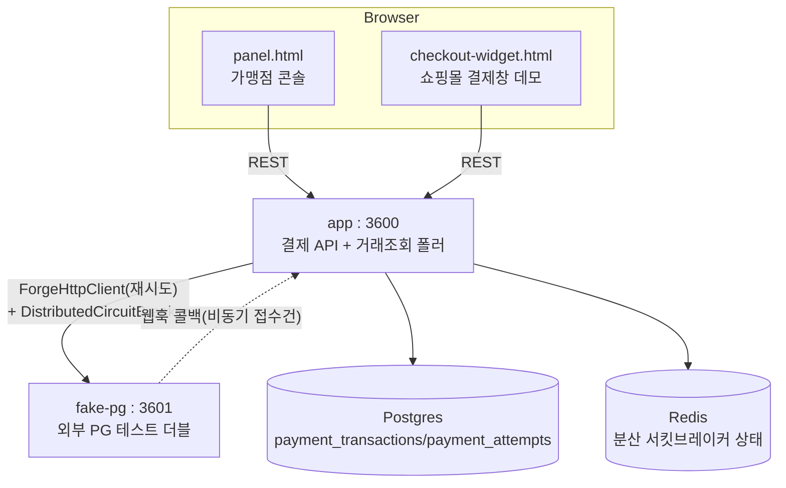

# payment-gateway — 외부 결제대행사 연동 게이트웨이 (7번째 실험)

지금까지 6개 실험이 안 쓴 node-forge의 `http`(`ForgeHttpClient`)와 `versioning`(Accept-Version
헤더 협상)을 검증한다. 지금까지는 전부 "우리 시스템 내부"의 정합성을 다뤘다면, 이 실험은
"밖으로 나가는 호출이 실패할 때"를 다루는 첫 실험이다 — 불안정한 외부 PG를 흉내낸 `fake-pg`를
호출하면서, 재시도·분산 서킷브레이커·비동기 콜백·거래조회(reconciliation)를 실제로 겪어보고
트랜잭션이 유실도 중복도 되지 않는지 검증한다.

## 런타임 구조



`app`과 `fake-pg`는 완전히 독립된 프로세스다(webhook-relay의 ingest/test-receiver와 같은
패턴) — `fake-pg`는 자체 DB 없이 인메모리로 거래를 들고 있는다. 진짜 외부 PG처럼
payment-gateway와 상태를 공유하지 않는다는 걸 보여주기 위한 의도적 설계다.

## 트랜잭션 상태머신

```
PENDING --(PG 동기 승인)--------------------> CONFIRMED
PENDING --(PG 동기 거절/명시적 에러 응답)-----> FAILED
PENDING --(회로 OPEN, PG 호출 자체를 안 함)---> FAILED   (호출 안 했으니 모호함 없음)
PENDING --(PG 비동기 접수, 202)---------------> PENDING (웹훅 대기)
PENDING --(응답 자체를 못 받음: 타임아웃)-----> IN_DOUBT
IN_DOUBT --(reconciler가 거래조회로 확인)-----> CONFIRMED / FAILED
IN_DOUBT --(N회 재조회에도 미해소)------------> DEAD (운영자 확인 대상)
PENDING --(웹훅 콜백 도착)---------------------> CONFIRMED / FAILED
```

**IN_DOUBT는 오직 "PG 응답 자체를 못 받은 경우"에만 진입한다** — PG가 명시적으로 거절/에러를
응답했으면 그 자체가 확정 정보이므로 FAILED로 바로 처리한다(`payment.service.ts`의
`attemptCharge()` 참고). 회로가 이미 OPEN이라 PG를 호출조차 안 한 경우도 마찬가지로 즉시
FAILED다.

## 재조회 키 문제 — `clientReference`

타임아웃이 PG의 응답을 받기 전에 발생하면 `pgTransactionId`를 모른다. 그래서 `clientReference`
(UUID)를 PG 호출 "전에" 미리 생성해 요청에 실어 보내고, `fake-pg`는 `clientReference`로도
조회 가능한 엔드포인트(`GET /pg/charge/by-reference/:ref`)를 제공한다. `fake-pg`는 이
`clientReference`로 멱등성도 보장한다 — 같은 참조로 다시 호출하면(재시도든 뭐든) 새로
처리하지 않고 이미 저장된 상태를 그대로 반환한다. 이 덕분에 `ForgeHttpClient`의 내장
재시도(`retries: 2`)를 안전하게 켤 수 있다(재시도가 중복 과금을 유발하지 않음).

## 후속 발견 — "PENDING+pgTransactionId 정체" 버그와 수정 (2026-08-02)

실제 Docker 3중 검증 중 발견: `ForgeHttpClient`의 재시도(300ms/600ms 지연)가 fake-pg의
6초짜리 타임아웃 시뮬레이션 도중에 발동하면, fake-pg의 멱등성 체크가 "이미 아는 거래"로
보고 **재시도 요청에 대해 즉시 `PROCESSING` 응답**을 돌려준다. 원래 요청은 여전히 타임아웃
중이었지만, 재시도가 대신 성공 응답을 받아버린 것이다. 이 경우 거래는 `PENDING`에
`pgTransactionId`만 채워진 채로 남는데, 이건 진짜 비동기 접수(202)가 아니라 재시도가 우연히
가로챈 것이라 **아무도 웹훅을 보내주지 않는다** — 초기 구현은 `reconcile()`이 `IN_DOUBT`만
대상으로 삼아서, 이 거래가 영원히 멈춰 있는 버그가 있었다.

**수정**: `reconcile()`과 `listInDoubt()`(reconciler가 순회하는 대상 목록)를 `IN_DOUBT`뿐
아니라 `PENDING이면서 pgTransactionId가 있는` 거래도 포함하도록 확장했다(`payment.service.ts`).
PG가 "처리 중"이라고 답한 이상, 그 경로가 웹훅이든 재시도가 우연히 잡아챈 응답이든 상관없이
"누군가는 나중에 확인해야 하는 상태"라는 점은 동일하다는 게 핵심 통찰이다. 웹훅이 먼저
도착하면 reconciler는 아무 것도 안 하고(이미 종결 상태라 대상에서 빠짐), reconciler가 먼저
돌면 fake-pg가 아직 `PROCESSING`을 answer하므로 재시도 카운터만 올리고 넘어간다 — 두 경로가
경합해도 서로 덮어쓰지 않는다.

## API

| Method | Path | 설명 |
|---|---|---|
| POST | `/payments` | 결제 생성(멱등, `accept-version` 헤더로 v1/v2 응답 분기) |
| GET | `/payments/:id` | 결제 상태 조회(v1: `{id,status}`, v2: 전체 필드) |
| GET | `/payments/:id/attempts` | 시도 이력(성공/거절/회로차단/타임아웃/웹훅/거래조회 전부 기록) |
| POST | `/webhooks/pg-callback` | fake-pg의 비동기 접수 건 최종 결과 콜백 수신 |
| GET | `/admin/payments/dead` | 거래조회 포기(DEAD) 목록 |
| GET | `/admin/payments/in-doubt` | reconciler 대상 목록(IN_DOUBT + PENDING&pgTransactionId) |
| POST | `/admin/payments/:id/reconcile` | 수동 거래조회 트리거 |
| GET/POST | `/admin/payments/fake-pg/config` | fake-pg 불안정성 설정 조회/변경(프록시) |
| GET | `/admin/logs/stream` | SSE(다른 실험과 동일한 AdminEventBus 패턴) |

fake-pg 자체 API(`POST /pg/charge`, `GET /pg/charge/:id`, `GET /pg/charge/by-reference/:ref`,
`GET/POST /admin/fake-pg/config`)는 우리 `ApiResponse<T>` 봉투를 쓰지 않는다 — 실제 외부
PG라면 우리 응답 컨벤션을 알 리 없기 때문이다.

## DB 스키마 (Postgres, `synchronize: true` — 랩 전용)

| 테이블 | 컬럼 |
|---|---|
| `payment_transactions` | `id, merchantId, idempotencyKey(unique), clientReference(unique), amount, apiVersion, status, pgTransactionId, reconcileAttempts, lastError, createdAt, updatedAt` |
| `payment_attempts` | `id, paymentId, attemptNo, outcome(SUCCESS/DECLINED/PG_ERROR/TIMEOUT/CIRCUIT_OPEN/WEBHOOK_CONFIRMED/WEBHOOK_FAILED/RECONCILED), httpStatus, durationMs, detail, at` |

## Redis 키 스키마

| 키 | 용도 |
|---|---|
| `circuit:fake-pg` | `DistributedCircuitBreaker`가 관리하는 fake-pg 호출 회로 상태(해시) |

## 이 실험만의 설계 결정

| 결정 | 이유 |
|---|---|
| `ForgeHttpClient`(재시도) + `DistributedCircuitBreaker`(회로차단)를 조합 | `ForgeHttpClient` 자체에는 서킷브레이커가 없다(고정 지연 재시도만 제공) — webhook-relay가 이미 검증한 분산 서킷브레이커를 여기선 "나가는 호출" 보호용으로 재사용 |
| `clientReference`를 PG 호출 전에 생성 | 호출 후에 만들면 응답을 못 받았을 때 재조회할 키가 없어짐 |
| fake-pg가 clientReference로 멱등 처리 | `ForgeHttpClient`의 내장 재시도를 안전하게 쓰기 위한 전제 — 실제 PG 연동도 이 계약을 요구함 |
| IN_DOUBT는 "응답을 못 받은 경우"에만, 명시적 에러/회로OPEN은 즉시 FAILED | 모호한 경우와 확정된 경우를 섞으면 불필요한 재조회가 늘어나고 장애 대응이 느려짐 |
| fake-pg는 자체 DB 없이 인메모리 | 진짜 외부 시스템처럼 payment-gateway와 상태를 공유하지 않는다는 걸 의도적으로 보여줌 |
| `POST /payments`는 REST, 결과 확인은 폴링(WebSocket 없음) | 이 실험의 핵심은 "나가는 호출의 신뢰성"이지 실시간 동기화가 아니다(live-auction과 다른 검증 대상) — YAGNI |

## 검증 이력 (2026-08-02, 실제 컨테이너)

- **정상 결제(v2)**: 즉시 CONFIRMED, 시도 이력 1건(SUCCESS) 기록 확인
- **버전 협상**: `accept-version: v1` 요청 시 `{id,status}`만 담긴 플랫 응답 확인(v2는 전체 필드)
- **서킷브레이커**: fake-pg 실패율 100%로 설정 후 연속 요청 — 1~3번째는 각각 PG_ERROR로 FAILED(재시도 포함 약 1초 소요), 4번째부터 회로 OPEN — PG 호출 없이 8ms 만에 즉시 FAILED(CIRCUIT_OPEN) 확인
- **타임아웃 → IN_DOUBT/PENDING 정체 → reconciler 자동 해소**: 타임아웃율 100%로 설정 후 결제 요청 → 재시도가 PROCESSING 응답을 가로채 PENDING+pgTransactionId 상태로 남음(위 "후속 발견" 참고) → `PaymentReconcilerService`(3초 간격)가 자동으로 거래조회해서 FAILED(한도초과)로 해소 확인 — 시도 이력에 SUCCESS(202)→RECONCILED 순서로 기록됨
- **비동기 웹훅 콜백**: 비동기율 100%로 설정 후 결제 요청 → 즉시 PENDING(202) → 약 2초 후 fake-pg의 웹훅 콜백으로 CONFIRMED 전이 확인, 시도 이력 SUCCESS(202)→WEBHOOK_CONFIRMED
- **멱등성**: 같은 `idempotencyKey`로 2번 요청 → 동일한 결제 id/상태 반환, PG 재호출 없음 확인
- 유닛 테스트 11개 통과(실제 `DistributedCircuitBreaker` 클래스를 `FakeRedisClient`(hmset/hgetall/hincrby 흉내)와 조합해서 회로 전이 로직 자체를 목 없이 검증)
