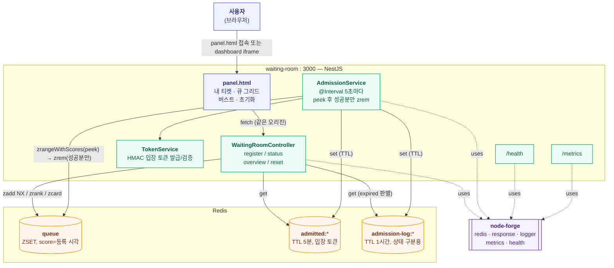

# waiting-room 아키텍처

정렬셋(Redis Sorted Set) 기반 가상 대기열 서버. 레포 전체 구조는 dashboard의 **Architecture ▸ 전체**
탭(`docs/architecture.md`) 참고, 여기서는 이 서비스 내부만 다룬다.

## 런타임 구조

## API

| 메서드 | 경로 | 설명 |
|---|---|---|
| POST | `/rooms/:roomId/waiting-users` | 대기 등록. `roomId`가 `ROOM_ID`(환경변수)와 다르면 `E9400`, 중복 등록 시 `E9409` |
| GET | `/rooms/:roomId/waiting-users` | 큐 개요 — 전체 길이 + 앞쪽 20명 순번 |
| GET | `/rooms/:roomId/waiting-users/:userId` | 내 상태 — waiting/admitted/expired(입장 기회를 놓침)/not_found |
| DELETE | `/rooms/:roomId/waiting-users` | 큐 + admitted + admission-log 전체 초기화 (테스트/데모 전용) |
| POST | `/rooms/:roomId/waiting-users/remove` | 지정한 `userIds`만 대기열에서 제거 (테스트/데모 전용). panel.html의 버스트 "중지"가 사용 — 전체를 지우는 reset과 달리 이 시뮬레이션이 등록한 사람만 취소하고 다른 등록(예: "내 티켓")은 안 건드림 |
| POST | `/rooms/:roomId/waiting-users/verify` | 입장 토큰 검증 — 서명 + Redis 대조. 실제 서비스가 "이 유저 들어와도 되는지" 확인할 때 사용 |
| GET | `/health` | Redis 헬스체크 |
| GET | `/metrics` | Prometheus 텍스트 포맷 (큐 길이, 대기시간, admission 누적) |

## Redis 키 스키마

| 키 | 타입 | 용도 |
|---|---|---|
| `waiting:{roomId}:queue` | ZSET | member=`userId`, score=등록 시각(`Date.now()` ms) |
| `waiting:{roomId}:admitted:{userId}` | STRING (TTL 5분) | admission 시 발급한 HMAC 입장 토큰. 실제 접근 권한 판단은 항상 이 키 기준 |
| `waiting:{roomId}:admission-log:{userId}` | STRING (TTL 1시간) | "admission된 적 있다"는 사실만 기록. `admittedKey` 만료 후 `expired` 상태를 보여주기 위한 용도, 권한 판단에는 안 씀 |

## 이 서비스만의 설계 결정

| 결정 | 이유 |
|---|---|
| 대기열 = Kafka 아닌 Redis ZSET | `ZRANK`로 임의 유저의 순번을 O(log N)에 즉시 조회 가능, 중간 유저 제거(`ZREM`)도 O(log N) — Kafka 로그는 이 두 개를 못 함 |
| admission 동시성 = Lua 스크립트 아닌 `zpopmin` | Redis 네이티브 명령 자체가 "조회+제거"를 원자적으로 수행 — 커스텀 스크립트 불필요 |
| score = 등록 시각(ms epoch), 단조증가 시퀀스 아님 | `admittedAt - score`로 대기시간을 바로 계산 가능해서 관측이 단순해짐. 동일 밀리초 동시 등록의 순서는 임의여도 무방하다고 판단 |
| 입장 토큰은 외부 JWT 라이브러리 없이 HMAC | 실험 스코프에 충분한 수준, 의존성 최소화 |
| kafka-forge 입장 이벤트 발행, 멀티룸 스케줄링, 다중 인스턴스 admission 조율 | 전부 스코프 아웃 — 필요해지면 별도 플랜(`.claude-plans/`)으로 확장 |
| 등록은 `zscore`+`zadd`가 아니라 `zadd(..., { mode: "NX" })`(원자적) | 두 단계로 나누면 동시에 같은 userId로 요청이 올 때 중복 방지가 깨짐(TOCTOU). `ForgeRedisClient.zadd`에 NX 옵션이 없어 처음엔 `getClient()`로 우회했다가, node-forge에 제안(`proposals/node-forge/20260717/20260717-zadd-nx-option.md`) → 1.0.3에 `{ mode, ch }` 옵션으로 반영되어 wrapped zadd로 되돌림 |
| 다른 `roomId`로 등록 시 명시적 에러(`E9400`) | admission 스케줄러가 `ROOM_ID` 하나만 순회하므로, 막지 않으면 조용히 영원히 admission 안 되는 유저가 생김 |
| admission은 `zpopmin`(먼저 제거) 대신 `zrangeWithScores`(조회만) → 성공분만 `zrem`(마지막에 커밋) | `zpopmin`으로 먼저 지우면, 그 뒤 토큰 저장 도중 프로세스가 어떤 식으로든(에러든 강제 종료든) 죽었을 때 유저가 대기열에도 admitted에도 없는 상태로 사라짐. 커밋(zrem)을 성공 확인 이후로 미루면 프로세스가 언제 죽어도 최악의 경우 "다음 주기에 재시도"일 뿐 유실은 안 됨 |
| admittedKey(TTL 5분)와 별개로 admission-log(TTL 1시간) 유지 | TTL 만료로 admittedKey가 사라지면 "한 번도 등록 안 한 사람"과 "입장 기회를 놓친 사람"을 구분 못 함 — `expired` 상태를 위해 더 오래 남는 기록을 따로 둠 |
| vitest로 핵심 로직(중복 등록 방지, verify, expired 분기, admission 부분 실패)에 유닛테스트 | 실제 Redis 없이 `ForgeRedisClient`의 필요한 메서드만 인메모리로 구현한 fake로 테스트(kafka-forge가 kafkajs를 fake하는 것과 동일 패턴) — 회귀를 잡기 위함 |

관련 플랜: `.claude-plans/20260712/waiting-room-queue-logic.md`,
`.claude-plans/20260717/waiting-room-correctness-fixes.md`,
`.claude-plans/20260717/waiting-room-remaining-fixes.md` (전부 실행 이력 포함).
node-forge 관련 이슈 대응 이력은 dashboard의 **Issue** 탭 참고.
