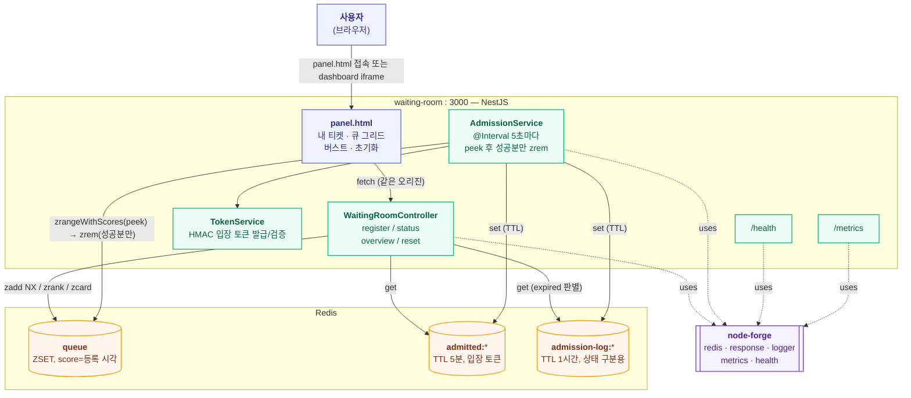

# waiting-room 아키텍처

정렬셋(Redis Sorted Set) 기반 가상 대기열 서버. 레포 전체 구조는 dashboard의 **Architecture ▸ 전체**
탭(`docs/architecture.md`) 참고, 여기서는 이 서비스 내부만 다룬다.

## 런타임 구조

## API

| 메서드 | 경로 | 설명 |
|---|---|---|
| POST | `/rooms/:roomId/waiting-users` | 대기 등록. `roomId`가 `ROOM_ID`(환경변수)와 다르면 `E9400`, 중복 등록 시 `E9409` |
| GET | `/rooms/:roomId/waiting-users` | 큐 개요 — 전체 길이 + 앞쪽 20명 순번 |
| GET | `/rooms/:roomId/waiting-users/:userId` | 내 상태 — waiting/admitted/expired(입장 기회를 놓침)/not_found |
| POST | `/rooms/:roomId/waiting-users/verify` | 입장 토큰 검증 — 서명 + Redis 대조. 실제 서비스가 "이 유저 들어와도 되는지" 확인할 때 사용 |
| DELETE | `/admin/rooms/:roomId/waiting-users` | 큐 + admitted + admission-log 전체 초기화 (테스트/데모 전용, admin/test 네이밍 컨벤션 적용 — 기존 `DELETE /rooms/.../waiting-users`에서 이동) |
| POST | `/admin/rooms/:roomId/waiting-users/remove` | 지정한 `userIds`만 대기열에서 제거 (테스트/데모 전용). panel.html의 버스트 "중지"가 사용 — 전체를 지우는 reset과 달리 이 시뮬레이션이 등록한 사람만 취소하고 다른 등록(예: "내 티켓")은 안 건드림 |
| GET | `/admin/logs/stream` | SSE — 등록(joined)/입장 허용(admitted) 이벤트 실시간 스트림(node-forge 1.0.9 `AdminEventsModule`) |
| GET | `/health` | Redis 헬스체크 |
| GET | `/metrics` | Prometheus 텍스트 포맷 (큐 길이, 대기시간, admission 누적) |

## Redis 키 스키마

| 키 | 타입 | 용도 |
|---|---|---|
| `waiting:{roomId}:queue` | ZSET | member=`userId`, score=등록 시각(`Date.now()` ms) |
| `waiting:{roomId}:admitted:{userId}` | STRING (TTL 5분) | admission 시 발급한 HMAC 입장 토큰. 실제 접근 권한 판단은 항상 이 키 기준 |
| `waiting:{roomId}:admission-log:{userId}` | STRING (TTL 1시간) | "admission된 적 있다"는 사실만 기록. `admittedKey` 만료 후 `expired` 상태를 보여주기 위한 용도, 권한 판단에는 안 씀 |

## 이 서비스만의 설계 결정

| 결정 | 이유 |
|---|---|
| 대기열 = Kafka 아닌 Redis ZSET | `ZRANK`로 임의 유저의 순번을 O(log N)에 즉시 조회 가능, 중간 유저 제거(`ZREM`)도 O(log N) — Kafka 로그는 이 두 개를 못 함 |
| admission 동시성 = Lua 스크립트 아닌 `zpopmin` | Redis 네이티브 명령 자체가 "조회+제거"를 원자적으로 수행 — 커스텀 스크립트 불필요 |
| score = 등록 시각(ms epoch), 단조증가 시퀀스 아님 | `admittedAt - score`로 대기시간을 바로 계산 가능해서 관측이 단순해짐. 동일 밀리초 동시 등록의 순서는 임의여도 무방하다고 판단 |
| 입장 토큰은 외부 JWT 라이브러리 없이 HMAC | 실험 스코프에 충분한 수준, 의존성 최소화 |
| kafka-forge 입장 이벤트 발행, 멀티룸 스케줄링, 다중 인스턴스 admission 조율 | 전부 스코프 아웃 — 필요해지면 별도 플랜(`.claude-plans/`)으로 확장 |
| 등록은 `zscore`+`zadd`가 아니라 `zadd(..., { mode: "NX" })`(원자적) | 두 단계로 나누면 동시에 같은 userId로 요청이 올 때 중복 방지가 깨짐(TOCTOU). `ForgeRedisClient.zadd`에 NX 옵션이 없어 처음엔 `getClient()`로 우회했다가, node-forge에 제안(`proposals/node-forge/20260717/20260717-zadd-nx-option.md`) → 1.0.3에 `{ mode, ch }` 옵션으로 반영되어 wrapped zadd로 되돌림 |
| 다른 `roomId`로 등록 시 명시적 에러(`E9400`) | admission 스케줄러가 `ROOM_ID` 하나만 순회하므로, 막지 않으면 조용히 영원히 admission 안 되는 유저가 생김 |
| admission은 `zpopmin`(먼저 제거) 대신 `zrangeWithScores`(조회만) → 성공분만 `zrem`(마지막에 커밋) | `zpopmin`으로 먼저 지우면, 그 뒤 토큰 저장 도중 프로세스가 어떤 식으로든(에러든 강제 종료든) 죽었을 때 유저가 대기열에도 admitted에도 없는 상태로 사라짐. 커밋(zrem)을 성공 확인 이후로 미루면 프로세스가 언제 죽어도 최악의 경우 "다음 주기에 재시도"일 뿐 유실은 안 됨 |
| admittedKey(TTL 5분)와 별개로 admission-log(TTL 1시간) 유지 | TTL 만료로 admittedKey가 사라지면 "한 번도 등록 안 한 사람"과 "입장 기회를 놓친 사람"을 구분 못 함 — `expired` 상태를 위해 더 오래 남는 기록을 따로 둠 |
| vitest로 핵심 로직(중복 등록 방지, verify, expired 분기, admission 부분 실패)에 유닛테스트 | 실제 Redis 없이 `ForgeRedisClient`의 필요한 메서드만 인메모리로 구현한 fake로 테스트(kafka-forge가 kafkajs를 fake하는 것과 동일 패턴) — 회귀를 잡기 위함 |

관련 플랜: `.claude-plans/20260712/waiting-room-queue-logic.md`,
`.claude-plans/20260717/waiting-room-correctness-fixes.md`,
`.claude-plans/20260717/waiting-room-remaining-fixes.md` (전부 실행 이력 포함).
node-forge 관련 이슈 대응 이력은 dashboard의 **Issue** 탭 참고.

### 후속 (2026-08-01) — 공유 패널 UI + admin API 네이밍 통일 + SSE 로그 스트리밍(node-forge 1.0.9)

`dashboard-panel-expansion` 플랜(`.claude-plans/20260801/dashboard-panel-expansion.md`) 적용:

- `panel.html`의 공통 CSS/로그 렌더링을 `@forge-lab/panel-ui`로 이동, `main.ts`가
  `require.resolve`로 위치를 찾아 `/shared/*`로 마운트
- `reset`/`removeUsers`를 `WaitingRoomController`에서 분리해 새 `AdminController`로,
  경로도 `/admin/rooms/:roomId/waiting-users`(+`/remove`)로 이동
- `WaitingRoomService.register()`(등록)와 `AdmissionService.runAdmission()`(입장 허용)에
  node-forge 1.0.9 `AdminEventBus`를 주입해 `/admin/logs/stream`으로 실시간 방송 —
  panel.html의 "admission 감지: N명 → M명 (추정)" 클라이언트 추정 로그와 등록 성공 시
  낙관적 로그를 제거하고, 서버가 실제로 등록/입장 처리한 순간의 진실을 그대로 보여주도록 교체

**검증(2026-08-01, 실제 컨테이너)**: 유저 1명 등록 → `curl -sN`으로 `/admin/logs/stream` 구독,
`joined`(등록, 순번/대기인원 포함) → `admitted`(입장 허용, 5초 이내 배치 처리) 2개 이벤트가
순서대로 정상 수신되는 것 확인. 유닛 테스트 20개 전부 통과.

### 후속 (2026-08-02) — 실사용 페르소나 화면 + 개발자 콘솔 + ticket-shop.html(실제 목적지 데모)

webhook-relay에서 먼저 확립한 "메인 화면은 실사용 페르소나만, 시스템 로그/원시 상태는
개발자 콘솔로" 컨벤션(`.claude/rules/project/convention.md`)을 이 서비스에도 같은 깊이로
적용(`.claude-plans/20260802/waiting-room-persona-split.md`). 백엔드는 전혀 건드리지 않고
`public/` 정적 파일만 변경/추가했다.

- `panel.html`을 실제 온라인 티켓팅 대기열 키오스크 페르소나로 재구성: 헤더 바, "내 티켓"
  히어로(점선 티켓 스텁 스타일), 입장 가능해지면 "입장하기" 링크로 `ticket-shop.html`(새 탭)로
  이동. 부하 시뮬레이션/초기화는 "테스트 도구" 모달로, 이벤트 로그는 `PanelUI.mountDevConsole`
  (로그 탭 + "대기열 원시 상태" 탭, 2초 폴링)로 이동해 메인 화면에서 걷어냄
- **신규 `public/ticket-shop.html`** — webhook-relay의 `channel.html`(Slack 워크스페이스)에
  대응하는, "이 대기열이 실제로 지키는 목적지"를 보여주는 완전히 다른 스타일(실제 티켓
  판매 사이트 톤)의 데모 앱. 기존 `POST /rooms/:roomId/waiting-users/verify` API를 그대로
  호출해 입장 토큰을 검증하고, 유효하면 좌석등급/매수 선택 + `ADMITTED_TOKEN_TTL_SECONDS`
  (기본 300초)에 맞춘 카운트다운이 있는 티켓 구매 화면을 보여준다(구매 자체는 실제 결제
  API가 없는 스코프 밖이라 클라이언트에서 완결하는 데모). 무효/만료 토큰이면 "입장할 수
  없습니다" + 대기열로 돌아가기 안내. 새 도메인 API 없이 기존 `verify`만 재사용

**검증(2026-08-02)**: 유닛 테스트 20개 회귀 없음. Docker 재빌드·재기동 후 curl로 등록 →
5초 뒤 admission으로 토큰 발급 → 그 토큰으로 `verify` 호출 시 `valid:true`(ticket-shop.html의
정상 입장 경로), 조작된 토큰으로는 `valid:false`(거부 경로) 확인.

### 후속 (2026-08-02) — 다중 인스턴스 admission 스케줄러 실측(백로그 검증, 스코프 아웃 재확인)

`admission.service.ts` 상단 주석에 이미 "여러 앱 인스턴스가 동시에 스케줄을 돌리는 다중
인스턴스 조율은 스코프 아웃(단일 인스턴스 전제)"라고 명시돼 있었는데, 실제로 스케일했을 때
정확히 어떤 형태로 깨지는지 실측한 적은 없었다. `docker-compose.yml`의 `app` 포트 매핑을
일시적으로 `3000-3001:3000` 범위로 바꿔 `--scale app=2`로 실제 2인스턴스를 띄우고 검증한
뒤, 매핑은 원래대로(`${HOST_PORT:-3000}:3000`) 복구했다(랩 컨벤션상 이 서비스는 웹훅 릴레이/
msa-checkout의 스케일 대상 서비스와 달리 항상 단일 인스턴스+고정 포트를 전제로 하므로).

**재현 방법**: 큐 초기화 → 15명 등록(`ADMISSION_BATCH_SIZE=10`보다 많게, 최소 2주기에 걸쳐
처리되도록) → 두 인스턴스의 로그를 5초 간격(`ADMISSION_INTERVAL_MS`)으로 관찰.

**실측 결과**:
- 1주기차(동시 tick): app-1, app-2 둘 다 `zrangeWithScores`로 같은 상위 10명을 피크 →
  둘 다 각자 토큰 발급 성공 → 둘 다 "admitted 10/10"으로 로그 남김 → 둘 다 같은 10명에
  대해 `zrem` 호출(두 번째 호출은 Redis에서 이미 지워진 멤버라 조용히 no-op)
  → **실제 결과는 정확함**(10명이 정확히 admitted, 중복 admission 없음, 유실 없음) —
  `zrangeWithScores`(조회) + 성공분만 `zrem`(커밋)이라는 크래시 안전 설계 자체는 다중
  인스턴스에서도 "누구를 admit하는가"는 깨지지 않았다
- 그러나 **관측(observability)은 깨짐**: `waiting_room_admissions_total`을 각 인스턴스가
  독립적으로 증가시켜서, app-1은 자기 `/metrics`에 10, app-2는 15(1주기 10 + 2주기 5)를
  보고함 — 실제 admitted된 사람은 15명인데 두 인스턴스 값을 그대로 더하면(전형적인
  Prometheus 멀티 타겟 합산) 25로 잡혀 실제보다 부풀려짐
- **로그도 인스턴스-로컬**: `AdminEventBus`가 프로세스 내부 rxjs Subject라 인스턴스마다
  독립이고 앞에 로드밸런서가 없어서(각 인스턴스가 자기 호스트 포트를 그대로 노출), 사용자가
  app-1의 `/admin/logs/stream`만 구독 중이면 app-2가 처리한 2주기차(5명) admission은 그
  브라우저의 개발자 콘솔 로그에 아예 나타나지 않음 — 중복이 아니라 **누락**으로 보일 수 있음

**결론**: 실제 admission 결과(누가 들어가는가)의 정합성은 다중 인스턴스에서도 깨지지 않지만,
집계 지표와 실시간 로그는 인스턴스 간 조율이 없어 부정확(중복 또는 누락)해질 수 있음을
실측으로 확인했다. 이 서비스는 원래부터 단일 인스턴스를 전제로 설계됐고(주석에 명시), 이번
검증은 그 전제를 깨는 리팩터가 아니라 "실제로 스케일하면 어떤 형태로 새는지"를 확인하는
백로그 작업이었다. 분산 카운터 합산이나 공유 이벤트 버스로 고치는 건 이번 라운드 스코프
밖 — 필요해지면 별도 플랜으로 진행.
