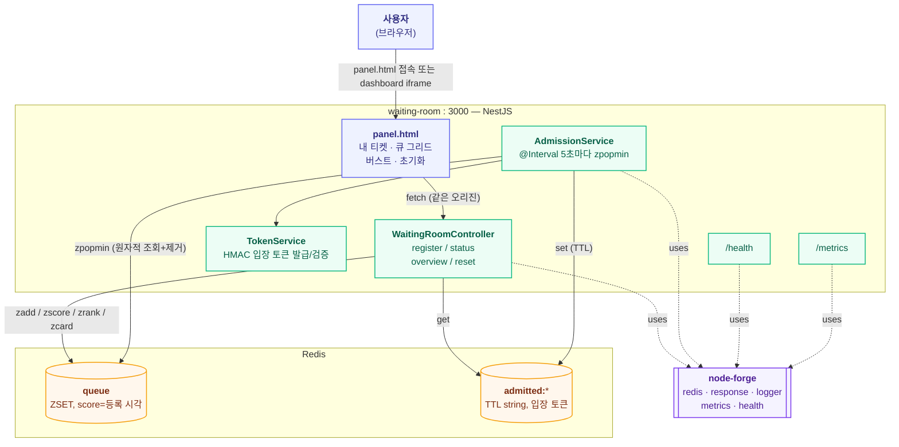

# waiting-room 아키텍처

정렬셋(Redis Sorted Set) 기반 가상 대기열 서버. 레포 전체 구조는 dashboard의 **Architecture ▸ 전체**
탭(`docs/architecture.md`) 참고, 여기서는 이 서비스 내부만 다룬다.

## 런타임 구조

## API

| 메서드 | 경로 | 설명 |
|---|---|---|
| POST | `/rooms/:roomId/waiting-users` | 대기 등록. 중복 등록 시 `E9409` |
| GET | `/rooms/:roomId/waiting-users` | 큐 개요 — 전체 길이 + 앞쪽 20명 순번 |
| GET | `/rooms/:roomId/waiting-users/:userId` | 내 상태 — waiting/admitted/not_found |
| DELETE | `/rooms/:roomId/waiting-users` | 큐 + admitted 기록 초기화 (테스트/데모 전용) |
| GET | `/health` | Redis 헬스체크 |
| GET | `/metrics` | Prometheus 텍스트 포맷 (큐 길이, 대기시간, admission 누적) |

## Redis 키 스키마

| 키 | 타입 | 용도 |
|---|---|---|
| `waiting:{roomId}:queue` | ZSET | member=`userId`, score=등록 시각(`Date.now()` ms) |
| `waiting:{roomId}:admitted:{userId}` | STRING (TTL) | admission 시 발급한 HMAC 입장 토큰 |

## 이 서비스만의 설계 결정

| 결정 | 이유 |
|---|---|
| 대기열 = Kafka 아닌 Redis ZSET | `ZRANK`로 임의 유저의 순번을 O(log N)에 즉시 조회 가능, 중간 유저 제거(`ZREM`)도 O(log N) — Kafka 로그는 이 두 개를 못 함 |
| admission 동시성 = Lua 스크립트 아닌 `zpopmin` | Redis 네이티브 명령 자체가 "조회+제거"를 원자적으로 수행 — 커스텀 스크립트 불필요 |
| score = 등록 시각(ms epoch), 단조증가 시퀀스 아님 | `admittedAt - score`로 대기시간을 바로 계산 가능해서 관측이 단순해짐. 동일 밀리초 동시 등록의 순서는 임의여도 무방하다고 판단 |
| 입장 토큰은 외부 JWT 라이브러리 없이 HMAC | 실험 스코프에 충분한 수준, 의존성 최소화 |
| kafka-forge 입장 이벤트 발행, 멀티룸 스케줄링, 다중 인스턴스 admission 조율 | 전부 스코프 아웃 — 필요해지면 별도 플랜(`.claude-plans/`)으로 확장 |

관련 플랜: `.claude-plans/20260712/waiting-room-queue-logic.md` (실행 이력 포함).
node-forge 관련 이슈 대응 이력은 dashboard의 **Issue** 탭 참고.
