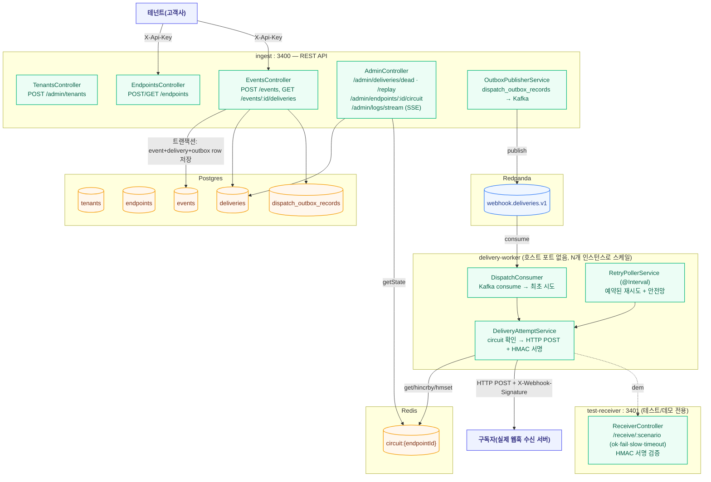

# webhook-relay — 웹훅 전달 플랫폼 (5번째 실험)

실생활에서 실제로 쓰이는 제품군(Svix/Hookdeck류)을 만들면서, 이전 4개 실험이 다루지 않은
영역을 검증한다: 하나의 이벤트를 여러 외부 HTTP 엔드포인트로 fan-out, node-forge의
`ForgeCircuitBreaker`가 다루지 못하는 다중 인스턴스 간 회로 상태 공유, 아웃바운드 HMAC
서명, 장시간(수 시간대) 백오프 재시도 스케줄링.

## 런타임 구조

하나의 npm workspace(`services/webhook-relay`), 3개 프로세스가 같은 이미지에서
`docker-compose.yml`의 `command:`로만 갈린다(order-outbox/live-ranking과 동일 패턴).

## 배달 흐름 — 왜 Kafka(최초 시도) + DB 폴링(재시도)을 섞어 쓰는가

1. `POST /events` — event/delivery(구독 엔드포인트별 fan-out)/dispatch_outbox_record를
   **하나의 DB 트랜잭션**으로 저장(order-outbox와 동일한 트랜잭셔널 아웃박스 원리, 코드는
   새로 작성 — convention.md의 실험 간 코드 공유 금지 원칙).
2. `OutboxPublisherService`(ingest, `@Interval`)가 미발행 outbox row를 Kafka
   `webhook.deliveries.v1`로 발행 — **최초 시도**만 이 경로로 실시간 트리거된다.
3. `delivery-worker`의 `DispatchConsumer`가 소비해서 `DeliveryAttemptService.attempt()`를
   호출 — 여기서 circuit breaker 확인 → HTTP POST(HMAC 서명 포함).
4. 실패하면 지수 백오프(30초→2분→10분→1시간→6시간)로 `nextAttemptAt`을 예약한다.
   **Kafka는 지연 발행 기능이 없어서**, 이후 재시도는 전부 `RetryPollerService`(delivery-worker
   의 `@Interval` 폴러)가 `nextAttemptAt`이 지난 pending delivery를 직접 집어서
   `attempt()`를 다시 호출한다 — Kafka consume과 DB 폴링을 한 프로세스 안에서 역할
   분리해서 같이 쓰는 게 이 실험의 핵심 설계.
5. 폴러의 두 번째 조건(`nextAttemptAt IS NULL AND attempts=0 AND 일정 시간 경과`)은
   dispatch outbox 발행 실패/Kafka 메시지 유실에 대한 안전망 — 이것마저 없으면 그 delivery는
   최초 시도조차 못 한 채 영원히 pending으로 남는다.

## 분산 circuit breaker — 이 실험의 핵심 검증 대상

node-forge의 `ForgeCircuitBreaker`(`core/circuit-breaker.ts`)는 순수 인메모리 클래스라
프로세스 하나 안에서만 상태를 기억한다. `delivery-worker`를 여러 인스턴스로 스케일하면
(같은 엔드포인트로 가는 delivery가 파티션에 따라 서로 다른 인스턴스에 배정될 수 있음),
회로 상태를 인스턴스마다 따로 가지면 무의미해진다 — 그래서 처음엔 `RedisCircuitBreaker`를
로컬로 구현해서 Redis 해시(`circuit:{endpointId}`)에 상태를 공유했고(실패 카운터는
`hincrby` 원자 연산), 지금은 node-forge 1.0.10의 공식 `DistributedCircuitBreaker`
(`@paikpaik/node-forge/redis`)로 교체했다(아래 "후속" 참고).

**실제 검증(2026-08-01, 실제 컨테이너, delivery-worker 2개 인스턴스로 스케일)**: 토픽
파티션을 4개로 늘려(`rpk topic add-partitions`) 두 인스턴스가 실제로 서로 다른 파티션을
소비하는 것 확인(`memberAssignment: {webhook.deliveries.v1: [0,2]}` / `[1,3]`). fail
엔드포인트로 이벤트 6건을 동시 발행 → circuit breaker가 임계치(3)를 넘겨 OPEN 전환,
그 이후 요청은 실제 HTTP 호출 없이 즉시 보류(`lastError: "circuit open — 재시도 보류"`,
attempts=0 유지)되는 것 확인. 6건 중 5건은 동시 발행 레이스로 이미 실제 HTTP 시도가
나간 뒤였지만(분산 시스템에서 "이미 인플라이트인 동시 요청"까지 즉시 취소하지는 못하는
정상적인 한계), 마지막 1건은 확실히 막혔다 — **로컬(인스턴스별) 회로였다면 각 인스턴스가
독립적으로 3번씩 채워야 해서 최소 6건 다 실제로 나갔을 것**이라는 점과 대비된다. 이후
엔드포인트를 정상으로 고치고 데드레터를 복구(replay)하자 회로가 자동으로 CLOSED로
복귀하는 것까지 확인.

단순화: 교과서적인 half-open은 "탐색 요청 딱 하나만 통과"시키지만, 여기서는 resetTimeout이
지나면 모든 인스턴스가 동시에 탐색을 시도하도록 단순화했다(추가 조율 없음) — 실패하면
다시 OPEN, 성공하면 CLOSED.

로컬 유닛 테스트 + 실제 멀티 인스턴스 검증까지 끝낸 뒤 node-forge에 제안서 작성
(`proposals/node-forge/20260801/20260801-distributed-circuit-breaker.md` +
`20260801-circuit-breaker-options-parity.md`, `successThreshold`/`onStateChange` 보강) →
**같은 날 node-forge 1.0.10으로 반영 확인**(자세한 내용은 아래 후속 참고).

## API

### ingest (port 3400)

| 메서드 | 경로 | 설명 |
|---|---|---|
| POST | `/admin/tenants` | 테넌트 생성, API 키 발급(admin/test 네이밍 컨벤션 — 최종 고객이 아니라 이 랩 운영자가 호출) |
| POST | `/endpoints` | 엔드포인트(구독자) 등록. `X-Api-Key` 필요 |
| GET | `/endpoints` | 테넌트의 엔드포인트 목록 |
| POST | `/events` | 이벤트 발행 — 트랜잭셔널 아웃박스로 fan-out. `X-Api-Key` 필요 |
| GET | `/events/:id/deliveries` | 이벤트의 배달 상태(엔드포인트별) |
| GET | `/admin/deliveries/dead` | 데드레터(최대 재시도 초과) 목록 |
| POST | `/admin/deliveries/:id/replay` | 데드레터 복구 — 재시도 카운터 리셋 + 새 dispatch 트리거 |
| GET | `/admin/endpoints/:id/circuit` | 엔드포인트의 현재 circuit breaker 상태(Redis 직접 조회) |
| GET | `/admin/logs/stream` | SSE — fan-out/재발송 이벤트 실시간 스트림(node-forge 1.0.9 `AdminEventsModule`) |
| GET | `/health` / `/metrics` | Postgres+Kafka+Redis 헬스체크 / node-forge 기본 지표 |

### delivery-worker (호스트 포트 없음, 다중 인스턴스)

Kafka consumer(최초 시도) + `@Interval` 재시도 폴러만 있고 별도 REST API는 없다 — 배달
상태는 전부 `deliveries` 테이블(ingest가 노출)로, circuit 상태는 Redis(ingest가 직접
읽어 노출)로 확인 가능해서, 별도 SSE/이벤트 릴레이 없이도 관측 공백이 없다.

### test-receiver (port 3401, 테스트/데모 전용)

| 메서드 | 경로 | 설명 |
|---|---|---|
| POST | `/receive/:scenario` | `?secret=`으로 받은 키로 `X-Webhook-Signature` 검증. `ok`(정상)/`fail`(500)/`slow`(3초 지연 후 성공)/`timeout`(8초 지연 — 클라이언트 타임아웃 5초보다 길어서 실제 타임아웃 유발) |

## DB 스키마 (Postgres, `synchronize: true` — 랩 전용)

| 테이블 | 주요 컬럼 | 용도 |
|---|---|---|
| `tenants` | id, name, apiKey(unique) | 서버-to-서버 API 키 인증 |
| `endpoints` | id, tenantId, url, secret, eventTypes(simple-json), active | 구독자 정보. eventTypes에 `"*"`면 전체 구독 |
| `events` | id, tenantId, type, payload(simple-json) | 발행된 도메인 이벤트 원본 |
| `deliveries` | id, eventId, endpointId, status, attempts, nextAttemptAt, lastError, responseStatus | 이벤트×엔드포인트 조합별 배달 상태. status: pending/success/dead |
| `dispatch_outbox_records` | id, topic, key, payload({deliveryId}), publishedAt | "이 delivery를 최초로 시도해봐라"는 Kafka 트리거 전용 아웃박스 |

## Redis 키 스키마

| 키 | 타입 | 용도 |
|---|---|---|
| `circuit:{endpointId}` | HASH(state/failures/openedAt) | 분산 circuit breaker 상태. failures는 `hincrby`로 원자 증가 |

## Kafka 토픽

| 토픽 | 용도 |
|---|---|
| `webhook.deliveries.v1` | `{deliveryId}`만 담은 최초 시도 트리거. partitionKey=deliveryId |

## 이 실험만의 설계 결정

| 결정 | 이유 |
|---|---|
| Kafka(최초 시도) + DB 폴링(장시간 재시도) 역할 분리 | Kafka에 지연 발행 기능이 없어서 — 실제 프로덕션 웹훅 플랫폼도 보통 비슷하게 "즉시 트리거는 큐, 장시간 재시도는 스케줄 테이블"로 나눈다 |
| circuit breaker를 Redis로 직접 구현(로컬, node-forge 제안 안 함) | `ForgeCircuitBreaker`는 순수 인메모리라 멀티 인스턴스에 못 씀. local-first 컨벤션대로 먼저 구현·실측 검증했고, 아직 제안은 안 함(더 검증되면 판단) |
| circuit OPEN이면 attempts를 안 늘림 | 엔드포인트가 실제로 응답할 기회를 못 받았으니 "실패"로 세는 건 부당함 — nextAttemptAt만 회로 재시도 시점 근처로 미룸 |
| 아웃바운드 HMAC 서명은 Stripe 방식(`t=,v1=`) | 타임스탬프를 서명에 포함시켜 리플레이 공격도 걸러낼 수 있게 함. `timingSafeEqual`로 타이밍 공격 방지 |
| test-receiver는 URL 쿼리로 secret을 받음(`?secret=`) | test-receiver는 ingest와 DB를 공유하지 않는 완전히 별도 프로세스라, 검증에 필요한 secret을 알 다른 방법이 없음 — 등록 URL에 실어 보내는 방식으로 단순화 |
| 멀티테넌시를 처음부터 설계 | 실제 웹훅 플랫폼은 대부분 멀티테넌트라 — 스코프를 처음부터 이렇게 잡기로 사용자와 확인 |
| CIRCUIT_FAILURE_THRESHOLD(기본 3) < MAX_DELIVERY_ATTEMPTS(기본 5) | 유닛 테스트를 작성하다가 발견한 상호작용 — 기본 설정대로면 연속 3회 실패 시 회로가 먼저 열려서, 그 뒤 시도들은 "실제 실패"가 아니라 "회로 열림으로 보류"가 되어 attempts가 안 늘어난다. 즉 기본 설정에서는 dead 전환이 반복적인 실제 실패만으로는 잘 안 일어나고, 회로가 HALF_OPEN으로 넘어갈 때마다(20초 간격) 실제 시도가 하나씩 추가되는 식으로 훨씬 느리게 attempts가 쌓인다 — 의도한 설계는 아니지만 관측 가능한 실제 동작이라 기록해둔다(테스트에서는 이 상호작용을 격리하려고 매 실패 뒤 circuit을 강제로 리셋함) |
| 테스트 수신 서버(test-receiver)를 이 실험 안에 포함 | 외부 도구(webhook.site 등) 대신 자체 구축해서, 실패/느림/타임아웃까지 실측 재현 가능하게 함 — 사용자와 확인 |

## 검증 이력 (2026-08-01)

- **기본 흐름**: 테넌트 생성 → ok 엔드포인트 등록 → 이벤트 발행 → 4초 뒤 `status: success`,
  `responseStatus: 201`, test-receiver 로그에 "서명 검증: 통과" 확인
- **실패+circuit breaker**: fail 엔드포인트로 이벤트 3건 → circuit `OPEN` 전환 확인. 4번째
  이벤트는 `attempts: 0`, `lastError: "circuit open — 재시도 보류"`로 실제 HTTP 호출 없이
  보류되는 것 확인(test-receiver 수신 카운트 불변)
- **데드레터 복구**: delivery를 dead로 강제 설정 → 엔드포인트를 ok로 고침 → `POST .../replay`
  → 성공 확인, circuit도 CLOSED로 복귀 확인
- **다중 인스턴스 분산 circuit breaker**: 위 "분산 circuit breaker" 절 참고 — 이 실험의
  핵심 검증을 실제로 재현

관련 플랜: `.claude-plans/20260801/webhook-relay.md` (실행 이력 포함).

### 후속 (2026-08-01) — node-forge 1.0.10 채택: 공식 DistributedCircuitBreaker로 교체

두 제안서(`20260801-distributed-circuit-breaker.md` + `20260801-circuit-breaker-options-parity.md`)
가 같은 날 1.0.10으로 반영됐다(`src/redis/circuit-breaker.ts`, 실제 커밋 `261cb7a`) —
`successThreshold`/`keyPrefix`/`onStateChange` 전부 제안한 그대로 구현됐고, "이미 OPEN인데
실패하면 즉시 재개방 + onStateChange(key, "OPEN", "OPEN") 호출"까지 두 번째 제안서의
half-open 탐색 실패 시나리오도 정확히 반영됐다.

- `shared/redis-circuit-breaker.ts`/`redis-circuit-breaker.test.ts` 삭제, 호출부
  (`delivery-attempt.service.ts`, `admin.controller.ts`)를
  `@paikpaik/node-forge/redis`의 `DistributedCircuitBreaker`로 교체 — API(`getState`/
  `recordSuccess`/`recordFailure`)가 로컬 구현과 동일해서 호출부 자체는 import만 변경
- `DistributedCircuitBreaker`는 생성자가 `(redis, options)` plain constructor라
  `@InjectRedis()` 같은 파라미터 데코레이터가 없어서 NestJS가 자동 조립을 못 한다 —
  ingest/delivery-worker 양쪽 `app.module.ts`에서 `useFactory` provider로 직접 생성하도록
  등록(`REDIS_CLIENT` 토큰을 주입해서 `new DistributedCircuitBreaker(redis, {failureThreshold,
  resetTimeout})` 생성)
- 테스트용 `FakeRedisClient`(test-utils)를 고치는 과정에서 진짜 버그 하나를 미리 잡았다 —
  실제 `ForgeRedisClient.hmset/hgetall`은 값을 `JSON.stringify`/`JSON.parse`로 왕복하는데,
  기존 fake는 단순 `String()` 변환이라 `openedAt: null`이 문자열 `"null"`(truthy)로
  저장돼서 실제 Redis와 다르게 동작할 뻔했다 — JSON 직렬화로 고쳐서 실제 동작과 일치시킴
- circuit breaker 자체의 상태 전이 로직 테스트(6건)는 삭제 — 이제 그건 node-forge 저장소
  자체의 책임(실제로 `circuit-breaker.test.ts` 238줄이 그쪽에 있음)이고, 이 서비스의 테스트는
  "라이브러리를 올바르게 호출하는지"만 검증하면 됨

**검증(2026-08-01, 실제 컨테이너, 공식 API로 재현)**: 정상 배달(success, HMAC 서명 검증
통과) → fail 엔드포인트 3건으로 circuit `OPEN` 전환 → 4번째 이벤트가 `attempts: 0`,
`lastError: "circuit open — 재시도 보류"`로 실제 HTTP 호출 없이 보류 → 엔드포인트 정상화 +
데드레터 replay → circuit `CLOSED` 복귀까지 전부 이전과 동일하게 재현됨. 유닛 테스트
19개 전부 통과.
